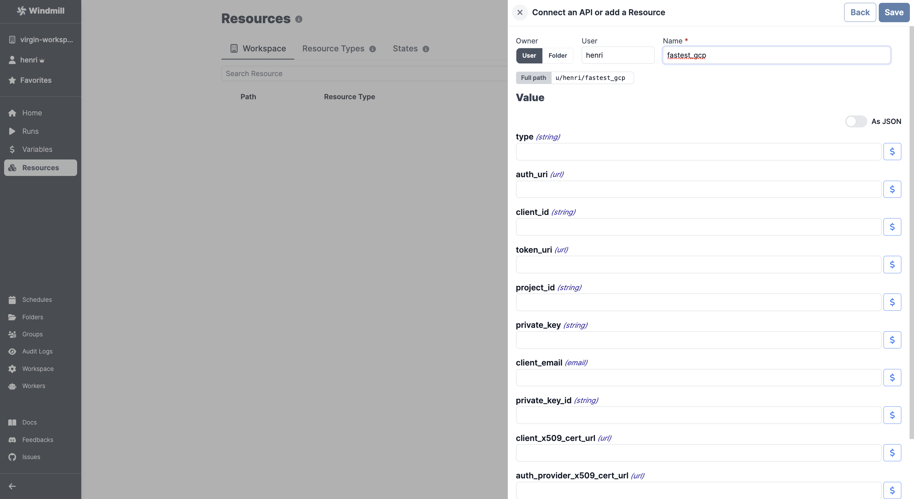

# Google Cloud Platform Integration

To integrate [GCP](https://cloud.google.com/gcp) to Windmill, you need to save the following elements as a [resource](../core_concepts/3_resources_and_types/index.md).

| Property                    | Type   | Description                                          | Default | Required | Where to Find                                                                                     |
| --------------------------- | ------ | ---------------------------------------------------- | ------- | -------- | ------------------------------------------------------------------------------------------------- |
| type                        | string | Type of credentials object                           |         | false    | Google Cloud Console > APIs & Services > Credentials > Create service account key > JSON key file |
| project_id                  | string | Google Cloud Platform project ID                     |         | false    | Google Cloud Console > Home > Project ID                                                          |
| private_key_id              | string | Private key ID for the service account               |         | false    | Google Cloud Console > APIs & Services > Credentials > Create service account key > JSON key file |
| private_key                 | string | Private key for the service account                  |         | false    | Google Cloud Console > APIs & Services > Credentials > Create service account key > JSON key file |
| client_email                | string | Email address associated with the service account    |         | false    | Google Cloud Console > APIs & Services > Credentials > Create service account key > JSON key file |
| client_id                   | string | Client ID for the service account                    |         | false    | Google Cloud Console > APIs & Services > Credentials > Create service account key > JSON key file |
| auth_uri                    | string | Authentication URI for the service account           |         | false    | Google Cloud Console > APIs & Services > Credentials > Create service account key > JSON key file |
| token_uri                   | string | Token URI for the service account                    |         | false    | Google Cloud Console > APIs & Services > Credentials > Create service account key > JSON key file |
| auth_provider_x509_cert_url | string | Auth provider X.509 cert URL for the service account |         | false    | Google Cloud Console > APIs & Services > Credentials > Create service account key > JSON key file |
| client_x509_cert_url        | string | Client X.509 cert URL for the service account        |         | false    | Google Cloud Console > APIs & Services > Credentials > Create service account key > JSON key file |

  

:::tip

Feel free to create your own Google Cloud Platform scripts on [Windmill](../getting_started/00_how_to_use_windmill/index.mdx).

:::
