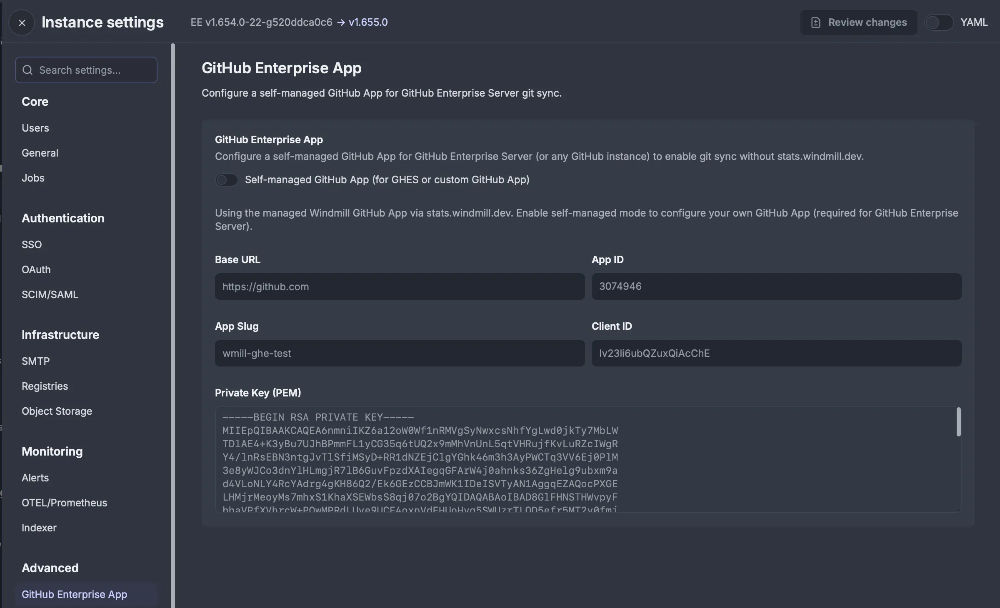

import DocCard from '@site/src/components/DocCard';

# Git integration

[Git](https://git-scm.com/) is a distributed version control system designed to handle everything from small to very large projects with speed and efficiency.

Windmill has a dedicated [resource Type](https://hub.windmill.dev/resource_types/135/git_repository) used for [Git sync](../advanced/11_git_sync/index.mdx), to sync Windmill workspace to a remote repository that will automatically be committed and pushed scripts, flows and apps on each [deploy](../core_concepts/0_draft_and_deploy/index.mdx).

More:

	<DocCard
		title="Git sync"
		description="Connect a Windmill workspace to a Git repository to automatically commit and push scripts, flows and apps to the repository on each deploy."
		href="/docs/advanced/git_sync"
	/>

This video shows how to set up a Git repository for a workspace.

<iframe
	style={{ aspectRatio: '16/9' }}
	src="https://www.youtube.com/embed/cHrREDmrnUM?vq=hd1080&hd=1&quality=highres"
	title="Git sync"
	frameBorder="0"
	allow="accelerometer; autoplay; clipboard-write; encrypted-media; gyroscope; picture-in-picture; web-share"
	allowFullScreen
	className="border-2 rounded-lg object-cover w-full dark:border-gray-800"
></iframe>
 

## GitHub App

Instead of using a long lived personal access token to authenticate with GitHub for [Git sync](../advanced/11_git_sync/index.mdx), you can use the GitHub App to authenticate with GitHub. This allows you to control which repositories can be accessed by your Windmill deployment using a short-live [GitHub app installation token](https://docs.github.com/en/apps/creating-github-apps/authenticating-with-a-github-app/authenticating-as-a-github-app-installation).

GitHub App is available under [Windmill Enterprise](/pricing).

### Network requirements

The GitHub App feature requires your Windmill instance to communicate with `https://stats.windmill.dev` to obtain GitHub installation tokens. This is the same endpoint used for [telemetry](../advanced/18_instance_settings/index.mdx#telemetry).

If your GitHub organization uses [IP allow lists](https://docs.github.com/en/organizations/keeping-your-organization-secure/managing-security-settings-for-your-organization/managing-allowed-ip-addresses-for-your-organization), you will need to whitelist the IP address of `stats.windmill.dev` to allow it to request installation tokens from GitHub on behalf of your Windmill instance. Contact support@windmill.dev to get the current IP address.

:::info
This network requirement only applies to the Windmill-managed GitHub App. If you use a [self-managed GitHub App](#self-managed-github-app), your Windmill instance communicates directly with your GitHub instance. In that case, if your GitHub organization uses IP allow lists, whitelist your Windmill instance's IP address instead.
:::

As a [Windmill workspace admin](https://www.windmill.dev/docs/core_concepts/roles_and_permissions#admin), you can install the GitHub app to multiple organizations and link them to your Windmill workspaces. Once an app has been installed to a workspace, you can install it to other workspace where you have the admin role.

:::warning
You will only be able to use the installation token for [Git sync](../advanced/11_git_sync/index.mdx).
:::

### Importing / Exporting to/from other windmill instance

A GitHub app can only be installed to a GitHub organization once. Hence to associate an installation to multiple windmill instances you need to export the associated JWT token on the source instance using the "Export" button and paste the JWT in the destination instance to import the installation.

:::warning
The JWT token associated to your GitHub app installation is sensitive and has the rights to request a short lived installation token. To revoke the JWT, you need to uninstall the GitHub app from your organization and re-install it to re-associate it with a windmill instance.
:::

<video
	className="border-2 rounded-lg object-cover w-full h-full dark:border-gray-800"
	controls
	src="/videos/github_app_installation.mp4"
/>

### Self-managed GitHub App

Instead of using the Windmill-managed GitHub App, you can register your own GitHub App on any GitHub instance — whether GitHub.com or a GitHub Enterprise Server (GHES) instance. This gives you full control over the app configuration and removes the dependency on `stats.windmill.dev`, as tokens are exchanged directly between your Windmill instance and your GitHub instance.

This feature is [Enterprise Edition](/pricing) only and is configured at the instance level by a [superadmin](../core_concepts/16_roles_and_permissions/index.mdx#superadmin).

To set up a self-managed GitHub App:

1. Register a new GitHub App on your GitHub instance (github.com or your GHES instance)
2. In Windmill [Instance Settings](../advanced/18_instance_settings/index.mdx#github-enterprise-app), go to **Advanced > GitHub Enterprise App** and enable "Self-managed GitHub App (for GHES or custom GitHub App)"
3. Fill in the app details: Base URL (e.g. `https://github.com` or your GHES URL), App ID, App Slug, Client ID, and Private Key (PEM)
4. Install the GitHub App to your organization on your GitHub instance

Once configured, the self-managed GitHub App can be used for [Git sync](../advanced/11_git_sync/index.mdx) authentication in the same way as the managed GitHub App. Host-based installation filtering ensures tokens are scoped to the correct GitHub instance, preventing token leakage across instances.

