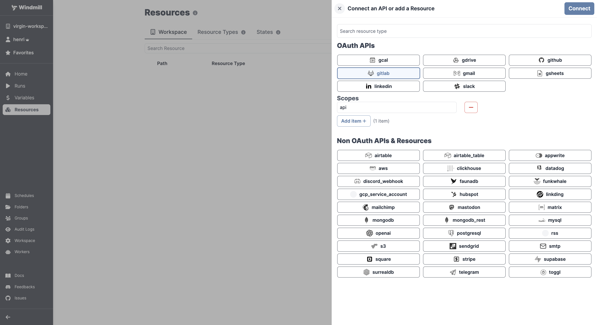

# Gitlab Integration

To integrate [Gitlab](https://about.gitlab.com/) to Windmill, you need to save the following elements as a [resource](../core_concepts/3_resources_and_types/index.md).

| Property | Type   | Description                      | Default            | Required | Where to Find                                                                   |
| -------- | ------ | -------------------------------- | ------------------ | -------- | ------------------------------------------------------------------------------- |
| baseUrl  | string | Base URL of your GitLab instance | https://gitlab.com | false    | Provided by your GitLab hosting provider or GitLab instance URL for self-hosted |
| token    | string | GitLab personal access token     |                    | true     | Sign in from Windmill                                                           |

  

:::tip

Find some pre-set interactions with Gitlab on the [Hub](https://hub.windmill.dev/integrations/gitlab).

Feel free to create your own Gitlab scripts on [Windmill](../getting_started/00_how_to_use_windmill/index.mdx).

:::
