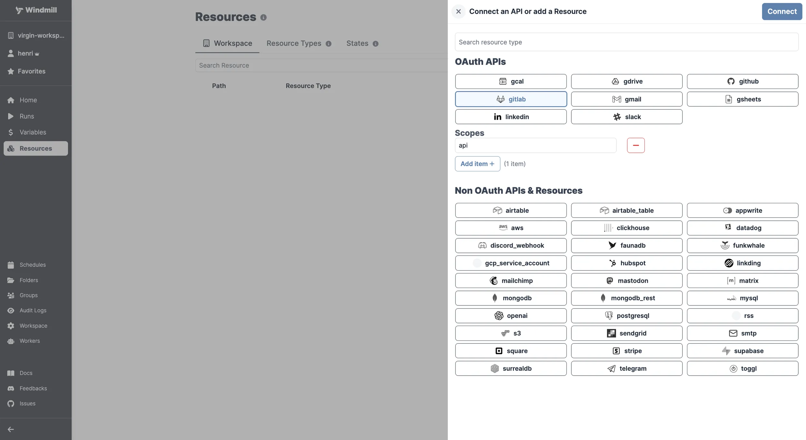

import DocCard from '@site/src/components/DocCard';

# GitLab Integration

[GitLab](https://about.gitlab.com/) is a web-based Git-repository manager with CI/CD capabilities.

The GitLab integration is done through OAuth. You just need to sign in from your GitLab account on your browser. The access will be automatically saved to the workspace as a [resource](../core_concepts/3_resources_and_types/index.mdx).

On [self-hosted instances](../advanced/1_self_host/index.mdx), integrating an OAuth API will require [Setup OAuth and SSO](../misc/2_setup_oauth/index.mdx).

	<DocCard
		title="Deploy to Prod using a Git Workflow"
		description="Windmill integration with Git repositories makes it possible to adopt a robust development process for your Windmill scripts, flows and apps."
		href="/docs/advanced/deploy_gh_gl"
	/>

Your resource can be used [passed as parameters](../core_concepts/3_resources_and_types/index.mdx#passing-resources-as-parameters-to-scripts-preferred) or [directly fetched](../core_concepts/3_resources_and_types/index.mdx#fetching-them-from-within-a-script-by-using-the-wmill-client-in-the-respective-language) within [scripts](../script_editor/index.mdx), [flows](../flows/1_flow_editor.mdx) and [apps](../apps/0_app_editor/index.mdx).

<video
	className="border-2 rounded-xl object-cover w-full h-full dark:border-gray-800"
	controls
	src="/videos/add_resources_variables.mp4"
/>

 

:::tip

Find some pre-set interactions with Gitlab on the [Hub](https://hub.windmill.dev/integrations/gitlab).

Feel free to create your own Gitlab scripts on [Windmill](../getting_started/00_how_to_use_windmill/index.mdx).

:::
