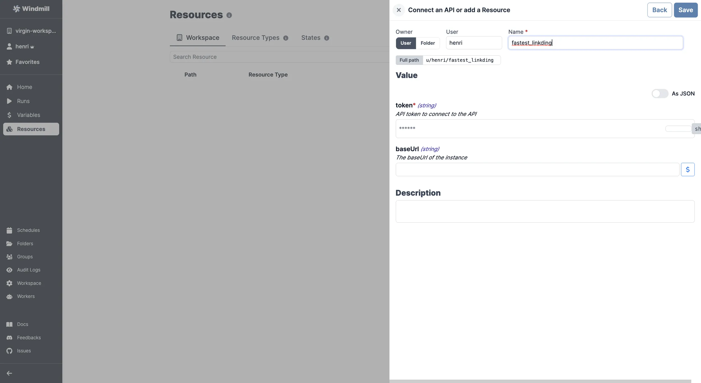

# Linkding integration

[Linkding](https://github.com/sissbruecker/linkding) is a self-hosted bookmark manager.

To integrate Linkding to Windmill, you need to save the following elements as a [resource](../core_concepts/3_resources_and_types/index.mdx).

| Property | Type   | Description                     | Default | Required | Where to Find                                 |
| -------- | ------ | ------------------------------- | ------- | -------- | --------------------------------------------- |
| token    | string | API token to connect to the API |         | true     | Linkding > User Settings > Generate API token |
| baseUrl  | string | The base URL of the instance    |         | false    | Provided by your Linkding hosting provider    |

  

Your resource can be used [passed as parameters](../core_concepts/3_resources_and_types/index.mdx#passing-resources-as-parameters-to-scripts-preferred) or [directly fetched](../core_concepts/3_resources_and_types/index.mdx#fetching-them-from-within-a-script-by-using-the-wmill-client-in-the-respective-language) within [scripts](../script_editor/index.mdx), [flows](../flows/1_flow_editor.mdx) and [apps](../apps/0_app_editor/index.mdx).

<iframe
	style={{ aspectRatio: '16/9' }}
	src="https://www.youtube.com/embed/ggJQtzvqaqA"
	title="YouTube video player"
	frameBorder="0"
	allow="accelerometer; autoplay; clipboard-write; encrypted-media; gyroscope; picture-in-picture; web-share"
	allowFullScreen
	className="border-2 rounded-lg object-cover w-full dark:border-gray-800"
></iframe>

 

> Example of a Supabase resource being used in two different manners from a script in Windmill.
 

:::tip

Feel free to create your own Hubspot scripts on [Linkding](../getting_started/00_how_to_use_windmill/index.mdx).

:::
