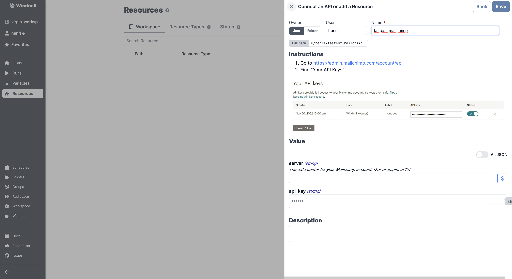

# Mailchimp Integration

:::info Using emails to trigger scripts & flows

To trigger scripts and flows by emails using Mailchimp, refer to the [Mailchimp Mandrill Integration](./mailchimp_mandrill.md) for seamless integration.

:::

To integrate [Mailchimp](https://mailchimp.com/) to Windmill, you need to save the following elements as a [resource](../core_concepts/3_resources_and_types/index.mdx).

| Property | Type   | Description                                             | Default | Required | Where to Find                                          |
| -------- | ------ | ------------------------------------------------------- | ------- | -------- | ------------------------------------------------------ |
| api_key  | string | Mailchimp API key                                       |         | false    | Mailchimp > Account > Extras > API keys > Create A Key |
| server   | string | The data center for your Mailchimp account (e.g., us12) |         | false    | Found in your API key (e.g., "us12" in "123abc-us12")  |

  

:::tip

Find some pre-set interactions with Mailchimp on the [Hub](https://hub.windmill.dev/integrations/mailchimp).

Feel free to create your own Mailchimp scripts on [Windmill](../getting_started/00_how_to_use_windmill/index.mdx).

:::
