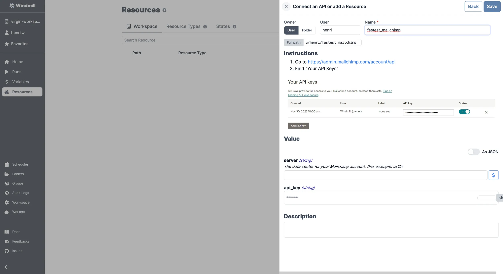

# Mailchimp integration

[Mailchimp](https://mailchimp.com/) is an all-in-one marketing platform for small businesses.

:::info Using emails to trigger scripts & flows

To trigger scripts and flows by emails using Mailchimp, refer to the [Mailchimp Mandrill Integration](./mailchimp_mandrill.md) for seamless integration.

:::

To integrate Mailchimp to Windmill, you need to save the following elements as a [resource](../core_concepts/3_resources_and_types/index.mdx).

| Property | Type   | Description                                             | Default | Required | Where to Find                                          |
| -------- | ------ | ------------------------------------------------------- | ------- | -------- | ------------------------------------------------------ |
| api_key  | string | Mailchimp API key                                       |         | false    | Mailchimp > Account > Extras > API keys > Create A Key |
| server   | string | The data center for your Mailchimp account (e.g., us12) |         | false    | Found in your API key (e.g., "us12" in "123abc-us12")  |

  

Your resource can be used [passed as parameters](../core_concepts/3_resources_and_types/index.mdx#passing-resources-as-parameters-to-scripts-preferred) or [directly fetched](../core_concepts/3_resources_and_types/index.mdx#fetching-them-from-within-a-script-by-using-the-wmill-client-in-the-respective-language) within [scripts](../script_editor/index.mdx), [flows](../flows/1_flow_editor.mdx), [low-code apps](../apps/0_app_editor/index.mdx) and [full-code apps](../full_code_apps/index.mdx).

<iframe
	style={{ aspectRatio: '16/9' }}
	src="https://www.youtube.com/embed/ggJQtzvqaqA"
	title="YouTube video player"
	frameBorder="0"
	allow="accelerometer; autoplay; clipboard-write; encrypted-media; gyroscope; picture-in-picture; web-share"
	allowFullScreen
	className="border-2 rounded-lg object-cover w-full dark:border-gray-800"
></iframe>

 

> Example of a Supabase resource being used in two different manners from a script in Windmill.
 

:::tip

Find some pre-set interactions with Mailchimp on the [Hub](https://hub.windmill.dev/integrations/mailchimp).

Feel free to create your own Mailchimp scripts on [Windmill](../getting_started/00_how_to_use_windmill/index.mdx).

:::
