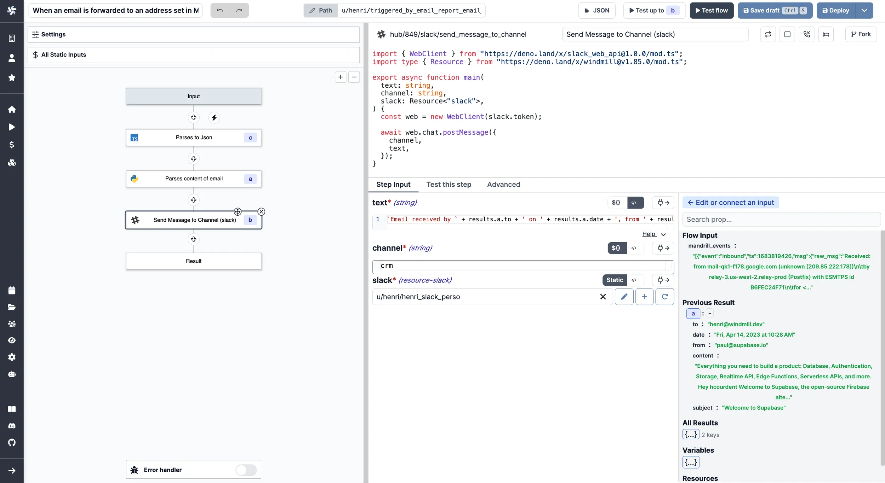

# Mailchimp Mandrill Integration

Integrating [Mailchimp Mandrill](https://mailchimp.com/en/features/transactional-email/) is a powerfull way of [triggering scripts](../getting_started/8_trigger_scripts/index.mdx) or [flows](../getting_started/9_trigger_flows/index.mdx) by e-mail.

<video
    className="border-2 rounded-xl object-cover w-full h-full dark:border-gray-800"
    autoPlay
    controls
    id="main-video"
    src="/videos/trigger_mandrill.mp4"
/>

<br/>

:::info TLDR

The present tutorial explains how to use Mailchimp to trigger Windmill [scripts](../getting_started/0_scripts_quickstart/1_typescript_quickstart/index.mdx) and [flows](../getting_started/6_flows_quickstart/index.mdx) through sending parsed inbound emails to Windmill via [webhooks](../core_concepts/4_webhooks/index.mdx).

:::

## Webhooks in Windmill

[Webhooks](../core_concepts/4_webhooks/index.mdx) in Windmill are a versatile and efficient method for triggering scripts or flows based on external events. Every script or flow created within the platform is automatically assigned a set of autogenerated webhooks, which can be found on the "Detail" page of the script/flow.

Combined with a token created in Windmill, these webhooks can be interacted with using standard web technologies, making them compatible with a broad range of external systems and services, including Mailchimp Mandrill for email-triggered executions.


> Each script or flow has webhook endpoints. Bearer token must be passed as either an Authorization: Bearer &lt;TOKEN&gt; header, or as a token query parameter: https://&lt;instance&gt;/&lt;route&gt;?token=&lt;TOKEN&gt;

## Using Mailchimp to trigger Windmill webhooks from emails

All the details on the Mailchimp side are explained in [this tutorial](https://mailchimp.com/developer/transactional/guides/set-up-inbound-email-processing/).

:::tip

The flow we used for the example is available on [Windmill Hub](https://hub.windmill.dev/flows/41/).

:::

Here are the steps to follow:

1. Create a [script](../getting_started/0_scripts_quickstart/1_typescript_quickstart/index.mdx) or [flow](../getting_started/6_flows_quickstart/index.mdx) in Windmill. Make sure it has an input designed to receive the parsed results (for example a string called "mandrill_events").

2. [Sign up to Mailchimp](https://mailchimp.com/signup/) (we used the free trial at first).

3. Go the the [inbound menu of Mailchimp Mandrill](https://mandrillapp.com/inbound).

4. Add a domain or sub-domain. For example `webhooks.domain.com`.

5. Add the MX records to your DNS provider and validate them from Mandrill.

6. From Mandrill, click the dropdown next to the `Test DNS Settings` button, select `Routes`, and then select the `Add New Route button`. Configure a new route. That will be the accepted email(s) to trigger your script or flow. Please note that these e-mail adresses do not have to pre-exist to be treated by Mailchimp.

7. From Windmill, go to the `Details` menu of your script or flow. If not any, create a token. Pick a webhook (`UUID/Async` [is commonly preferred](../core_concepts/4_webhooks/index.mdx#synchronous)).

8. In Mandrill's "Post to URL" box, paste the webhook in the form `https://app.windmill.dev/.../rest_of_the_webhook/?token=TOKEN`.

9. Click the `Test DNS Settings` button to check it's working.

Now you're all set!

Maybe you want to deal with the specific elements of the email. It is likely the payload has been sent as a string, so add a parsing to json step and use its results as inputs for further steps.

<details>
  <summary>Parses payload to Json. Code below:</summary>

```js
export async function main(x) {
	return JSON.parse(x);
}
```

With "x" = our only input `flow_input.mandrill_events`.

</details>

### Extract information from directly routed e-mails

If your routing rules are set to capture emails that are directly addressed to certain recipients (for instance, any emails sent to name@company.com), extracting the relevant information from these emails is straightforward. It works as followed:

- Mailchimp already parses the e-mail's details.
- The parsed results are sent as an array, of which Windmill treats each element as a potential output & input.

:::info Mailbox Routing
In email systems, routing rules are not strictly tied to a single email address. Instead, they are flexible mechanisms that govern how an email server handles incoming messages based on various criteria.

<br/>

A Mailbox Route allows at the server-level incoming emails to be automatically directed to specific destinations based on predefined rules. These rules match criteria like recipient address or subject line, and the system performs actions such as delivering the message to a mailbox, forwarding it, or applying filters

<br/>

Thus, you can use the Mailchimp address effectively and have most emails be parsed directly without anyone knowing there is a Mailchimp domain. For instance: all emails sent to sales@domain.com and joe@domain.com will also be sent to windmill@windmill.domain.com to be analyzed and parsed by Windmill and if deemed relevant added to the CRM.
:::

Then you just have to pick the details you want by "connecting inputs" of the JSON.parse step.


> _On the bottom right corner, relevant details from the email to be picked as inputs for further steps_

### Extract information from forwarded e-mails

If your routing rules are designed to process emails that are forwarded from certain recipients (for instance, any emails forwarded by name@company.com), you'll need an additional step to extract the relevant information from the original emails.

Indeed, Mailchimp already parses the e-mail's details but does it as a single e-mail. So for example the considered sender will be the one who forwarded the e-mail, not the sender of the original e-mail.

So we recommend you to add the following step an connecting "input_email" to `results.c[0].msg.text`, c being the JSON parser step:

<details>
  <summary>Example of a simple parser to get info from the forwarded email. Code below:</summary>

```python
import re

def main(input_email):
  from_pattern = re.compile(r'From: .+ <(.+)>')
  subject_pattern = re.compile(r'Subject: (.+)')
  date_pattern = re.compile(r'Date: (.+)')
  to_pattern = re.compile(r'To: <(.+)>')
  content_pattern = re.compile(r'\n\n(.*)\n', re.DOTALL)

  from_field = re.search(from_pattern, input_email)
  date_field = re.search(date_pattern, input_email)
  subject_field = re.search(subject_pattern, input_email)
  to_field = re.search(to_pattern, input_email)
  content_field = re.search(content_pattern, input_email)

  return {
      'from': from_field.group(1) if from_field else None,
      'date': date_field.group(1) if date_field else None,
      'subject': subject_field.group(1) if subject_field else None,
      'to': to_field.group(1) if to_field else None,
      'content': content_field.group(1).strip() if content_field else None
  }

```

</details>



> _On the bottom right corner, relevant details parsed from the forwarded email to be picked as inputs for further steps_

### Extract information from both directly routed and forwarded e-mails

At last, you may be in a situation where you want to extract the relevant details for both forwarded and directly routed e-mails. Meaning:

- if A directly sent e-mail, treat contact details of A ;
- if A forwarded e-mail from B, treat contact details of B.

Then you have two solutions:

1. From Mailchimp, set-up two routes (and therefore, two workflows and two different emails configurations) to handle each cases. It has the advantage of being clear but it will be poor to handle human mistakes on the right address to send to.
2. From Windmill, use [branches](../flows/13_flow_branches.md) to condition the behaviour of the workflow.

For example, have a script that reads the subject of the e-mail and returns a value if it contains "Fwd", value on which a conditional branch will depend.

<details>
  <summary>Example of a script that returns true if the mail Topic contains given value. Code below:</summary>

```js
export async function main(input: string, substring: string = 'Fwd'): Promise<Output> {
	const containsSubstring = input.includes(substring);
	return { containsSubstring };
}

interface Output {
	containsSubstring: boolean;
}
```

</details>

Here is what it does when "input" = `results.c[0].msg.headers.Subject` (c being the JSON.parse script) and string = "Fwd":

<video
    className="border-2 rounded-xl object-cover w-full h-full dark:border-gray-800"
    controls
    src="/videos/branch_fwd_direct.mp4"
/>

<br/>

In this flow, when "Fwd" is not found, it considers it was not a forwarded e-mail and the default branch executes. Of course this can be customized to your needs.

## How to go further?

The present example is a very simple use case: when an email is transfered to a given address, it triggers a flow that reports the main details of the mail to Slack.

However, you could go with much more complex workflows:

- Play with branches [branches](../flows/13_flow_branches.md) and have this flow report on different media depending of the content of the e-mail.
- The email could be dealt with to automatically update a CRM (e.g. [Hubspot](https://hub.windmill.dev/integrations/hubspot), [Salesforce](https://hub.windmill.dev/integrations/salesforce), [Airtable](https://hub.windmill.dev/integrations/airtable)).
- Use the parsed details to [branch the execution of your flow](../flows/13_flow_branches.md) on a condition.
- Have [OpenAI](https://hub.windmill.dev/integrations/openai) summarize the content of the email.
- Invoicing and Accounting: If your business receives invoices or receipts via email, you can parse these emails to extract relevant information and automatically update your accounting software or database.
- Monitoring and Alerting: If you're receiving system or application alerts via email, you can parse these emails and trigger specific workflows based on the type of alert. For example, you could automatically create a task in a project management tool, send a message in a Slack channel, or even trigger a script to attempt to resolve the issue automatically.

On top of much more custom-made uses only you can think of.
