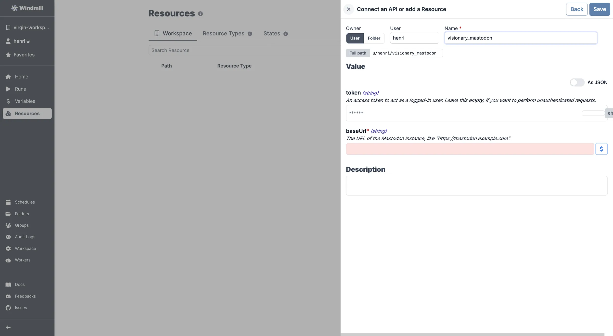

# Mastodon Integration

To integrate [Mastodon](https://mastodon.social/) to Windmill, you need to save the following elements as a [resource](../core_concepts/3_resources_and_types/index.mdx).

| Property | Type   | Description                                                             | Default | Required | Where to Find                                                                                      |
| -------- | ------ | ----------------------------------------------------------------------- | ------- | -------- | -------------------------------------------------------------------------------------------------- |
| baseUrl  | string | The URL of the Mastodon instance (e.g., "https://mastodon.example.com") |         | true     | Provided by your Mastodon hosting provider or Mastodon instance URL for self-hosted instances      |
| token    | string | An access token to act as a logged-in user                              |         | false    | Mastodon > Preferences > Development > Your Applications > New Application > Generate access token |

  

Your resource can be used [passed as parameters](../core_concepts/3_resources_and_types/index.mdx#passing-resources-as-parameters-to-scripts-preferred) or [directly fetched](../core_concepts/3_resources_and_types/index.mdx#fetching-them-from-within-a-script-by-using-the-wmill-client-in-the-respective-language) within [scripts](../script_editor/index.mdx), [flows](../flows/1_flow_editor.mdx) and [apps](../apps/0_app_editor/index.mdx).

<video
	className="border-2 rounded-xl object-cover w-full h-full dark:border-gray-800"
	controls
	src="/videos/add_resources_variables.mp4"
/>

 

:::tip

Find some pre-set interactions with Mastodon on the [Hub](https://hub.windmill.dev/integrations/mastodon).

Feel free to create your own Mastodon scripts on [Windmill](../getting_started/00_how_to_use_windmill/index.mdx).

:::
