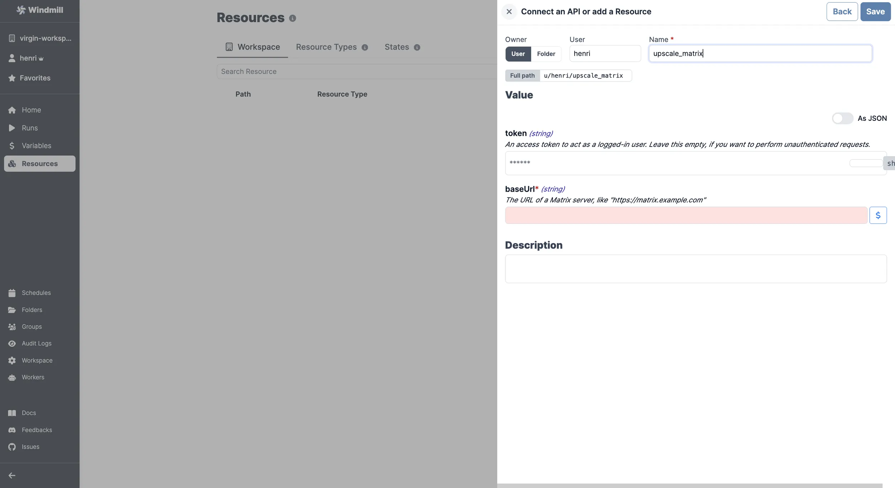

# Matrix Integration

[Matrix](https://matrix.org/) is an open standard for decentralized, real-time communication.

To integrate Matrix to Windmill, you need to save the following elements as a [resource](../core_concepts/3_resources_and_types/index.mdx).

| Property | Type   | Description                                                     | Default | Required | Where to Find                                                                             |
| -------- | ------ | --------------------------------------------------------------- | ------- | -------- | ----------------------------------------------------------------------------------------- |
| baseUrl  | string | The URL of a Matrix server (e.g., "https://matrix.example.com") |         | true     | Provided by your Matrix hosting provider or Matrix instance URL for self-hosted instances |
| token    | string | An access token to act as a logged-in user                      |         | false    | Matrix > Settings > Security & Privacy > Access Token > Reveal Access Token               |

  

Your resource can be used [passed as parameters](../core_concepts/3_resources_and_types/index.mdx#passing-resources-as-parameters-to-scripts-preferred) or [directly fetched](../core_concepts/3_resources_and_types/index.mdx#fetching-them-from-within-a-script-by-using-the-wmill-client-in-the-respective-language) within [scripts](../script_editor/index.mdx), [flows](../flows/1_flow_editor.mdx) and [apps](../apps/0_app_editor/index.mdx).

<video
	className="border-2 rounded-lg object-cover w-full h-full dark:border-gray-800"
	controls
	src="/videos/add_resources_variables.mp4"
/>

 

> Example of a Supabase resource being used in two different manners from a script in Windmill.

 

:::tip

Find some pre-set interactions with Matrix on the [Hub](https://hub.windmill.dev/integrations/matrix).

Feel free to create your own Matrix scripts on [Windmill](../getting_started/00_how_to_use_windmill/index.mdx).

:::
