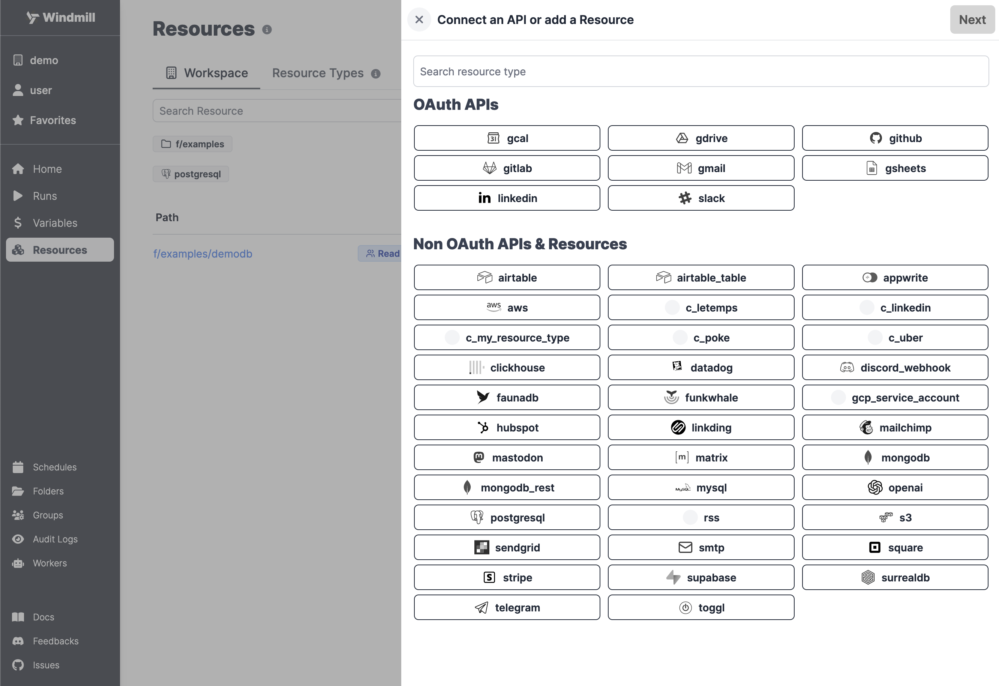
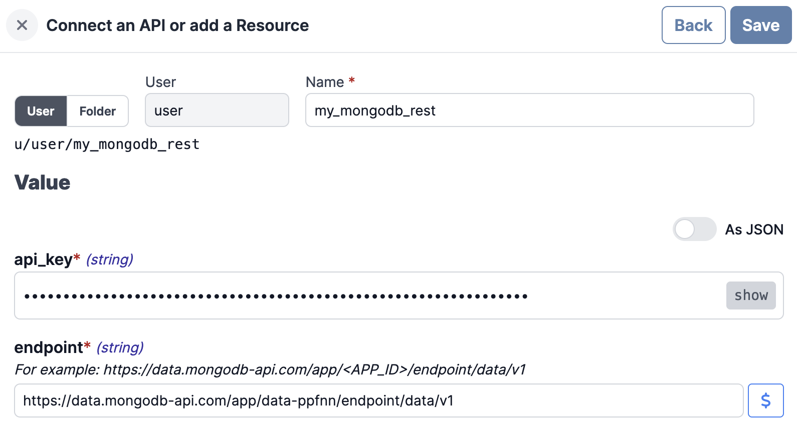
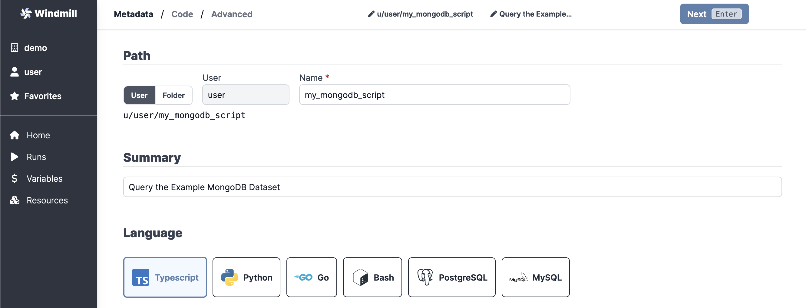
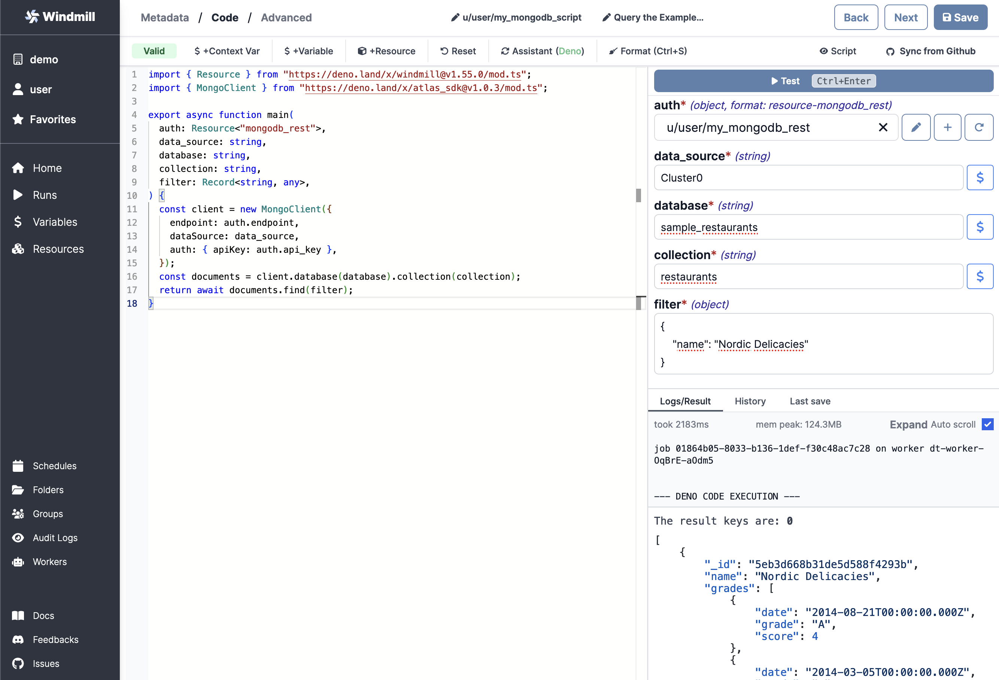

# Mongodb Integration

This guide aims to show you how to create a connection from your Windmill
instance to an external MongoDB Atlas database, then use it to make queries.

<!--truncate-->

:::info

[MongoDB Atlas][mongodb-atlas] is the cloud-hosted and managed version of
MongoDB. This guide **won't cover** the self-hosted version of MongoDB and also
assumes, that you already have an Atlas database set up.

You can find more information about setting up MongoDB Atlas
[here][mongodb-atlas-setup].

:::


## Create Resource

Windmill provides integration with many different apps and services with the use
of [Resources][docs-resources]. Each Resource has a **Resources Type**, which
controls the shape of it. To be able to connect to a MongoDB instance, we'll
need to define a Resource with the `mongodb_rest` Resource Type first.

:::tip

You can find a list of all the officially supported Resource Types on
[Windmill Hub][hub-resources].

:::

Head to the [Resources][wm-app-resources] page in the Windmill app, click on
"Add a resource/API" in the top right corner and select the `mongodb_rest` type.



:::caution

There is a `mongodb` and a `mongodb_rest` Resource Type.

- [mongodb_rest](https://hub.windmill.dev/resource_types/65/mongodb_rest) uses an API Key and Endpoint
- [mongodb](https://hub.windmill.dev/resource_types/22/mongodb) uses a custom configuration (asking for db, tls, servers, and credentials)

For the present section, we'll select **`mongodb_rest`** as this will make it easier to connect to MongoDB Atlas.

:::

To enable access to your database, follow the instructions in
[this article][mongo-api] and paste your **API key** and **endpoint** in
Windmill. When it's done, click "Save".



### Using Custom Configuration

Integration MongoDB through the [mongodb resource type](https://hub.windmill.dev/resource_types/22/mongodb) can be made by providing the following parameters.

<details>
  <summary>Parameters below:</summary>

| Property           | Type    | Description                | Default     | Required | Where to Find           | Additional Details                                  |
| ------------------ | ------- | -------------------------- | ----------- | -------- | ----------------------- | --------------------------------------------------- |
| db                 | string  | Database name              |             | true     | MongoDB Atlas Dashboard | Name of the database you want to connect to         |
| tls                | boolean | Use TLS for connections    | true        | false    | Your own preference     | Set to true for secure connections                  |
| servers            | array   | Array of server objects    |             | true     | MongoDB Atlas Dashboard | Each server object should contain `host` and `port` |
| host (nested)      | string  | Server address             |             | true     | MongoDB Atlas Dashboard | Hostname of the MongoDB instance                    |
| port (nested)      | integer | Port number                | 27017       | false    | MongoDB Atlas Dashboard | Default MongoDB port is `27017`                     |
| credential         | object  | Authentication information |             | true     | MongoDB Atlas Dashboard | Contains `username`, `password`, `db`, `mechanism`  |
| username (nested)  | string  | Database username          |             | true     | MongoDB Atlas Dashboard | Your database user's username                       |
| password (nested)  | string  | Database password          |             | true     | MongoDB Atlas Dashboard | Your database user's password                       |
| db (nested)        | string  | Authentication database    |             | true     | MongoDB Atlas Dashboard | The database used for authentication                |
| mechanism (nested) | string  | Authentication mechanism   | SCRAM-SHA-1 | false    | Your own preference     | Default authentication mechanism is `"SCRAM-SHA-1"` |

</details>

## Create Script

Next, let's create a Script that will use the newly created Resource. Head on to
the [Home][wm-app-home] page and click on the "+Script" button. We'll be using
TypeScript as the language.

:::info

Windmill uses Deno as the TypeScript runtime.

:::

Name the Script `my_mongodb_script`, give it a summary, "Query the Example
MongoDB Dataset" for example and click "Next".



Paste in the following code into the editor:

```typescript
import { MongoClient } from 'https://deno.land/x/atlas_sdk@v1.0.3/mod.ts';

type MongodbRest = {
	endpoint: string;
	api_key: string;
};

export async function main(
	auth: MongodbRest,
	data_source: string,
	database: string,
	collection: string,
	filter: Record<string, any>
) {
	const client = new MongoClient({
		endpoint: auth.endpoint,
		dataSource: data_source,
		auth: { apiKey: auth.api_key }
	});
	const documents = client.database(database).collection(collection);
	return await documents.find(filter);
}
```

In case you are using the [sample dataset][mongo-sample-data] of MongoDB Atlas,
you'll have a `sample_restaurants` database filled with restarurants. To make a
query for a specific restaurant name, the arguments of the Script would look
like the followings (**casing matters**):

- **auth** - select the Resource we created in the previous step
  (`my_mongodb_rest`)
- **data_source** - `Cluster0`
- **database** - `sample_restaurants`
- **collection** - `restaurants`
- **filter** - `{ "name": "Nordic Delicacies" }`

After filling the inputs, try running the Script by clicking "Test" or pressing
`Ctrl` + `Enter`. You should see exactly one restaurant returned in the bottom
right corner.



If you tried querying by the `_id` field, you might have noticed that it didn't
return anything. That's because it is stored as an ObjectID, which is a special
type in MongoDB. To query by ID, you'll need to convert the filter value to an
ObjectID first. Replace your code with the following to make it able to query by
ID:

```typescript
import { MongoClient, ObjectId } from 'https://deno.land/x/atlas_sdk@v1.0.3/mod.ts';

type MongodbRest = {
	endpoint: string;
	api_key: string;
};

export async function main(
	auth: MongodbRest,
	data_source: string,
	database: string,
	collection: string,
	filter: Record<string, any>
) {
	const client = new MongoClient({
		endpoint: auth.endpoint,
		dataSource: data_source,
		auth: { apiKey: auth.api_key }
	});
	const documents = client.database(database).collection(collection);
	if ('_id' in filter) {
		filter['_id'] = new ObjectId(filter['_id']);
	}
	return await documents.find(filter);
}
```

Now try running the Script again with the same arguments, **except for the
filter**, which should be `{ "_id": "5eb3d668b31de5d588f4293b" }`. You should
see the same restaurant named "Nordic Delicacies" returned.

:::tip

You can find more Script examples related to MongoDB on
[Windmill Hub][hub-mongo].

:::

Once you're done, click on "Save", which will save it to your workspace. You can
now use this Script in your [Flows][docs-flows], [Apps][docs-apps] or as
standalone.

<!-- Links -->

[wm-app-resources]: https://app.windmill.dev/resources
[wm-app-home]: https://app.windmill.dev
[hub-resources]: https://hub.windmill.dev/resources
[hub-mongo]: https://hub.windmill.dev/integrations/mongodb
[docs-resources]: /docs/core_concepts/resources_and_types
[docs-path]: /docs/core_concepts/roles_and_permissions#path
[docs-flows]: /docs/getting_started/flows_quickstart
[docs-apps]: /docs/getting_started/apps_quickstart
[mongodb-atlas]: https://www.mongodb.com/atlas/database
[mongodb-atlas-setup]: https://www.mongodb.com/basics/mongodb-atlas-tutorial
[mongo-api]: https://www.mongodb.com/docs/atlas/api/data-api/
[mongo-sample-data]: https://www.mongodb.com/docs/atlas/sample-data/
