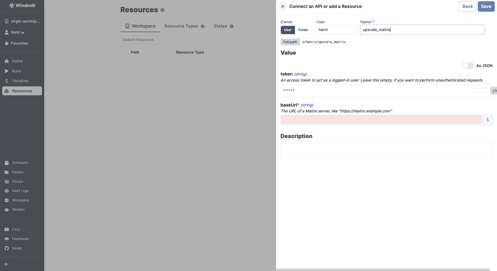

# MySQL Integration

To integrate [MySQL](https://www.mysql.com/) to Windmill, you need to save the following elements as a [resource](../core_concepts/3_resources_and_types/index.mdx).

| Property | Type   | Description     | Default | Required | Where to Find                                                                          |
| -------- | ------ | --------------- | ------- | -------- | -------------------------------------------------------------------------------------- |
| host     | string | Instance host   |         | false    | Your hosting provider's control panel or in your server's MySQL configuration file     |
| port     | number | Instance port   | 3306    | false    | Your hosting provider's control panel or in your server's MySQL configuration file     |
| user     | string | Username        |         | true     | Created in MySQL (e.g., via phpMyAdmin or MySQL Workbench) or provided by your hosting |
| database | string | Database name   |         | true     | Created in MySQL (e.g., via phpMyAdmin or MySQL Workbench) or provided by your hosting |
| password | string | User's password |         | true     | Created in MySQL (e.g., via phpMyAdmin or MySQL Workbench) or provided by your hosting |

## MySQL as a Script Language

MySQL can be used as a script language using the [MySQL driver for Deno](https://deno.land/x/mysql@v2.11.0) in Typescript.

Otherwise, [Python libraries](https://github.com/PyMySQL/PyMySQL) and [Deno](https://deno.com/manual@v1.28.3/node/how_to_with_npm/mysql2) are also suggesting mysql2 from npm.

  

:::tip

Find some pre-set interactions with MySQL on the [Hub](https://hub.windmill.dev/integrations/mysql).

Feel free to create your own MySQL scripts on [Windmill](../getting_started/00_how_to_use_windmill/index.mdx).

:::
