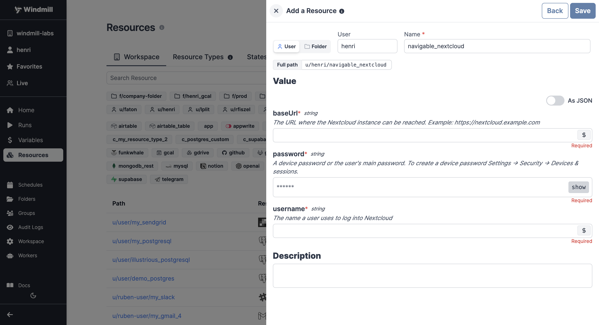

# Nextcloud Integration

To integrate [Nextcloud](https://nextcloud.com/) to Windmill, you need to save the following elements as a [resource](../core_concepts/3_resources_and_types/index.mdx).

| Property | Type   | Description                                                 | Default | Required | Where to Find                                           |
| -------- | ------ | ----------------------------------------------------------- | ------- | -------- | ------------------------------------------------------- |
| username | string | The username for accessing the Nextcloud instance           |         | true     | Your Nextcloud account credentials                     |
| password | string | The password associated with the provided username          |         | true     | Your Nextcloud account credentials                     |
| baseUrl  | string | The base URL of the Nextcloud instance (e.g., "https://nextcloud.example.com") |         | true     | Found in the address bar of your Nextcloud instance    |
  

:::tip

Find some pre-set interactions with Nextcloud on the [Hub](https://hub.windmill.dev/integrations/nextcloud).

Feel free to create your own Nextcloud scripts on [Windmill](../getting_started/00_how_to_use_windmill/index.mdx).

:::
