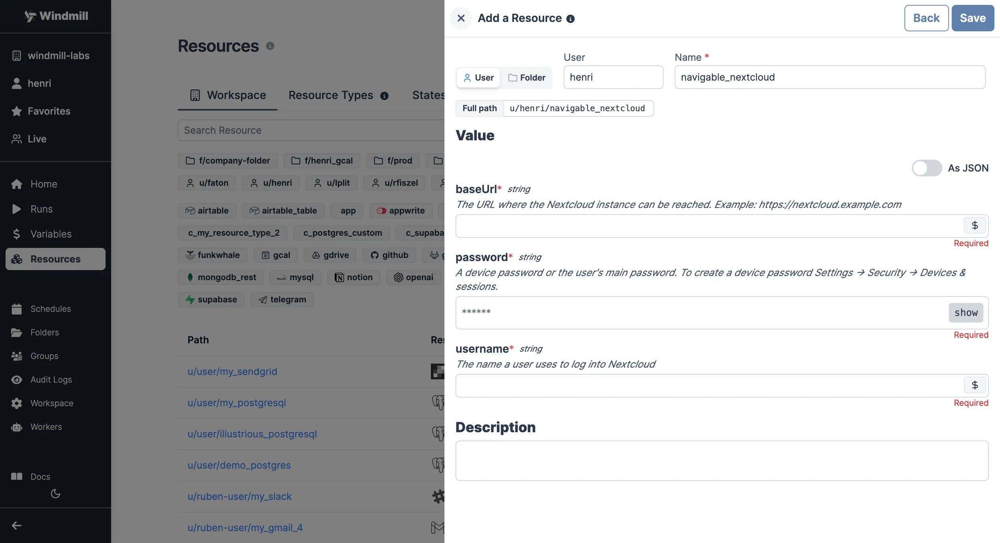

# Nextcloud Integration

[Nextcloud](https://nextcloud.com/) is a suite of client-server software for creating and using file hosting services.

To integrate Nextcloud to Windmill, you need to save the following elements as a [resource](../core_concepts/3_resources_and_types/index.mdx).

| Property | Type   | Description                                                 | Default | Required | Where to Find                                           |
| -------- | ------ | ----------------------------------------------------------- | ------- | -------- | ------------------------------------------------------- |
| username | string | The username for accessing the Nextcloud instance           |         | true     | Your Nextcloud account credentials                     |
| password | string | The password associated with the provided username          |         | true     | Your Nextcloud account credentials                     |
| baseUrl  | string | The base URL of the Nextcloud instance (e.g., "https://nextcloud.example.com") |         | true     | Found in the address bar of your Nextcloud instance    |
  

Your resource can be used [passed as parameters](../core_concepts/3_resources_and_types/index.mdx#passing-resources-as-parameters-to-scripts-preferred) or [directly fetched](../core_concepts/3_resources_and_types/index.mdx#fetching-them-from-within-a-script-by-using-the-wmill-client-in-the-respective-language) within [scripts](../script_editor/index.mdx), [flows](../flows/1_flow_editor.mdx) and [apps](../apps/0_app_editor/index.mdx).

<video
	className="border-2 rounded-lg object-cover w-full h-full dark:border-gray-800"
	controls
	src="/videos/add_resources_variables.mp4"
/>

 

:::tip

Find some pre-set interactions with Nextcloud on the [Hub](https://hub.windmill.dev/integrations/nextcloud).

Feel free to create your own Nextcloud scripts on [Windmill](../getting_started/00_how_to_use_windmill/index.mdx).

:::
