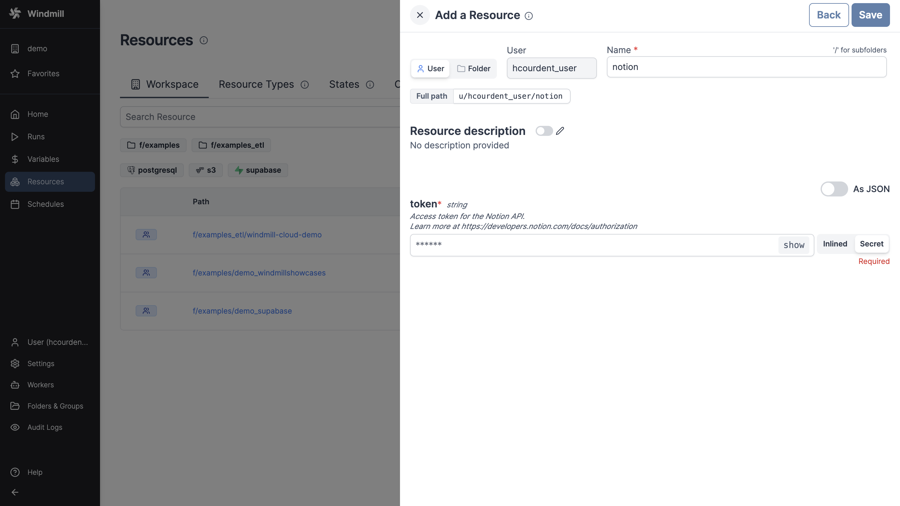

# Notion integration

[Notion](https://www.notion.so/) is a productivity and note-taking web application.

To integrate Notion to Windmill, you need to save a [token](https://developers.notion.com/reference/create-a-token) within a Notion [resource](../core_concepts/3_resources_and_types/index.mdx).

To create a token, on Notion go to the [My integrations](https://www.notion.so/my-integrations) page, create a new integration and associate it with the proper workspace.

Do not forget to "Connect to" Windmill the page (and therefore subpages) for which you want Windmill to have access to.

<iframe
	style={{ aspectRatio: '16/9' }}
	src="https://www.youtube.com/embed/J4bUqscEGsU"
	title="Notion Integration"
	frameBorder="0"
	allow="accelerometer; autoplay; clipboard-write; encrypted-media; gyroscope; picture-in-picture; web-share"
	allowFullScreen
	className="border-2 rounded-lg object-cover w-full dark:border-gray-800"
></iframe>

 

Your resource can then be used [passed as parameters](../core_concepts/3_resources_and_types/index.mdx#passing-resources-as-parameters-to-scripts-preferred) or [directly fetched](../core_concepts/3_resources_and_types/index.mdx#fetching-them-from-within-a-script-by-using-the-wmill-client-in-the-respective-language) within [scripts](../script_editor/index.mdx), [flows](../flows/1_flow_editor.mdx) and [apps](../apps/0_app_editor/index.mdx).

<iframe
	style={{ aspectRatio: '16/9' }}
	src="https://www.youtube.com/embed/ggJQtzvqaqA"
	title="YouTube video player"
	frameBorder="0"
	allow="accelerometer; autoplay; clipboard-write; encrypted-media; gyroscope; picture-in-picture; web-share"
	allowFullScreen
	className="border-2 rounded-lg object-cover w-full dark:border-gray-800"
></iframe>

 

> Example of a Supabase resource being used in two different manners from a script in Windmill.
 

:::tip

Find some pre-set interactions with Notion on the [Hub](https://hub.windmill.dev/integrations/notion).

Feel free to create your own Notion scripts on [Windmill](../getting_started/00_how_to_use_windmill/index.mdx).

:::
