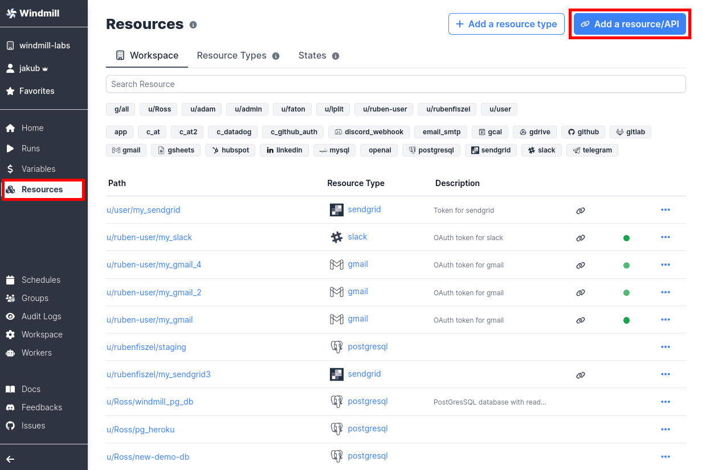
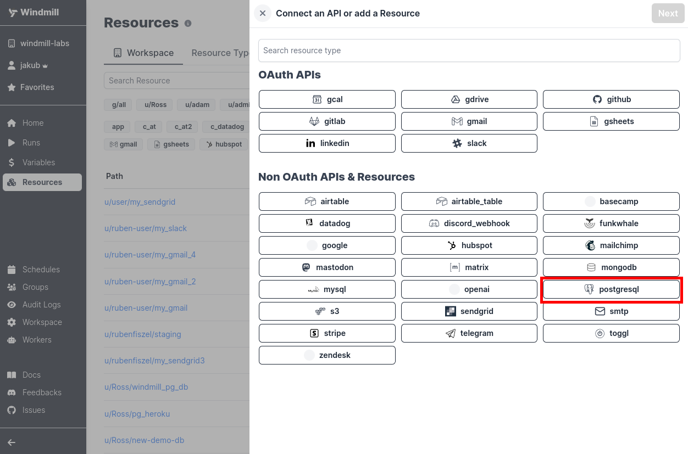
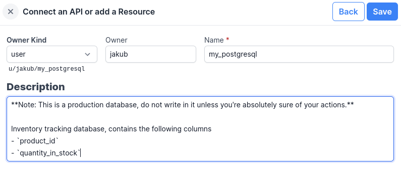
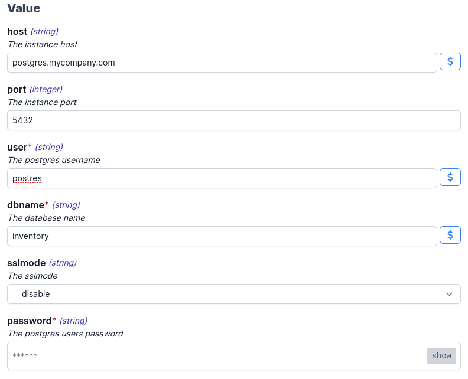
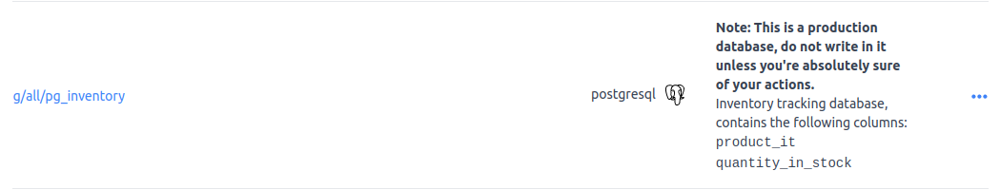
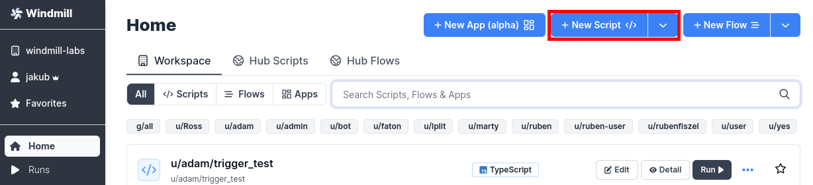
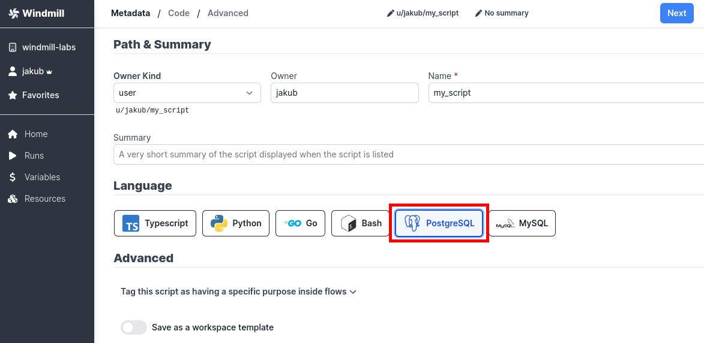
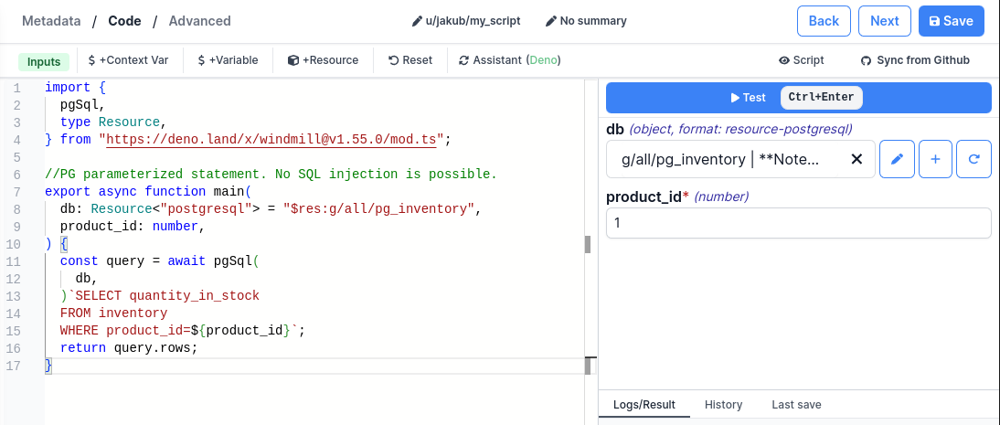
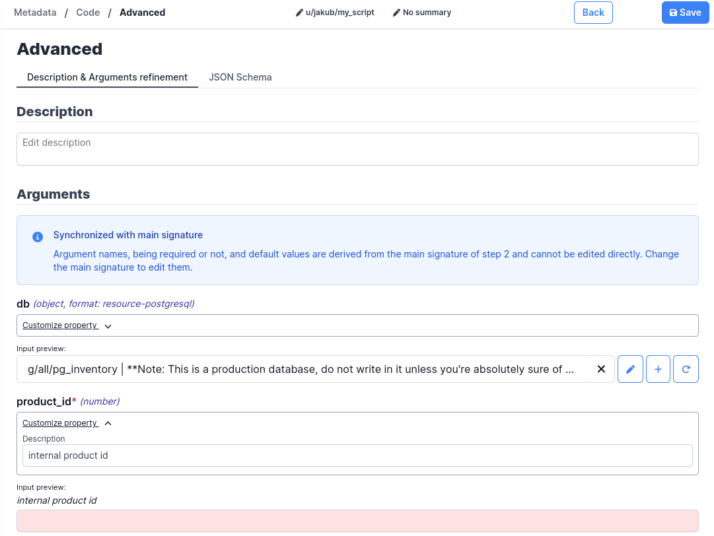

# Postgres

## Getting started

We will see how to connect your Windmill instance to an external Postgres
database, then use it in scripts.

## Create Resource

We need to define a `postgresql` [Resource][docs-resources].

Windmill provides integration with multiple different services and apps. We call
them _Resources Types_, and offer integrations with databases, enterprise chat
platforms or code versioning systems, to name a few.

You can also define your own types, but that will be covered in a different
section.

Head to the Resources tab and click on "Add a resource" button in the top right
corner.

Next we need to define the metadata.

**Path** is the unique identifier on the platform. It defines the visibility
scopes and ownership. For more information check the
[reference documentation][docs-path].

For this example we want to create a resource shareable to all the users of our
workspace:

- For **Owner Kind**, choose `group`, allowing everyone in that group to access
  the resource.
- **Owner** should be `all`, for the aforementioned reasons.
- Since we're creating an inventory database resource, let's **Name** it
  `pg_inventory`.
- **Description**, while not obligatory, is always a good idea. You can include
  any and all information to users of the resource. Let's put a warning that
  this is a production database, and users should be weary about their actions.

:::tip You can use Markdown formatting in the Description field.
 

:::

Fill in your connection details, and click "Save" to create the resource.

Once created, it can be seen in the [Resources][wm-app-resources] section.

Congratulations, you have just created a shared Postgres database resource!

## Create Script

Next, let's create a Script that will use the newly created resource.

We will use Postgres' parameterized queries template in TypeScript/Deno as
language.

Let's add the Script's code:

:::tip You can specify default values for parameters, they will automatically be used in the next step

 

Click Next to move on to the Advanced step.

 

Here we can customize the UI of the Script, give parameters descriptions, and
default values.

 

:::

From the dropdown menu, you can select the database we created in previous step.
Note you can see the description you provided in the previous step.

Once you're done, click on Save to save the Script to your workspace. You can
now use the created Script in your Flows, or as standalone.

<!-- Links -->

[wm-app-resources]: https://app.windmill.dev/resources
[docs-resources]: ../../reference/index.md#resource
[docs-path]: ../../reference/index.md#path
