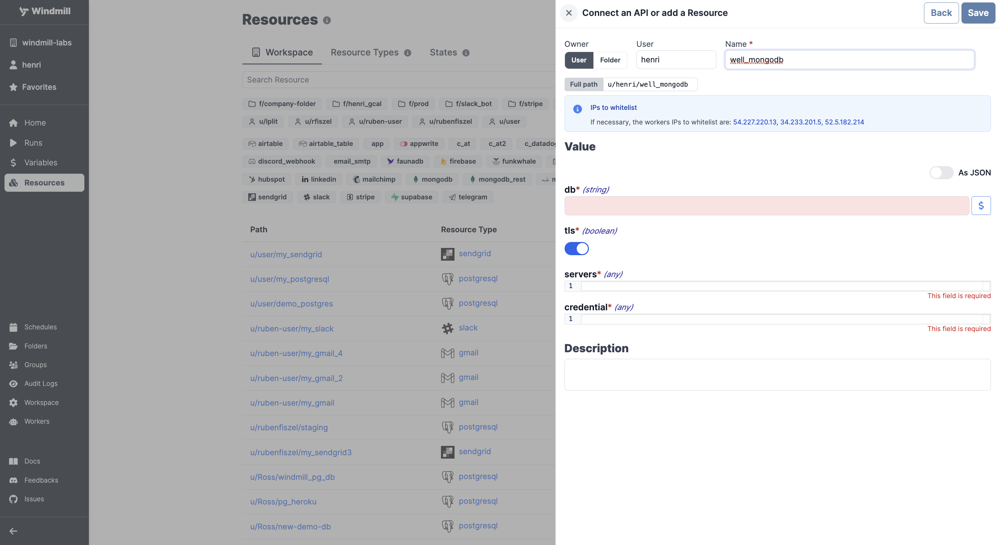

# Redis integration

[Redis](https://redis.io/) is an in-memory data structure store used as a database, cache, and message broker.

Redis follows the same connection method as [MongoDB](./mongodb.md), providing the database name, TLS settings, server information, and credentials for authentication.

Here's a table detailing the properties for Redis integration using the [MongoDB resource type](https://hub.windmill.dev/resource_types/22/mongodb):

Here's the table filled out for an Upstash connection:

| Property          | Type    | Description                | Default | Required | Where to Find       | Additional Details                                   |
| ----------------- | ------- | -------------------------- | ------- | -------- | ------------------- | ---------------------------------------------------- |
| db                | integer | Database index             | 0       | false    | Upstash Dashboard   | Index of the Upstash database you want to connect to |
| tls               | boolean | Use TLS for connections    | true    | false    | Your own preference | Set to true for secure connections                   |
| servers           | array   | Array of server objects    |         | true     | Upstash Dashboard   | Each server object should contain `host` and `port`  |
| host (nested)     | string  | Server address             |         | true     | Upstash Dashboard   | Hostname of the Upstash instance                     |
| port (nested)     | integer | Port number                | 6379    | false    | Upstash Dashboard   | Default Redis port is `6379`                         |
| credential        | object  | Authentication information |         | true     | Upstash Dashboard   | Contains `password`                                  |
| password (nested) | string  | Database password          |         | true     | Upstash Dashboard   | Your Upstash server's password                       |
