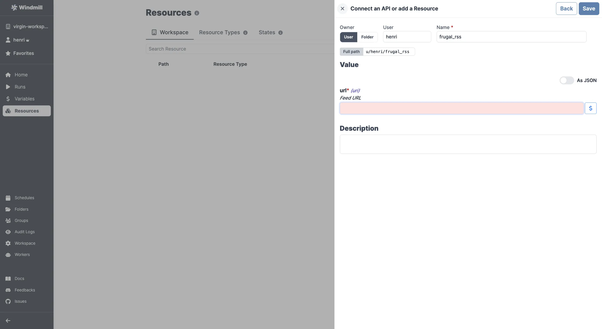

# RSS Integration

To integrate [RSS](https://rss.com/) to Windmill, you need to save the following elements as a [resource](../core_concepts/3_resources_and_types/index.mdx).

| Property | Type   | Description | Default | Required | Where to Find                           |
| -------- | ------ | ----------- | ------- | -------- | --------------------------------------- |
| url      | string | Feed URL    |         | true     | Provided by the RSS feed source website |

  

:::tip

Find some pre-set interactions with RSS on the [Hub](https://hub.windmill.dev/integrations/RSS).

Feel free to create your own RSS scripts on [Windmill](../getting_started/00_how_to_use_windmill/index.mdx).

:::
