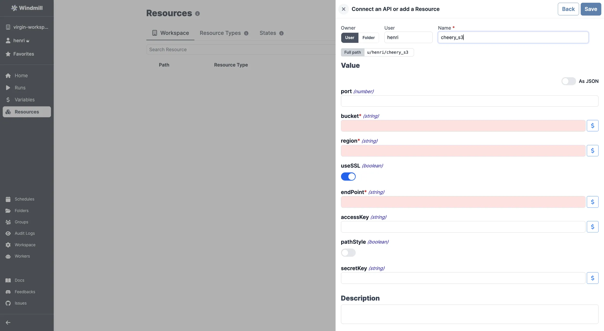

# S3 APIs integrations

Windmill provides a unique [resource type](https://hub.windmill.dev/resource_types/42/) for any API following the typical S3 schema.

Here are the required details:

| Property  | Type    | Description               | Default | Required |
| --------- | ------- | ------------------------- | ------- | -------- |
| bucket    | string  | S3 bucket name            |         | true     |
| region    | string  | S3 region for the bucket  |         | true     |
| useSSL    | boolean | Use SSL for connections   | true    | false    |
| endPoint  | string  | S3 endpoint               |         | true     |
| accessKey | string  | AWS access key            |         | false    |
| pathStyle | boolean | Use path-style addressing | false   | false    |
| secretKey | string  | AWS secret key            |         | false    |

 

For guidlines on where to find such details on a given platform, please go to the [AWS S3](./aws-s3.md) or [Cloudflare R2](./cloudlare-r2.md) pages.

 

:::tip

Find some pre-set interactions with S3 on the [Hub](https://hub.windmill.dev/integrations/s3).

Feel free to create your own S3 scripts on [Windmill](../getting_started/00_how_to_use_windmill/index.mdx).

:::
