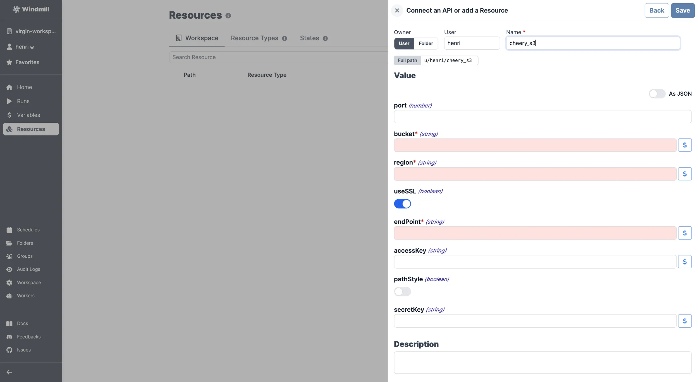
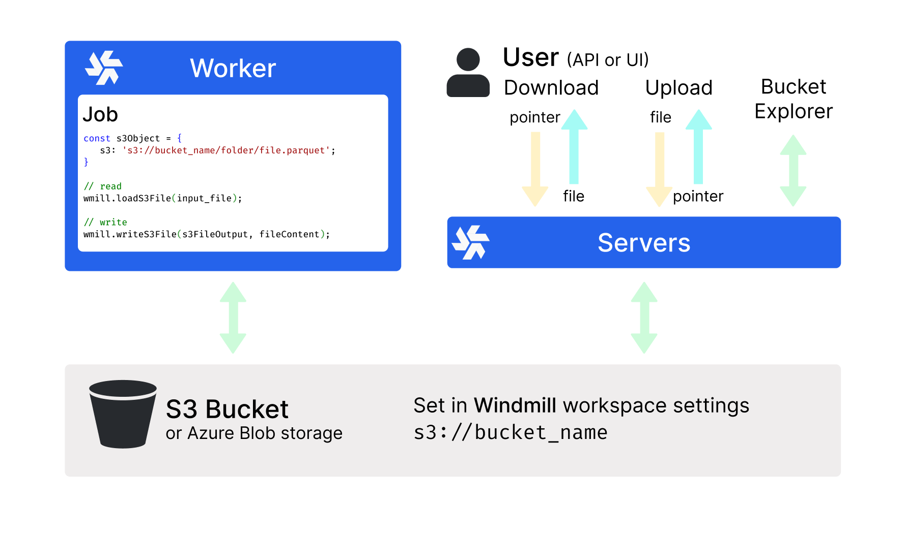

import DocCard from '@site/src/components/DocCard';

# S3 APIs integrations

S3 is a cloud-based object storage service designed to store and retrieve any amount of data.

Instance and workspace object storage are different from using S3 resources within scripts, flows, and apps, which is free and unlimited. This is what is [described in this page](#add-a-s3-resource).

At the [workspace level](../core_concepts/38_object_storage_in_windmill/index.mdx#workspace-object-storage), what is exclusive to the [Enterprise](/pricing) version is using the integration of Windmill with S3 that is a major convenience layer to enable users to read and write from S3 without having to have access to the credentials.

Additionally, for [instance integration](../core_concepts/38_object_storage_in_windmill/index.mdx#instance-object-storage), the Enterprise version offers advanced features such as large-scale log management and distributed dependency caching.

Windmill provides a unique [resource type](https://hub.windmill.dev/resource_types/42/) for any API following the typical S3 schema.

## Add a S3 resource

Here are the required details:

| Property  | Type    | Description               | Default | Required |
| --------- | ------- | ------------------------- | ------- | -------- |
| bucket    | string  | S3 bucket name            |         | true     |
| region    | string  | S3 region for the bucket  |         | true     |
| useSSL    | boolean | Use SSL for connections   | true    | true    |
| endPoint  | string  | S3 endpoint               |         | true     |
| accessKey | string  | AWS access key            |         | false    |
| pathStyle | boolean | Use path-style addressing | false   | true    |
| secretKey | string  | AWS secret key            |         | false    |

 

For guidelines on where to find such details on a given platform, please go to the [AWS S3](./aws-s3.mdx), [Cloudflare R2](./cloudflare-r2.mdx), or [Google Cloud Storage](./google-cloud-storage.mdx) pages.

Your resource can be used [passed as parameters](../core_concepts/3_resources_and_types/index.mdx#passing-resources-as-parameters-to-scripts-preferred) or [directly fetched](../core_concepts/3_resources_and_types/index.mdx#fetching-them-from-within-a-script-by-using-the-wmill-client-in-the-respective-language) within [scripts](../script_editor/index.mdx), [flows](../flows/1_flow_editor.mdx) and [apps](../apps/0_app_editor/index.mdx).

<iframe
	style={{ aspectRatio: '16/9' }}
	src="https://www.youtube.com/embed/ggJQtzvqaqA"
	title="YouTube video player"
	frameBorder="0"
	allow="accelerometer; autoplay; clipboard-write; encrypted-media; gyroscope; picture-in-picture; web-share"
	allowFullScreen
	className="border-2 rounded-lg object-cover w-full dark:border-gray-800"
></iframe>

 

> Example of a Supabase resource being used in two different manners from a script in Windmill.
 

:::tip

Find some pre-set interactions with S3 on the [Hub](https://hub.windmill.dev/integrations/s3).

Feel free to create your own S3 scripts on [Windmill](../getting_started/00_how_to_use_windmill/index.mdx).

:::

## Workspace object storage

Once you've created an S3, Azure Blob, or Google Cloud Storage resource in Windmill, you can use Windmill's native integration with S3-compatible storage, making it the recommended storage for large objects like files and binary data.

The workspace object storage is exclusive to the [Enterprise](/pricing) edition. It is meant to be a major convenience layer to enable users to read and write from S3 without having to have access to the credentials.

	<DocCard
		title="Workspace object storage"
		description="Connect your Windmill workspace to your S3 bucket, Azure Blob storage, or Google Cloud Storage to enable users to read and write from object storage without having to have access to the credentials."
		href="/docs/core_concepts/object_storage_in_windmill#workspace-object-storage"
	/>

## Instance object storage

Under [Enterprise Edition](/pricing), instance object storage offers advanced features to enhance performance and scalability at the [instance](../advanced/18_instance_settings/index.mdx) level. This integration is separate from the [Workspace object storage](#workspace-object-storage) and provides solutions for large-scale log management and distributed dependency caching.

	<DocCard
		title="Instance object storage"
		description="Connect your Windmill instance to your S3 bucket, Azure Blob storage, or Google Cloud Storage to enable advanced features like distributed caching and large log storage."
		href="/docs/core_concepts/object_storage_in_windmill#instance-object-storage"
	/>

