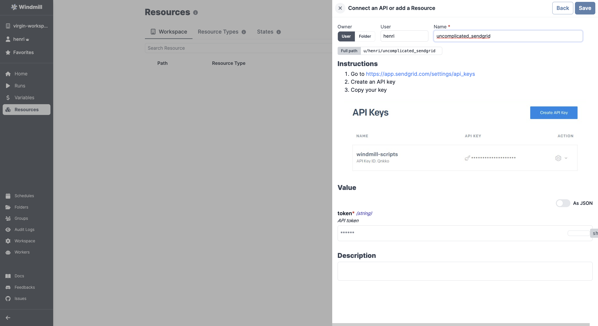

# Sendgrid Integration

To integrate [Sendgrid](https://sendgrid.com/) to Windmill, you need to save the following elements as a [resource](../core_concepts/3_resources_and_types/index.mdx).

| Property | Type   | Description | Required | Where to find                                                                      |
| -------- | ------ | ----------- | -------- | ---------------------------------------------------------------------------------- |
| token    | string | API token   | true     | 1. https://app.sendgrid.com/settings/api_keys 2.Create an API key 3. Copy your key |

  

:::tip

Find some pre-set interactions with Sendgrid on the [Hub](https://hub.windmill.dev/integrations/sendgrid).

Feel free to create your own Sendgrid scripts on [Windmill](../getting_started/00_how_to_use_windmill/index.mdx).

:::
