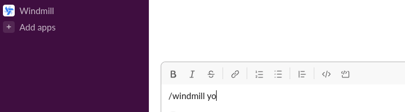

# Slack

Windmill features built-in Slack integration. There is actually more than one
way to integrate with Slack:

1. As a Windmill workspace admin allowing Windmill Slack Bot integration via
   `/windmill` command.
2. As a regular user allowing Windmill scripts performing operations on your
   behalf in Slack.
3. By providing a Slack token. Actions are constrained by the token kind and
   scopes.

## Slack Bot integration

Our goal here is to be able to:
* use slack bot token in Windmill scripts
* invoke a Windmill script from Slack, by using `/windmill` command

:::tip

All members of `g/slack` group can use Slack bot token. It allows Windmill
script to act on behalf of the installed app of the connected workspace.

:::

First of all you need to be a workspace admin. Then you should go to [workspace
settings page](https://app.windmill.dev/workspace_settings).

### Connect to Slack workspace

Let's connect now with some Slack workspace

### Using slack bot token in Windmill scripts

You need to be in `g/slack` group to be able to use this token:

Then it will be available in resources:

### Using /windmill command in Slack

Great! We've established Windmill-Slack connection, but it's not over yet. We
need a Windmill script that will be invoked on the event triggered by
`/windmill` command.

:::caution

Script's `main()` function must have specific signature, meaning it must
define `response_url: string` parameter and `text: string` parameter.

Don't worry about the value for `response_url` - Windmill will inject correct
value for you on each Slack event.

:::

#### Re-using script from WindmillHub

Having in mind that our script needs to implement specific interface let's not
reinvent the wheel but use [already existing script from
WindmillHub](https://hub.windmill.dev/scripts/slack/1405/example-of-responding-to-a-slack-command-slack)

#### Use script as a handler for Slack event

After creating a Windmill script that will handle a Slack event let's get back
to workspace settings and assign our script.

#### Time to test the integration

Let's test our integration by going to Slack and firing `/winmill yo` command.

Notice that Windmill Slack bot responded with job URL where you can preview the
job that was triggered by the `/winmill` command.

After job successfully finished, bot sent additional message with the text that
you used with `/windmill` command.

## Windmill acting on Slack on user's behalf

Our goal here is to allow Windmill scripts acting on Slack on your behalf.

Lets add a Slack resource. From "Resources" view select "Connect an API"
and then select Slack

