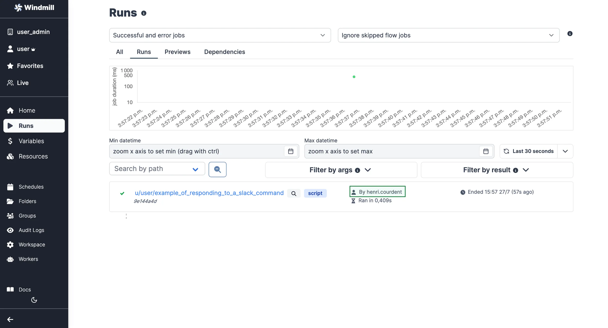

import DocCard from '@site/src/components/DocCard';

# Slack Integration

[Slack](https://slack.com/) is an instant messaging and collaboration platform.

There are two ways to build interactions between Slack and Windmill: run code on Windmill by a Slack command or use the
Slack API directly from Windmill. In this guide, we'll cover both approaches.

<video
	className="border-2 rounded-xl object-cover w-full h-full dark:border-gray-800"
	controls
	src="/videos/slack_handler.mp4"
/>

## Action on Windmill from Slack

The goal here is to be able to invoke a Windmill Script from Slack, by using
`/windmill` command.

<video
	className="border-2 rounded-xl object-cover w-full h-full dark:border-gray-800"
	controls
	src="/videos/slack_script.mp4"
/>

<br />

First, you need to be a **workspace admin**. Then you
should go to

<a href="https://app.windmill.dev/workspace_settings" rel="nofollow">
	Workspace Settings Page
</a>
and select the "Slack Command" tab. On there, click "Connect to Slack".

:::info Self-hosted

The Slack integration is done through OAuth. On [self-hosted instances](../advanced/1_self_host/index.mdx), integrating an OAuth API will require [Setup OAuth and SSO](../misc/2_setup_oauth/index.mdx).

:::

Slack will ask you to allow Windmill to access your workspace. Click "Allow".

<video
	className="border-2 rounded-xl object-cover w-full h-full dark:border-gray-800"
	controls
	src="/videos/adding_slack_resource.mp4"
/>

<br />

:::note

At the time of writing, Slack cautions that Windmill is not an approved app. We
are working on getting the app approved but you can safely ignore it for now.

:::

You can connect multiple Windmill workspaces to the same Slack workspace. Only one Windmill workspace can accept the `/windmill` [commands](#using-commands-on-slack) from a given Slack workspace. This feature is mostly useful for the [error handler](#error-handlers).

### Using commands on Slack

Once you allow access, you will be redirected to the Slack settings in Windmill.
We'll create a command handler Script first, so let's click "Create a script to
handle Slack command".

You will be navigated to the Script editor. Give your script a name
(e.g. `slack_command_handler`), a short summary (e.g. "Slack command handler"). You'll get to [this](https://hub.windmill.dev/scripts/slack/1405/example-of-responding-to-a-slack-command-slack) template:

```typescript
export async function main(response_url: string, text: string) {
	const x = await fetch(response_url, {
		method: 'POST',
		body: JSON.stringify({ text: `ROGER ${text}` })
	});
	const username = await Deno.env.get('WM_USERNAME');
	console.log(`user = ${username}`);
}
```

After the Script is deployed, navigate back to the

<a href="https://app.windmill.dev/workspace_settings?tab=slack" rel="nofollow">
	Slack settings
</a>
Choose the "Script" option for adding a command handler and select your newly created Script.


Congratulations! You've just created a Slack command handler. Now you can use
the `/windmill` command in your Slack workspace to trigger the Script. Try it
out with `/windmill foo` and you should get back `ROGER foo`. Go ahead and
customize the Script to your needs.

In addition to response_url, the script/flow can use the following parameters, simply by having them as inputs with the proper name:

```
channel_id
user_name
user_id
command
trigger_id
api_app_id
```


You won't be able to have Slack interact with your [resources](../core_concepts/3_resources_and_types/index.mdx) and [variables](../core_concepts/2_variables_and_secrets/index.mdx) before adding them to the `slack` [group](../core_concepts/8_groups_and_folders/index.mdx#groups) that was automatically created by Windmill after you set up your Slack workspace on Windmill. Tutorial below.

<details>
  <summary>How to let Slack use your resources and variables:</summary>

To give the permission, go to "Resources" (and "Variables") menu, click on `Share`, `Group` and pick `slack`.

<br />


<br />

One simplier way to handle permissions is to host resources and variables on a [folder](../core_concepts/8_groups_and_folders/index.mdx#folders) that is part of the [group](../core_concepts/8_groups_and_folders/index.mdx#groups) `slack`.

<br />


<br />


</details>

### Handle multiple commands

We cover in a [subsequent article](/blog/handler-slack-commands) how to manage multiple commands & human-in-the-loop steps from your slackbot using [branches](../flows/13_flow_branches.md), a text parser and [approval steps](../flows/11_flow_approval.mdx).

<video
	className="border-2 rounded-xl object-cover w-full h-full dark:border-gray-800"
	controls
	src="/videos/generated_email.mp4"
	alt="Slack Windmill"
/>

<br />

<div className="grid grid-cols-2 gap-6 mb-4">
	<DocCard
		title="Tutotial - Handler of multiple Slack commands"
		description="Create a flow with a parser & branches that will handle multiple Slack commands."
		href="/blog/handler-slack-commands#control-the-slackbot-by-getting-username"
	/>
</div>

### Monitor who ran the command

You can see who ran the `/windmill` command by going to the

<a href="https://app.windmill.dev/runs" rel="nofollow">
	Runs page
</a>
on Windmill. The runs will be permissioned through the `g/slack` global group.



You can also monitor and permission it from within the script leveraging the [contextual variable](../core_concepts/2_variables_and_secrets/index.mdx#contextual-variables) `WM_USERNAME` that will get the value of the Slack user.

For example our script:

```ts
export async function main(response_url: string, text: string) {
	const x = await fetch(response_url, {
		method: 'POST',
		body: JSON.stringify({ text: `ROGER ${text}` })
	});
	// This part:
	const username = await Deno.env.get('WM_USERNAME');
	console.log(`user = ${username}`);
}
```

will console.log `user = username`, username being the Slack username.

## Action on Slack from Windmill

The second way to make Slack and Windmill interact is through scripts triggered from Windmill to the Slack API. In other words, our goal here is to allow Windmill Scripts
acting on Slack on your behalf.

Lets navigate to the <a href="https://app.windmill.dev/resources" rel="nofollow">Resources page</a> page and click "Add a
resource/API".

:::info

You can read more about Resources in the documentation [here][docs-resource].

:::


Select the `slack` Resource Type from the "OAuth APIs" list and by clicking
"Connect", you will be redirected to the Slack account associated with your browser. Click "Allow" to let
Windmill access your Slack workspace. Once that's done, you will be redirected
back to Windmill, where you can name your Slack Resource and Save it.

:::note

On [self-hosted instances](../advanced/1_self_host/index.mdx), integrating an OAuth API will require [Setup OAuth and SSO](../misc/2_setup_oauth/index.mdx).

:::

<video
	className="border-2 rounded-xl object-cover w-full h-full dark:border-gray-800"
	controls
	src="/videos/slack_through_windmill.mp4"
	alt="Connect Slack to Windmill"
/>

<br />

Your connection is made! Now you can trigger the Slack API from Windmill.

For example, try [this script](https://hub.windmill.dev/scripts/slack/1284/send-message-to-channel-slack) to send a message to a channel.

```typescript
import { WebClient } from 'https://deno.land/x/slack_web_api@1.0.0/mod.ts';
type Slack = {
	token: string;
};

export async function main(text: string, channel: string, slack: Slack) {
	const web = new WebClient(slack.token);

	await web.chat.postMessage({
		channel,
		text
	});
}
```


### Have messages published on Windmill's behalf

Using the resource created above, Slack will behave on your behalf (under your name).

To have messages published on Windmill's behalf, use the Slack resource created in the [Action on Windmill from Slack](#action-on-windmill-from-slack) section.

<video
	className="border-2 rounded-xl object-cover w-full h-full dark:border-gray-800"
	controls
	src="/videos/slack_bots.mp4"
/>

<br />

:::info What's next?
Also, explore more Slack scripts, flows and apps on [Windmill Hub](https://hub.windmill.dev/integrations/slack).
:::

### Error Handlers

Slack is an efficient way to be notified of errors on a Windmill run, whole workspace or instance. Windmill provides an integration for error handling on Slack.

More details on [Error Handling](../core_concepts/10_error_handling/index.mdx) page.

<!-- Links -->

[hub-slack]: https://hub.windmill.dev/integrations/slack
[hub-script]: https://hub.windmill.dev/scripts/slack/649/list-users-slack
[docs-resource]: /docs/core_concepts/resources_and_types
