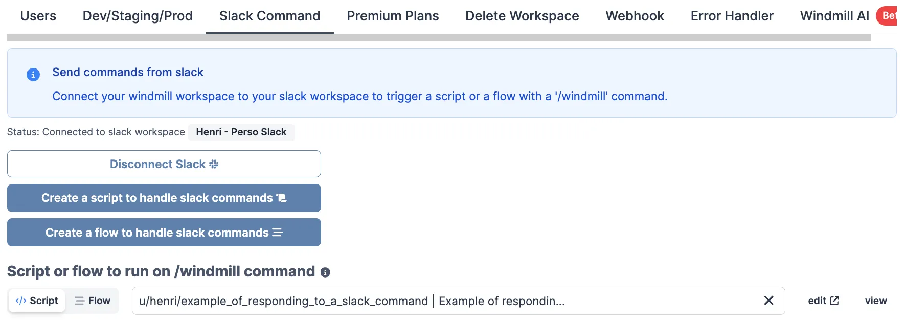
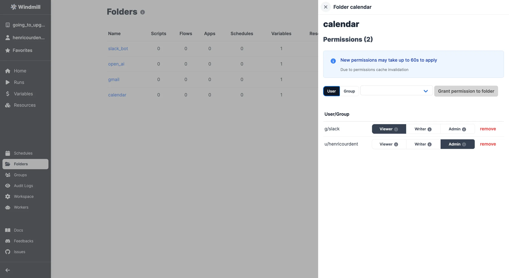

import DocCard from '@site/src/components/DocCard';
import Tabs from '@theme/Tabs';
import TabItem from '@theme/TabItem';

# Slack integration

[Slack](https://slack.com/) is an instant messaging and collaboration platform.

There are two ways to build interactions between Slack and Windmill: run code on Windmill by a Slack command or use the
Slack API directly from Windmill. In this guide, we'll cover both approaches.

<video
	className="border-2 rounded-lg object-cover w-full h-full dark:border-gray-800"
	controls
	src="/videos/slack_handler.mp4"
/>

## Action on Windmill from Slack

The goal here is to be able to invoke a Windmill Script from Slack, by using
`/windmill` command.

<video
	className="border-2 rounded-lg object-cover w-full h-full dark:border-gray-800"
	controls
	src="/videos/slack_script.mp4"
/>

<br />

First, you need to be a **workspace admin**. Then you
should go to

<a href="https://app.windmill.dev/workspace_settings" rel="nofollow">
	Workspace Settings Page
</a>
and select the "Slack Command" tab. On there, click "Connect to Slack".

:::info Self-hosted

The Slack integration is done through OAuth. On [self-hosted instances](../advanced/1_self_host/index.mdx), integrating an OAuth API will require [Setup OAuth and SSO](../misc/2_setup_oauth/index.mdx).

:::

:::tip Workspace-level configuration

By default, the OAuth flow uses instance-level Slack app credentials configured by your administrator. Workspace admins can also [configure their own Slack app](#workspace-level-slack-app-configuration) with workspace-specific credentials for better isolation and independent management.

:::

Slack will ask you to allow Windmill to access your workspace. Click "Allow".

<video
	className="border-2 rounded-lg object-cover w-full h-full dark:border-gray-800"
	controls
	src="/videos/adding_slack_resource.mp4"
/>

<br />

:::note

At the time of writing, Slack cautions that Windmill is not an approved app. We
are working on getting the app approved but you can safely ignore it for now.

:::

You can connect multiple Windmill workspaces to the same Slack workspace. Only one Windmill workspace can accept the `/windmill` [commands](#using-commands-on-slack) from a given Slack workspace. This feature is mostly useful for the [error handler](#error-handlers).

### Using commands on Slack

Once you allow access, you will be redirected to the Slack settings in Windmill.
We'll create a command handler Script first, so let's click "Create a script to
handle Slack command".

You will be navigated to the Script editor. Give your script a name
(e.g. `slack_command_handler`), a short summary (e.g. "Slack command handler"). You'll get to [this](https://hub.windmill.dev/scripts/slack/1405/example-of-responding-to-a-slack-command-slack) template:

```typescript
export async function main(response_url: string, text: string) {
	const x = await fetch(response_url, {
		method: 'POST',
		body: JSON.stringify({ text: `ROGER ${text}` })
	});
	const username = await Deno.env.get('WM_USERNAME');
	console.log(`user = ${username}`);
}
```

After the Script is deployed, navigate back to the

<a href="https://app.windmill.dev/workspace_settings?tab=slack" rel="nofollow">
	Slack settings
</a>
Choose the "Script" option for adding a command handler and select your newly created Script.



Congratulations! You've just created a Slack command handler. Now you can use
the `/windmill` command in your Slack workspace to trigger the Script. Try it
out with `/windmill foo` and you should get back `ROGER foo`. Go ahead and
customize the Script to your needs.

In addition to `response_url`, the script/flow can use the following parameters, simply by having them as inputs with the proper name:

```
channel_id
user_name
user_id
command
trigger_id
api_app_id
```


### Using @mentions

In addition to slash commands, you can trigger your Windmill scripts by @mentioning the Windmill bot in any channel, thread, or direct message. @mentions work identically to `/windmill` commands - they use the same handler script configured in your workspace settings and pass the same parameters.

When you @mention the bot (e.g., `@Windmill hello world`), the bot mention is automatically stripped from the text before being passed to your handler script, so it receives just `hello world` - identical to how `/windmill hello world` would work.

@mentions work in:
- Public channels (when the bot is invited to the channel)
- Private channels (when the bot is invited)
- Direct messages with the bot
- Message threads (reply to any message and @mention the bot)

The `command` parameter will be set to `@mention` for @mention triggers (vs `/windmill` for slash commands), allowing your handler to distinguish between the two if needed.

Available parameters for @mention triggers:

```
text           // Message text with bot mention stripped
channel_id     // Channel where message was sent
user_id        // Slack user ID who sent the message
command        // Set to "@mention" for @mentions
event_id       // Unique event identifier
ts             // Message timestamp
thread_ts      // Thread timestamp (if in a thread)
```

:::note
@mentions are delivered via Slack's Events API, which means your handler must respond within 3 seconds. For longer-running operations, launch a job and send updates to Slack asynchronously using the Slack API.
:::

#### Responding to `/` commands vs `@` mentions

When handling Slack triggers, the response method differs depending on the trigger type:

**For `/windmill` slash commands**: Use the `response_url` parameter (a webhook URL) to send your response back to Slack.

**For `@mention` triggers**: Use the Slack Web API with the bot token to post messages to the channel.

<Tabs className="unique-tabs">
<TabItem value="deno" label="Deno" attributes={{className: "text-xs p-4 !mt-0 !ml-0"}}>

```typescript
import { WebClient } from 'https://deno.land/x/slack_web_api@1.0.3/mod.ts';
import * as wmill from 'https://deno.land/x/windmill@v1.85.0/mod.ts';

type Slack = {
  token: string;
};

export async function main(
  text: string,
  response_url: string,
  channel_id: string,
  command: string
) {
  const responseText = `You said: ${text}`;

  if (command === '@mention') {
    // For @mentions: use Slack Web API
    const slack = await wmill.getResource<Slack>('f/slack_bot/bot_token');
    const web = new WebClient(slack.token);
    await web.chat.postMessage({
      channel: channel_id,
      text: responseText
    });
  } else {
    // For /windmill commands: use response_url
    await fetch(response_url, {
      method: 'POST',
      body: JSON.stringify({ text: responseText })
    });
  }
}
```

</TabItem>

<TabItem value="bun" label="Bun" attributes={{className: "text-xs p-4 !mt-0 !ml-0"}}>

```typescript
import { WebClient } from '@slack/web-api';
import * as wmill from 'windmill-client';

type Slack = {
  token: string;
};

export async function main(
  text: string,
  response_url: string,
  channel_id: string,
  command: string
) {
  const responseText = `You said: ${text}`;

  if (command === '@mention') {
    // For @mentions: use Slack Web API
    const slack = await wmill.getResource<Slack>('f/slack_bot/bot_token');
    const web = new WebClient(slack.token);
    await web.chat.postMessage({
      channel: channel_id,
      text: responseText
    });
  } else {
    // For /windmill commands: use response_url
    await fetch(response_url, {
      method: 'POST',
      body: JSON.stringify({ text: responseText })
    });
  }
}
```

</TabItem>

<TabItem value="python" label="Python" attributes={{className: "text-xs p-4 !mt-0 !ml-0"}}>

```python
from slack_sdk import WebClient
import wmill
import requests
import json

def main(text: str, response_url: str, channel_id: str, command: str):
    response_text = f"You said: {text}"

    if command == "@mention":
        # For @mentions: use Slack Web API
        slack = wmill.get_resource("f/slack_bot/bot_token")
        client = WebClient(token=slack["token"])
        client.chat_postMessage(
            channel=channel_id,
            text=response_text
        )
    else:
        # For /windmill commands: use response_url
        requests.post(
            response_url,
            data=json.dumps({"text": response_text}),
            headers={"Content-Type": "application/json"}
        )
```

</TabItem>
</Tabs>

### Workspace-level Slack app configuration

By default, workspaces use the instance-level Slack app configured by your Windmill administrator. However, workspace admins can optionally configure their own Slack app for their workspace. This provides:

- **Workspace isolation**: Each workspace uses its own Slack app and credentials
- **Separate rate limits**: Avoid sharing rate limits across workspaces
- **Independent management**: Workspace admins can manage their own Slack integration

To configure a workspace-specific Slack app:

1. Navigate to workspace settings → Slack app section
2. Enter your Slack app's **Client ID** and **Client Secret**
3. Save the configuration

:::note
The workspace-level Slack app will only apply to the auomatically managed `f/slack_bot/bot_token` resource used for workspace handlers and slack approvals. For general user specific slack oauth tokens, the instance level OAuth connection will be used.
:::

You won't be able to have Slack interact with your [resources](../core_concepts/3_resources_and_types/index.mdx) and [variables](../core_concepts/2_variables_and_secrets/index.mdx) before adding them to the `slack` [group](../core_concepts/8_groups_and_folders/index.mdx#groups) that was automatically created by Windmill after you set up your Slack workspace on Windmill. Tutorial below.

<details>
  <summary>How to let Slack use your resources and variables:</summary>

To give the permission, go to "Resources" (and "Variables") menu, click on `Share`, `Group` and pick `slack`.

<br />


<br />

One simplier way to handle permissions is to host resources and variables on a [folder](../core_concepts/8_groups_and_folders/index.mdx#folders) that is part of the [group](../core_concepts/8_groups_and_folders/index.mdx#groups) `slack`.

<br />


<br />



</details>

### Handle multiple commands

We cover in a [subsequent article](/blog/handler-slack-commands) how to manage multiple commands & human-in-the-loop steps from your slackbot using [branches](../flows/13_flow_branches.md), a text parser and [approval steps](../flows/11_flow_approval.mdx).

<video
	className="border-2 rounded-lg object-cover w-full h-full dark:border-gray-800"
	controls
	src="/videos/generated_email.mp4"
	alt="Slack Windmill"
/>

<br />

<div className="grid grid-cols-2 gap-6 mb-4">
	<DocCard
		title="Tutotial - Handler of multiple Slack commands"
		description="Create a flow with a parser & branches that will handle multiple Slack commands."
		href="/blog/handler-slack-commands#control-the-slackbot-by-getting-username"
	/>
</div>

### Monitor who ran the command

You can see who ran the `/windmill` command by going to the

<a href="https://app.windmill.dev/runs" rel="nofollow">
	Runs page
</a>
on Windmill. The runs will be permissioned through the `g/slack` global group.


You can also monitor and permission it from within the script leveraging the [contextual variable](../core_concepts/47_environment_variables/index.mdx#contextual-variables) `WM_USERNAME` that will get the value of the Slack user.

For example our script:

```ts
export async function main(response_url: string, text: string) {
	const x = await fetch(response_url, {
		method: 'POST',
		body: JSON.stringify({ text: `ROGER ${text}` })
	});
	// This part:
	const username = await Deno.env.get('WM_USERNAME');
	console.log(`user = ${username}`);
}
```

will console.log `user = username`, username being the Slack username.

### Slack approval steps

[Approval steps](../flows/11_flow_approval.mdx) are a way to suspend a [flow](../flows/1_flow_editor.mdx) until specific event(s) are received, such as approvals or cancellations. You can use them to handle approvals from Slack.

The Windmill [Python](../advanced/2_clients/python_client.md) and [TypeScript](../advanced/2_clients/ts_client.mdx) clients both have a helper function to request an interactive approval on Slack. An interactive approval is a Slack message that can be approved or rejected directly from Slack without having to go back to the Windmill UI.

<iframe
	style={{ aspectRatio: '16/9' }}
	src="https://www.youtube.com/embed/wUvqom8nmM4"
	title="Slack approval step"
	allow="accelerometer; autoplay; clipboard-write; encrypted-media; gyroscope; picture-in-picture; web-share"
	allowFullScreen
	className="border-2 rounded-lg object-cover w-full dark:border-gray-800"
></iframe>

<br />

The following hub scripts can be used:
- Python: [Request Interactive Slack Approval](https://hub.windmill.dev/scripts/slack/11403/request-interactive-slack-approval-(python)-slack)
- TypeScript: [Request Interactive Slack Approval](https://hub.windmill.dev/scripts/slack/11402/request-interactive-slack-approval-slack)

If you define a [form](../flows/11_flow_approval.mdx#form) on the approval step, the form will be displayed in the Slack message as a modal.


Both of these scripts are using the Windmill client helper function:

<Tabs className="unique-tabs">
<TabItem value="python" label="Python" attributes={{className: "text-xs p-4 !mt-0 !ml-0"}}>
```python
wmill.request_interactive_slack_approval(
    slack_resource_path="/u/username/my_slack_resource",
    channel_id="admins-slack-channel",
    message="Please approve this request",
    approver="approver123",
    default_args_json={"key1": "value1", "key2": 42},
    dynamic_enums_json={"foo": ["choice1", "choice2"], "bar": ["optionA", "optionB"]},
)
```
</TabItem>

<TabItem value="bun" label="Bun" attributes={{className: "text-xs p-4 !mt-0 !ml-0"}}>
```ts
await wmill.requestInteractiveSlackApproval({
    slackResourcePath: "/u/username/my_slack_resource",
    channelId: "admins-slack-channel",
    message: "Please approve this request",
    approver: "approver123",
    defaultArgsJson: { key1: "value1", key2: 42 },
    dynamicEnumsJson: { foo: ["choice1", "choice2"], bar: ["optionA", "optionB"] },
});
```
</TabItem>
</Tabs>

Where [dynamic_enums](../flows/11_flow_approval.mdx#dynamics-enums) can be used to dynamically set the options of enum form arguments and [default_args](../flows/11_flow_approval.mdx#default-args) can be used to dynamically set the default values of form arguments.

If multiple approvals are required, you can use the client helper directly and send approval requests to different channels:

<Tabs className="unique-tabs">
<TabItem value="python" label="Python" attributes={{className: "text-xs p-4 !mt-0 !ml-0"}}>
```python
import wmill

def main():
    # Send approval request to customers
    wmill.request_interactive_slack_approval(
        'u/username/slack_resource',
        'customers',
    )

    # Send approval request to admins
    wmill.request_interactive_slack_approval(
        'u/username/slack_resource',
        'admins',
    )
```
</TabItem>

<TabItem value="bun" label="Bun" attributes={{className: "text-xs p-4 !mt-0 !ml-0"}}>
```ts
import * as wmill from "windmill-client"

export async function main() {
  await wmill.requestInteractiveSlackApproval({
    slackResourcePath: "/u/username/slack_resource",
    channelId: "customers"
  })
  await wmill.requestInteractiveSlackApproval({
    slackResourcePath: "/u/username/slack_resource",
    channelId: "admins"
  })
}
```
</TabItem>
</Tabs>

For more details on approval steps and their features, check out the [Approval steps documentation](../flows/11_flow_approval.mdx).

<div className="grid grid-cols-2 gap-6 mb-4">
	<DocCard
		title="Suspend & Approval / Prompts"
		description="Suspend a flow until specific event(s) are received, such as approvals or cancellations."
		href="/docs/flows/flow_approval"
	/>
</div>

## Action on Slack from Windmill

The second way to make Slack and Windmill interact is through scripts triggered from Windmill to the Slack API. In other words, our goal here is to allow Windmill Scripts
acting on Slack on your behalf.

Lets navigate to the <a href="https://app.windmill.dev/resources" rel="nofollow">Resources page</a> page and click "Add a
resource/API".

:::info

You can read more about Resources in the documentation [here][docs-resource].

:::


Select the `slack` Resource Type from the "OAuth APIs" list and by clicking
"Connect", you will be redirected to the Slack account associated with your browser. Click "Allow" to let
Windmill access your Slack workspace. Once that's done, you will be redirected
back to Windmill, where you can name your Slack Resource and Save it.

:::note

On [self-hosted instances](../advanced/1_self_host/index.mdx), integrating an OAuth API will require [Setup OAuth and SSO](../misc/2_setup_oauth/index.mdx).

:::

<video
	className="border-2 rounded-lg object-cover w-full h-full dark:border-gray-800"
	controls
	src="/videos/slack_through_windmill.mp4"
	alt="Connect Slack to Windmill"
/>

<br />

Your connection is made! Now you can trigger the Slack API from Windmill.

For example, try [this script](https://hub.windmill.dev/scripts/slack/1284/send-message-to-channel-slack) to send a message to a channel.

```typescript
import { WebClient } from 'https://deno.land/x/slack_web_api@1.0.0/mod.ts';
type Slack = {
	token: string;
};

export async function main(text: string, channel: string, slack: Slack) {
	const web = new WebClient(slack.token);

	await web.chat.postMessage({
		channel,
		text
	});
}
```


### Have messages published on Windmill's behalf

Using the resource created above, Slack will behave on your behalf (under your name).

To have messages published on Windmill's behalf, use the Slack resource created in the [Action on Windmill from Slack](#action-on-windmill-from-slack) section.

<video
	className="border-2 rounded-lg object-cover w-full h-full dark:border-gray-800"
	controls
	src="/videos/slack_bots.mp4"
/>

<br />

:::info What's next?
Also, explore more Slack scripts, flows and apps on [Windmill Hub](https://hub.windmill.dev/integrations/slack).
:::

### Error handlers

Slack is an efficient way to be notified of errors on a Windmill run, whole workspace or instance. Windmill provides an integration for error handling on Slack.

More details on [Error handling](../core_concepts/10_error_handling/index.mdx) page.

### Critical alerts

Slack can be used to receive [critical alerts](../core_concepts/37_critical_alerts/index.mdx) from Windmill. This feature is available in the [Enterprise Edition](/pricing).

Critical alerts are generated under the following conditions:
- [Job](../core_concepts/20_jobs/index.mdx) is re-run after a crash
- [License key](../misc/7_plans_details/index.mdx#using-the-license-key-self-host) does not renew
- [Workspace error handler](../core_concepts/10_error_handling/index.mdx#workspace-error-handler) fails
- Number of running workers in a group falls below a specified threshold
- Number of [jobs waiting in queue](../core_concepts/9_worker_groups/index.mdx#queue-metric-alerts) is above a threshold for more than a specified amount of time

To set up critical alerts to Slack:

1. Configure [SMTP](../advanced/18_instance_settings/index.mdx#smtp) in the instance settings
2. Connect your instance to Slack in the [instance settings](../advanced/18_instance_settings/index.mdx#critical-alert-channels)
3. Specify the Slack channel where alerts should be sent

You can also set up worker group-specific alerts to receive notifications when the number of running workers in a group falls below a specified threshold. This can be configured in the [worker group config](../core_concepts/9_worker_groups/index.mdx#alerts).

:::note
Instance-wide critical alerts are only visible to users with the [superadmin](../core_concepts/16_roles_and_permissions/index.mdx#superadmin) or [devops](../core_concepts/16_roles_and_permissions/index.mdx#devops) roles. For workspace-specific alerts, users need to have admin privilege over that workspace.
:::

<div className="grid grid-cols-2 gap-6 mb-4">
	<DocCard
		title="Critical alerts"
		description="Get a notification for critical events such as everytime a job is re-run after a crash."
		href="/docs/core_concepts/critical_alerts"
	/>
</div>

<!-- Links -->

[hub-slack]: https://hub.windmill.dev/integrations/slack
[hub-script]: https://hub.windmill.dev/scripts/slack/649/list-users-slack
[docs-resource]: /docs/core_concepts/resources_and_types
