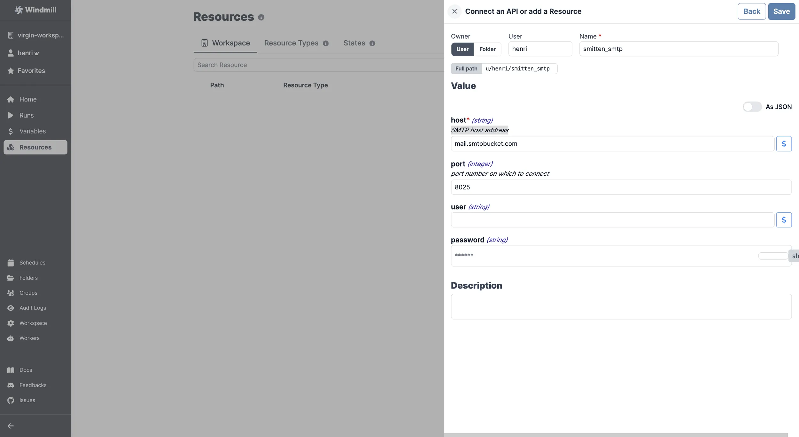

# SMTP integration

[SMTP](https://en.wikipedia.org/wiki/Simple_Mail_Transfer_Protocol) (Simple Mail Transfer Protocol) is an internet standard for electronic mail transmission.

Note that SMTP can be configured at the instance level to auto-invite users or send [critical alerts](../core_concepts/37_critical_alerts/index.mdx). See [Set up SMTP](../advanced/18_instance_settings/index.mdx#smtp).

To add a SMTP [resource](../core_concepts/3_resources_and_types/index.mdx) to Windmill, you need to save the following elements:

| Property | Type   | Description            | Required | Where to find                                           |
| -------- | ------ | ---------------------- | -------- | ------------------------------------------------------- |
| host     | string | SMTP host address      | true     | Provided by your SMTP service or email hosting provider |
| port     | number | Port number to connect | false    | Provided by your SMTP service or email hosting provider |
| user     | string | SMTP username          | false    | Provided by your SMTP service or email hosting provider |
| password | string | SMTP password          | false    | Provided by your SMTP service or email hosting provider |

  

Your resource can be used [passed as parameters](../core_concepts/3_resources_and_types/index.mdx#passing-resources-as-parameters-to-scripts-preferred) or [directly fetched](../core_concepts/3_resources_and_types/index.mdx#fetching-them-from-within-a-script-by-using-the-wmill-client-in-the-respective-language) within [scripts](../script_editor/index.mdx), [flows](../flows/1_flow_editor.mdx), [low-code apps](../apps/0_app_editor/index.mdx) and [full-code apps](../full_code_apps/index.mdx).

<iframe
	style={{ aspectRatio: '16/9' }}
	src="https://www.youtube.com/embed/ggJQtzvqaqA"
	title="YouTube video player"
	frameBorder="0"
	allow="accelerometer; autoplay; clipboard-write; encrypted-media; gyroscope; picture-in-picture; web-share"
	allowFullScreen
	className="border-2 rounded-lg object-cover w-full dark:border-gray-800"
></iframe>

 

> Example of a Supabase resource being used in two different manners from a script in Windmill.
 

:::tip

Find some pre-set interactions with SMTP on the [Hub](https://hub.windmill.dev/integrations/smtp).

Feel free to create your own SMTP scripts on [Windmill](../getting_started/00_how_to_use_windmill/index.mdx).

:::
