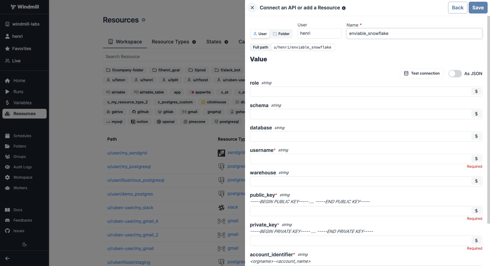

import DocCard from '@site/src/components/DocCard';

# Snowflake integration

[Snowflake](https://www.snowflake.com/en/) is a cloud-based data warehousing platform.

Windmill natively supports Snowflake scripts:

	<DocCard
		title="SQL (PostgreSQL, MySQL, MS SQL, BigQuery, Snowflake) quickstart"
		description="Learn how to build your first script in PostgreSQL, MySQL, BigQuery, Snowflake."
		href="/docs/getting_started/scripts_quickstart/sql"
	/>
	<DocCard
		title="Build a sample Snowflake app using OAuth"
		description="Learn how to build a sample Windmill App using Snowflake OAuth"
		href="/docs/misc/guides/snowflake_app_with_user_roles#sample-app-setup"
	/>
	<DocCard
		title="Configure Snowflake OAuth"
		description="How to configure a Snowflake OAuth connection"
		href="/docs/misc/setup_oauth#snowflake"
	/>

To integrate [Snowflake](https://www.snowflake.com/en/) with Windmill, you can either [create and OAuth connection](/docs/misc/setup_oauth#snowflake) or you need to gather the following information and save it as a [resource](../core_concepts/3_resources_and_types/index.mdx).

| Property           | Type   | Description                           | Default | Required | Where to Find                                                   |
| ------------------ | ------ | ------------------------------------- | ------- | -------- | --------------------------------------------------------------- |
| account_identifier | string | Snowflake account identifier          |         | true     | Snowflake Console > Account > Account Info > Account Identifier |
| private_key        | string | Snowflake private key                 |         | true     | Snowflake Console > Account > Security > RSA Key Pair           |
| public_key         | string | Snowflake public key                  |         | true     | Snowflake Console > Account > Security > RSA Key Pair           |
| warehouse          | string | Snowflake warehouse name              |         | true     | Snowflake Console > Warehouses                                  |
| username           | string | Snowflake username for authentication |         | true     | Snowflake Console > Users and Security > Users                  |
| database           | string | Snowflake database name               |         | true     | Snowflake Console > Databases                                   |
| schema             | string | Snowflake schema name                 |         | true     | Snowflake Console > Databases > [Your Database] > Schemas       |
| role               | string | Snowflake role for access control     |         | true     | Snowflake Console > Users and Security > Roles                  |

 
 

Your resource can be used [passed as parameters](../core_concepts/3_resources_and_types/index.mdx#passing-resources-as-parameters-to-scripts-preferred) or [directly fetched](../core_concepts/3_resources_and_types/index.mdx#fetching-them-from-within-a-script-by-using-the-wmill-client-in-the-respective-language) within [scripts](../script_editor/index.mdx), [flows](../flows/1_flow_editor.mdx) and [apps](../apps/0_app_editor/index.mdx).

<iframe
	style={{ aspectRatio: '16/9' }}
	src="https://www.youtube.com/embed/ggJQtzvqaqA"
	title="YouTube video player"
	frameBorder="0"
	allow="accelerometer; autoplay; clipboard-write; encrypted-media; gyroscope; picture-in-picture; web-share"
	allowFullScreen
	className="border-2 rounded-lg object-cover w-full dark:border-gray-800"
></iframe>

 

:::tip

Find some pre-set interactions with Snowflake on the [Hub](https://hub.windmill.dev/integrations/snowflake).

:::
