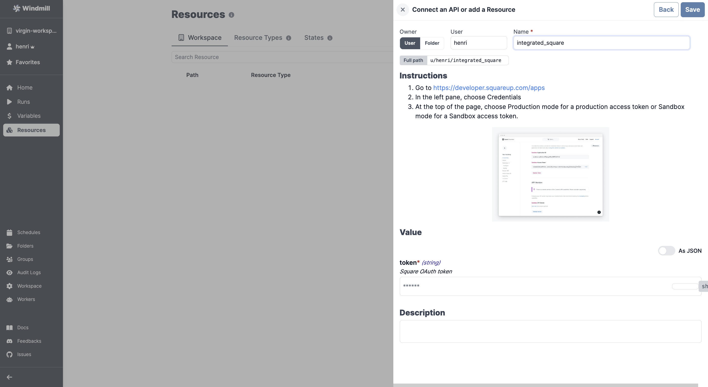

# Square Integration

To integrate [Square](https://www.squarespace.com/) to Windmill, you need to save the following elements as a [resource](../core_concepts/3_resources_and_types/index.mdx).

| Property | Type   | Description | Required | Where to find                                                                                                                                                                                                    |
| -------- | ------ | ----------- | -------- | ---------------------------------------------------------------------------------------------------------------------------------------------------------------------------------------------------------------- |
| token    | string | API token   | true     | 1. Go to https://developer.squareup.com/apps 2. In the left pane, choose Credentials 3. At the top of the page, choose Production mode for a production access token or Sandbox mode for a Sandbox access token. |

  

:::tip

Feel free to create your own Square scripts on [Windmill](../getting_started/00_how_to_use_windmill/index.mdx).

:::
