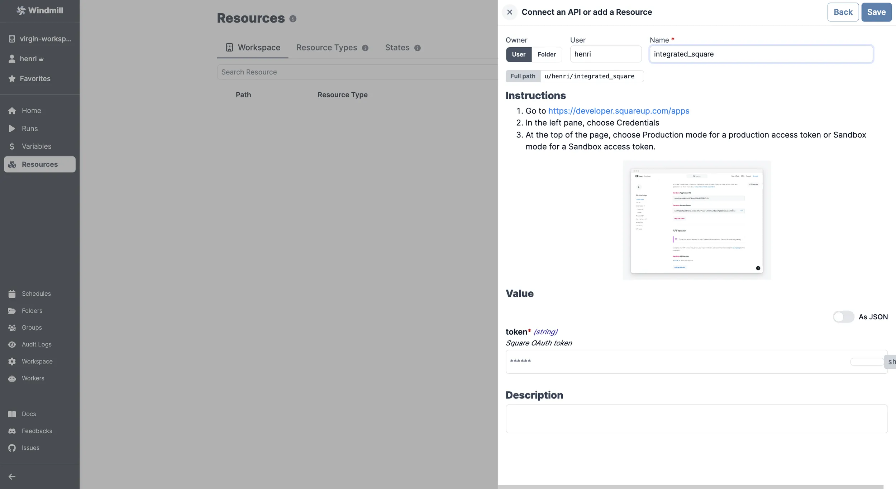

# Square Integration

[Square](https://www.squarespace.com/) is a payment and financial services provider.

To integrate Square to Windmill, you need to save the following elements as a [resource](../core_concepts/3_resources_and_types/index.mdx).

| Property | Type   | Description | Required | Where to find                                                                                                                                                                                                    |
| -------- | ------ | ----------- | -------- | ---------------------------------------------------------------------------------------------------------------------------------------------------------------------------------------------------------------- |
| token    | string | API token   | true     | 1. Go to https://developer.squareup.com/apps 2. In the left pane, choose Credentials 3. At the top of the page, choose Production mode for a production access token or Sandbox mode for a Sandbox access token. |

  

Your resource can be used [passed as parameters](../core_concepts/3_resources_and_types/index.mdx#passing-resources-as-parameters-to-scripts-preferred) or [directly fetched](../core_concepts/3_resources_and_types/index.mdx#fetching-them-from-within-a-script-by-using-the-wmill-client-in-the-respective-language) within [scripts](../script_editor/index.mdx), [flows](../flows/1_flow_editor.mdx) and [apps](../apps/0_app_editor/index.mdx).

<video
	className="border-2 rounded-lg object-cover w-full h-full dark:border-gray-800"
	controls
	src="/videos/add_resources_variables.mp4"
/>

 

:::tip

Feel free to create your own Square scripts on [Windmill](../getting_started/00_how_to_use_windmill/index.mdx).

:::
