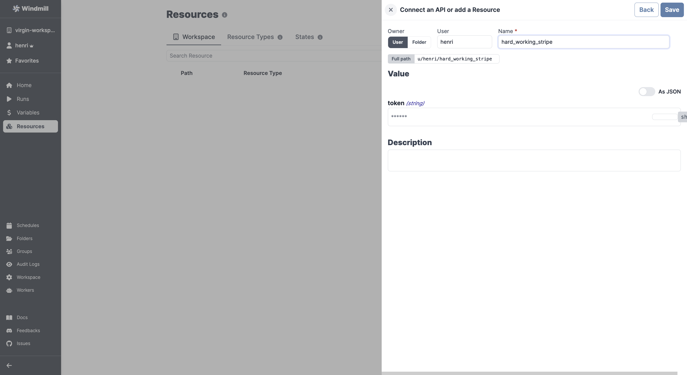

# Stripe Integration

To integrate [Stripe](https://stripe.com/) to Windmill, you need to save the following elements as a [resource](../core_concepts/3_resources_and_types/index.md).

| Property | Type   | Description | Required | Where to find                                            |
| -------- | ------ | ----------- | -------- | -------------------------------------------------------- |
| token    | string | API token   | true     | Stripe Dashboard -> Developers -> API keys -> Secret key |

  

:::tip

Find some pre-set interactions with Stripe on the [Hub](https://hub.windmill.dev/integrations/stripe).

Feel free to create your own Stripe scripts on [Windmill](../getting_started/00_how_to_use_windmill/index.mdx).

:::
