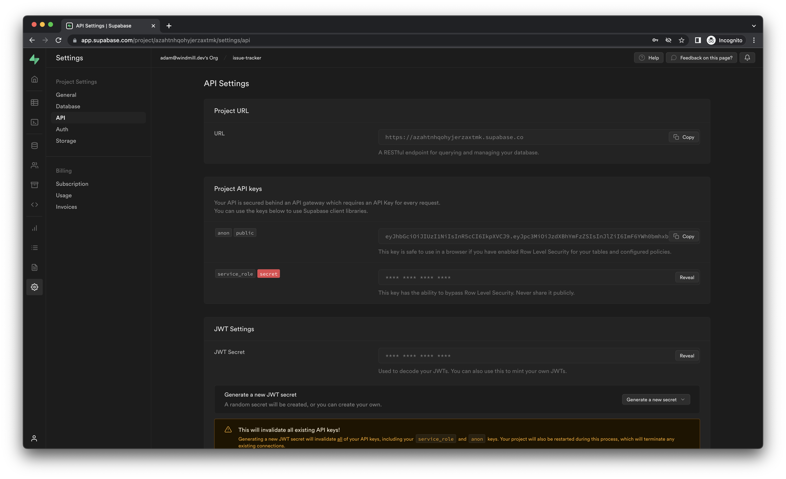

# Supabase Integration

Learn how to connect to your Supabase project from Windmill Scripts, Flows and Apps.

<<<<<<< HEAD

=======
:::info
This tutorial assumes that you already have a
[Windmill](https://app.windmill.dev) account and a
[Supabase](https://supabase.com) project. If you don't, visit the
[Windmill documentation](https://docs.windmill.dev/docs/intro) or the
[Supabase documentation](https://supabase.com/docs) to find out more.
:::


<br/>


>>>>>>> main

:::info

This tutorial assumes that you already have a <a href='https://app.windmill.dev/user/login' rel="nofollow">Windmill</a> account and a
[Supabase](https://supabase.com) project. If you don't, visit the
[Windmill documentation](/docs/getting_started/how_to_use_windmill) or the
[Supabase documentation](https://supabase.com/docs) to find out more.

:::

## Get the API keys

In order to make authenticated requests to the database, you'll need your API
key and the URL of your endpoint from Supabase. To get these, select your
project, navigate to the `Project Settings` page and select `API` from the menu.
You'll find the URL and 2 keys here.



As the description says, the access level of the `public` key will be controlled
by the policies you add and the `secret` key will bypass all of them. You can
safely use the `service_rolesecret` `secret` key in Windmill because it'll never be sent to users
directly.

## Create a resource

To safely use secret values throughout Windmill, you can save them in
`reources`. We are regularly updating the list of approved resources but if you
want an integration to be supported by Windmill directly, please submit a new
`resource type` on [Windmill Hub](https://hub.windmill.dev/resources).

**Navigate to the [Resources](https://app.windmill.dev/resources) page**


**Click "Add a resource/API"** 

**Search for `Supabase` and select the resource type**


**Enter the API key and the URL from Supabase and click "Save"**


## Use the resource

You can reference the type of a Supabase resource in a script the following way:

```ts
// To get the latest supported resource types,
// check for the latest version of the Windmill Deno
// package at https://deno.land/x/windmill/mod.ts
import { Resource } from 'https://deno.land/x/windmill@v1.89.0/mod.ts';

export async function main(auth: Resource<'supabase'>) {
	// Function contents
}
```

:::tip

You can find more examples and premade Supabase scripts on [Windmill Hub](https://hub.windmill.dev/integrations/supabase).
<<<<<<< HEAD
=======

<br/>

More tutorials on Supabase:
- [How to Send Database Events From Supabase to Windmill](https://docs.windmill.dev/blog/database-events-from-supabase-to-windmill)
- [Create an E-commerce backoffice](../apps/7_app_e-commerce.md)
- [Create an Issue Tracker App with Supabase in 15 Minutes](https://docs.windmill.dev/blog/create-issue-tracker-in-15-minutes)
- [Create an Issue Tracker App with Supabase - Part 2 Customize Your App](https://docs.windmill.dev/blog/create-issue-tracker-part-2)
- [Use Supabase Authentication on Windmill to query RLS protected tables for external apps](https://docs.windmill.dev/blog/supabase-authentication-and-rls-protected-tables-on-windmill)
>>>>>>> main

<br/>

More tutorials on Supabase:
- [How to Send Database Events From Supabase to Windmill](/blog/database-events-from-supabase-to-windmill)
- [Create an E-commerce backoffice](../apps/7_app_e-commerce.md)
- [Create an Issue Tracker App with Supabase in 15 Minutes](/blog/create-issue-tracker-in-15-minutes)
- [Create an Issue Tracker App with Supabase - Part 2 Customize Your App](/blog/create-issue-tracker-part-2)
- [Use Supabase Authentication on Windmill to query RLS protected tables for external apps](/blog/supabase-authentication-and-rls-protected-tables-on-windmill)

:::