# Supabase

## Getting started

We will see how to build Windmill workflow that's triggered by the
[Supabase Database Webhooks](https://supabase.com/docs/guides/database/webhooks).

:::tip Supabase Database Webhooks allow you to send real-time data from your
database to Windmill whenever a table event occurs. You can hook into three
table events: `INSERT`, `UPDATE`, and `DELETE`. All events are fired after a
database row is changed. :::

We will leverage [Windmill Webhooks](../../core_concepts/4_webhooks/index.md)
that allow triggering Windmill scripts or Windmill flows via `HTTP POST`
request.

## Check Supabase event structure

Let's create a simple Windmill script to test the integration and preview the
structure of Supabase events (official Supabase specification can be found at
https://supabase.com/docs/guides/database/webhooks#payload).

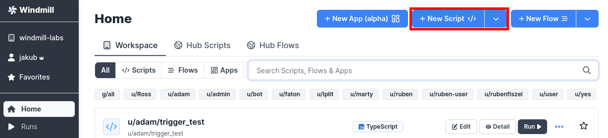

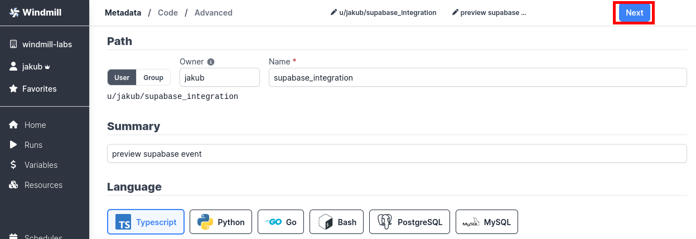

The idea here is just to sneak peak incoming event from Supabase so we will
create a void script, use it's webhook and inspect the logs of script run that
was triggered by Supabase.

### Void script

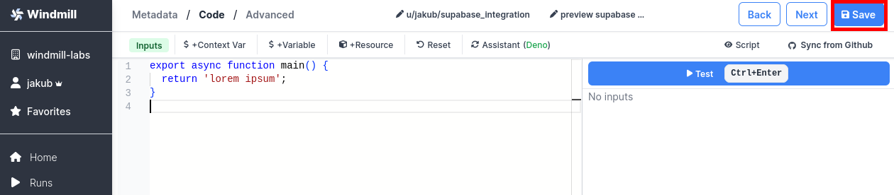

### Webhook URL

There are two kinds of Windmill Webhooks: `Hash` and `Path`. Let's copy the
`Hash` one. For more details check
[Windmill Webhooks](../../core_concepts/4_webhooks/index.md) docs.

:::warning If you've chosen `Hash` webhook and you later modify your script then
your script will have a new `Hash` webhook URL. The previous webhook `Hash` URL
will still run the old version of the script! :::

If your intention is that later script modifications should propagate to
previously created webhooks, then you should use the `Path` webhook URL.

:::caution Webhook URLs should be treated as a secret :::

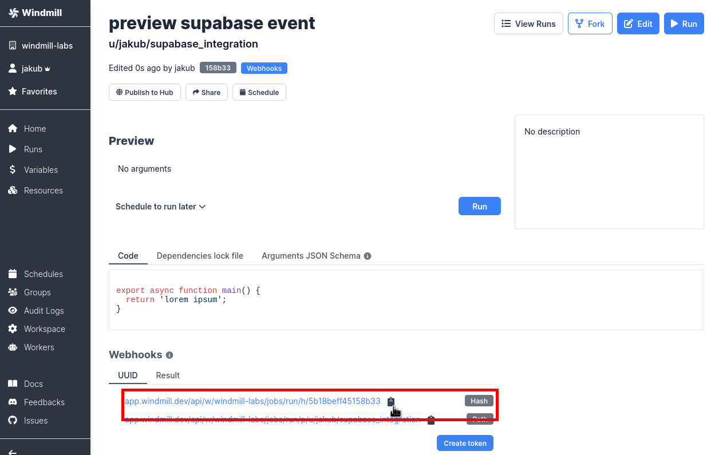

Save the URL somewhere, we will need it a bit later.

:::info Windmill flows also have their webhook URLs :::

### Windmill token used by Supabase

`HTTP POST` request done by Supabase will have to be authorized. Let's create
dedicated token.

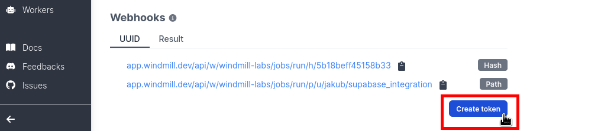

Make sure to label the token with some meaningful name.

:::tip It's a good idea to have a dedicated tokens per integration. :::

Optionally you can put an expiration date, so that the token will expire after
e.g. 3 months.

:::warning Setting token lifetime is aligned "good security practices" point of
view but on the other hand you might not remember to rotate it and the
integration will stop working at some point. :::

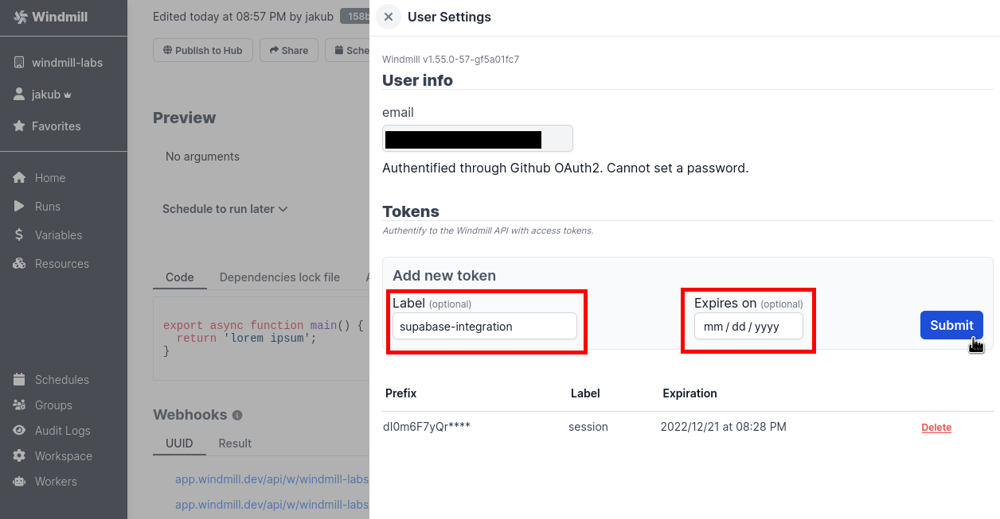

Remember to copy the token after creating it. Later you will not be able to do
this.

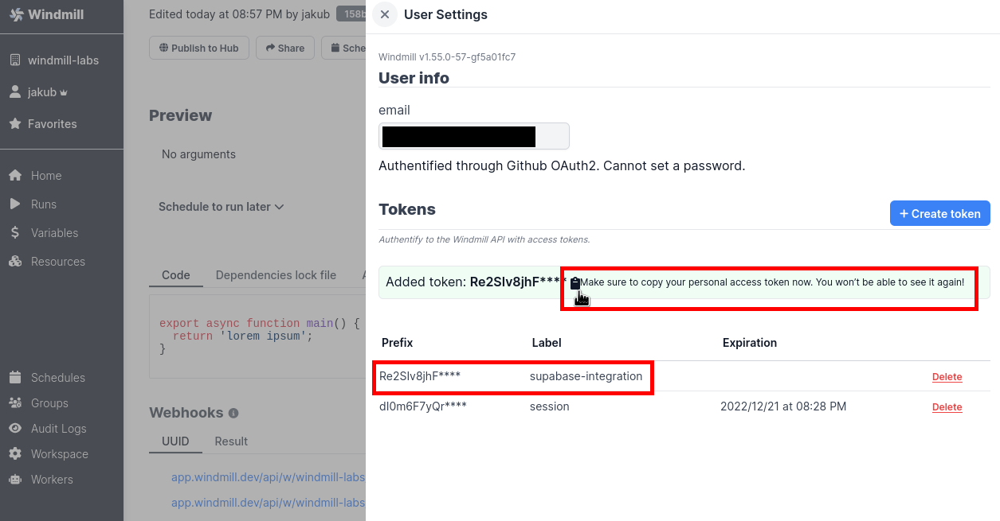

:::caution Tokens should be treated as a secret :::

Save the token value somewhere, we will still need it a bit later in this
tutorial.

## Hook into Supabase database table events

Now we can go to our Supabase "Database Webhooks" view and create some database
webhook:

Make sure to have some meaningful name, subscribe to `INSERT`, `UPDATE` and
`DELETE` and select the `HTTP Request` hook type:

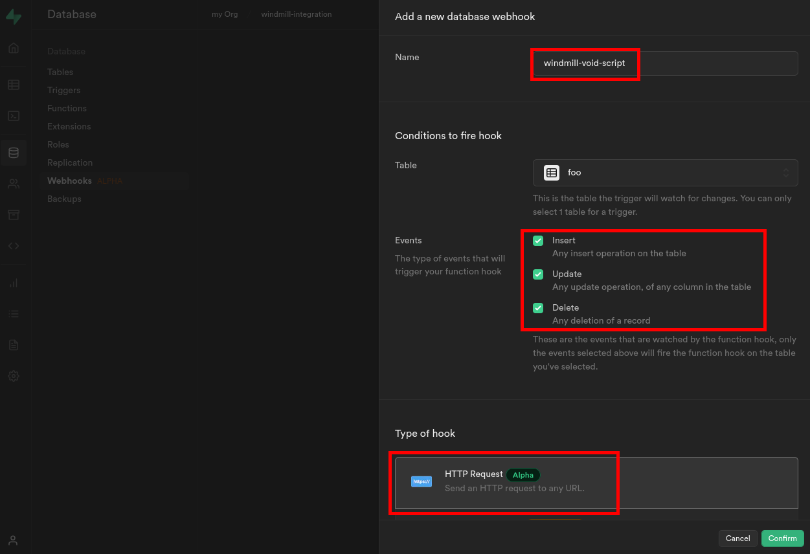

Make sure to select the `POST` HTTP Request method, paste the Windmill webhook
URL and add `Authorization` header that contains the token (e.g.
`Authorization: Bearer SuperSecretToken`).

:::caution Notice the `Bearer` keyword and the space before the actual token :::

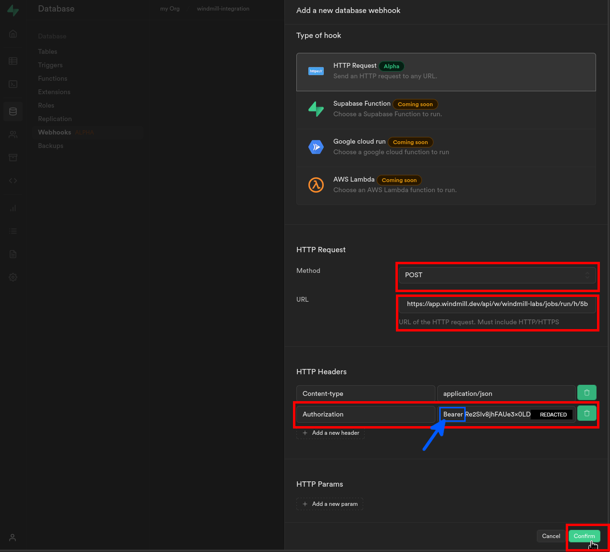

Congratulations! We're hooked in!

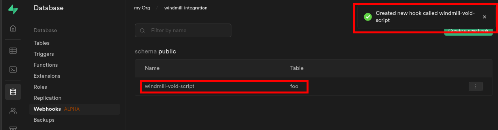

### Test integration

Let's check if it works. So let's log in to our Supabase PostgreSQL database and
do some `INSERT` into the table where we're "hooked in":

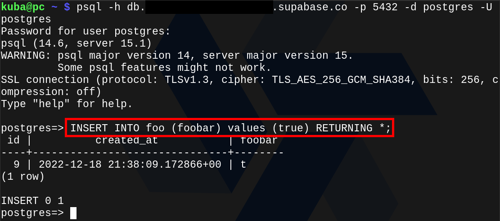

OK, so we've inserted a new row into the table in the Supabase PostgreSQL
database. The event should be propagated to Windmill and trigger our void
script. Do you remember that we've created this script to sneak peak the data
structure passed from Supabase to Windmill? Let's check it out!

If the script was indeed triggered we should see the result in the "Runs" view:

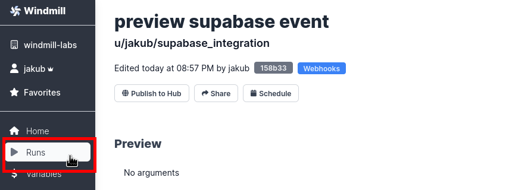

WOW, we can see that something indeed ran our script:
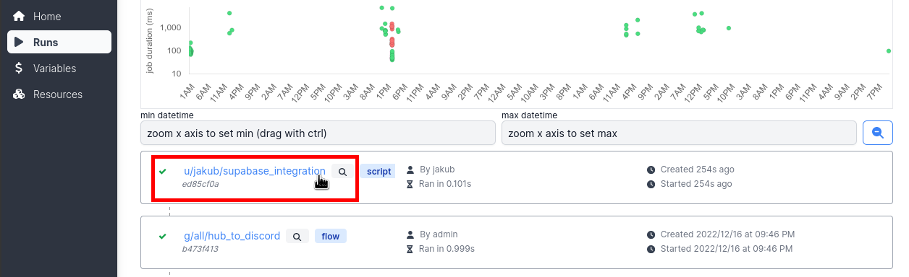

Let's check the logs and other details: 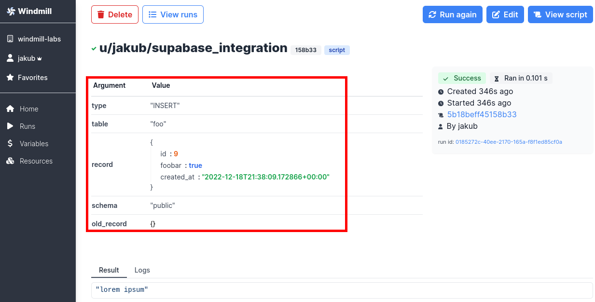

Cool! Now we know what kind of information is transmitted from Supabase.

### Process the Supabase event

We can now process the Supabase event in our script. So let's modify it so that
it's no longer void!

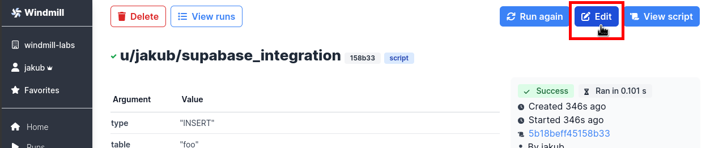

:::caution If you used Windmill Webhook `Hash` URL in previous steps, then you
will need to create a new Supabase Database Webhook - otherwise old version of
the script will be triggered. :::

This script is also available on Windmill Hub:
https://hub.windmill.dev/scripts/supabase/1455/preview-supabase-event-supabase

### Other database events

So the event generated for `UPDATE` looks like this:

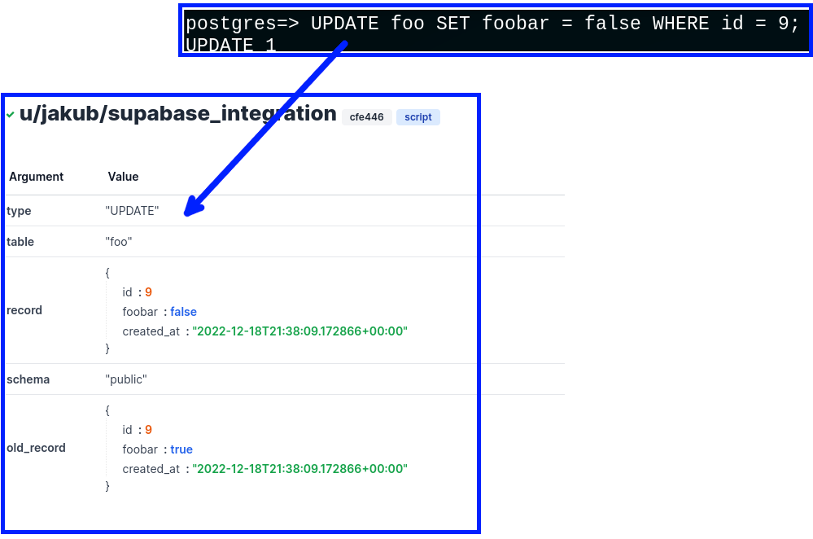

... and here is the `DELETE`:

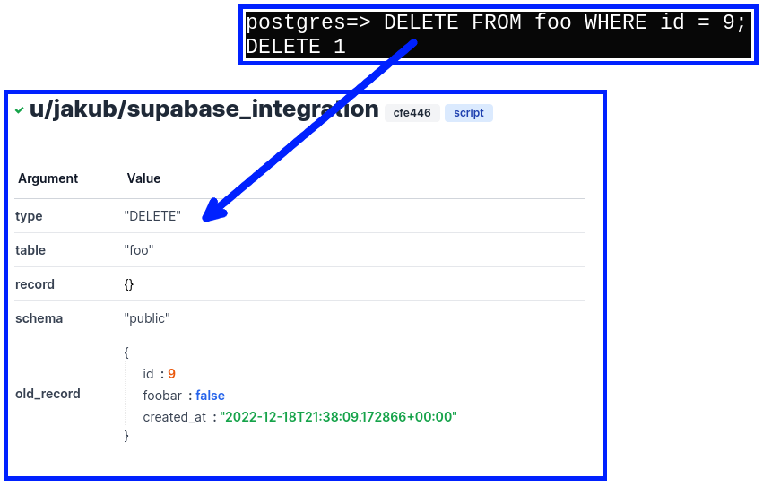

## Powerful workflow

It should be already clear that the combination of Windmill and Supabase allows
you to build powerful workflows. You can find more flow examples here:
<https://hub.windmill.dev/flows>

Just remember that Windmill Flows also expose webhook URL.
