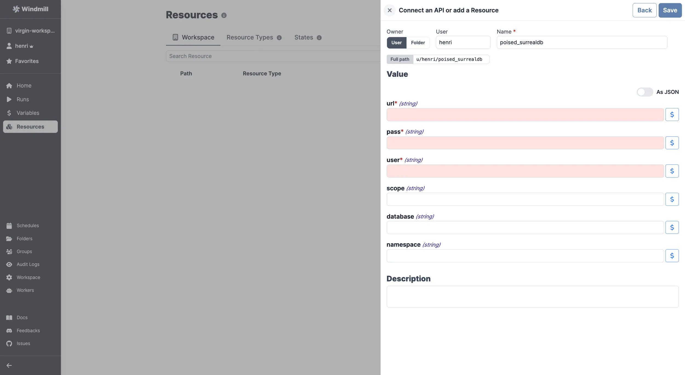

# SurrealDB Integration

[SurrealDB](https://surrealdb.com/) is a cloud-hosted NoSQL database.

To integrate SurrealDB to Windmill, you need to save the following elements as a [resource](../core_concepts/3_resources_and_types/index.mdx).

| Property  | Type   | Description                              | Required | Where to find                                      |
| --------- | ------ | ---------------------------------------- | -------- | -------------------------------------------------- |
| namespace | string | Namespace for the SurrealDB instance     | true     | SurrealDB Dashboard -> Namespaces                  |
| database  | string | Database name for the SurrealDB instance | true     | SurrealDB Dashboard -> Databases                   |
| scope     | string | Scope of the SurrealDB instance          | true     | SurrealDB Dashboard -> Scopes                      |
| user      | string | Username for the SurrealDB instance      | false    | SurrealDB Dashboard -> Users                       |
| pass      | string | Password for the SurrealDB instance      | false    | SurrealDB Dashboard -> Users                       |
| url       | string | URL of the SurrealDB instance            | false    | Provided by SurrealDB when you create the instance |

  

Your resource can be used [passed as parameters](../core_concepts/3_resources_and_types/index.mdx#passing-resources-as-parameters-to-scripts-preferred) or [directly fetched](../core_concepts/3_resources_and_types/index.mdx#fetching-them-from-within-a-script-by-using-the-wmill-client-in-the-respective-language) within [scripts](../script_editor/index.mdx), [flows](../flows/1_flow_editor.mdx) and [apps](../apps/0_app_editor/index.mdx).

<video
	className="border-2 rounded-lg object-cover w-full h-full dark:border-gray-800"
	controls
	src="/videos/add_resources_variables.mp4"
/>

 

:::tip

Feel free to create your own SurrealDB scripts on [Windmill](../getting_started/00_how_to_use_windmill/index.mdx).

:::
