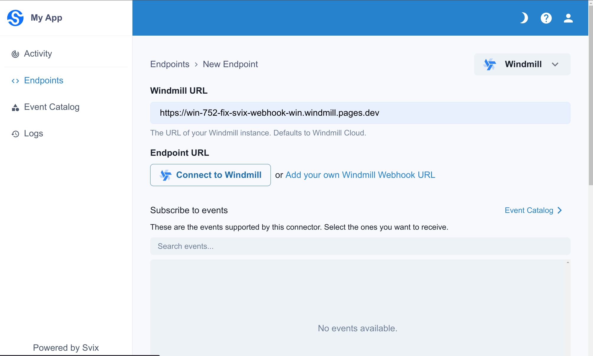
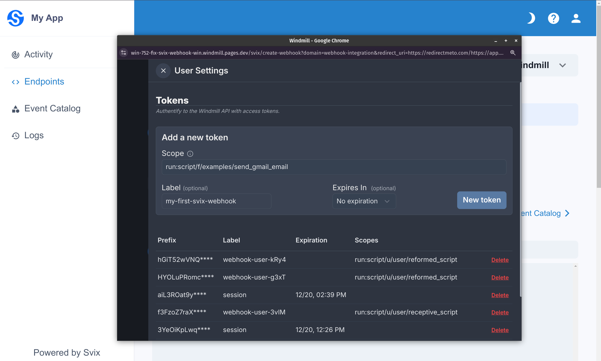
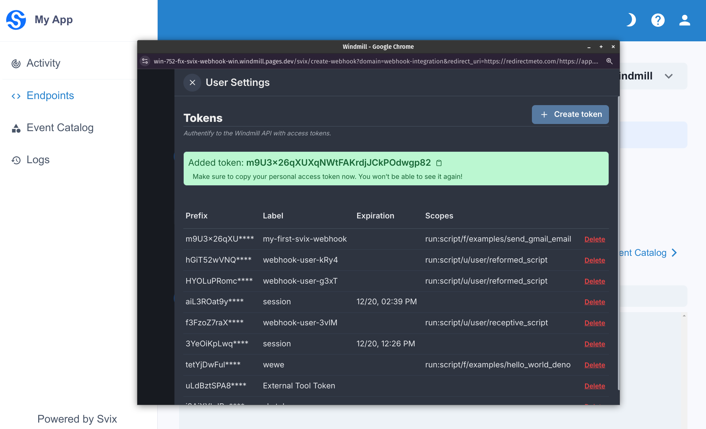

# Svix integration

[Svix](https://www.svix.com/) offers the possibility to easily add and manage Windmill [webhooks](../core_concepts/4_webhooks/index.mdx).

<video
	className="border-2 rounded-lg object-cover w-full h-full dark:border-gray-800"
	autoPlay
	loop
	src="/videos/svix_create_webhook.mp4"
/>

## Setting up the Windmill connector

Windmill can be added as a Svix [Connector](https://docs.svix.com/connectors).

## Adding Windmill webhooks from the App Portal

When a connector is set, webhooks can be easily created by adding a new Endpoint and selecting the Windmill option. First set the URL of the Windmill Instance, then click the `Connect to Windmill` button to let the wizard pop out.

On the wizard, choose the script or flow to be triggered, and set a webhook token. This is generally done by pressing `Generate webhook specific token` > `New Token` and closing the token drawer with the `X` on the top left.

After confirming that everything is correct, Windmill will redirect to Svix to finish creating the webhook endpoint.