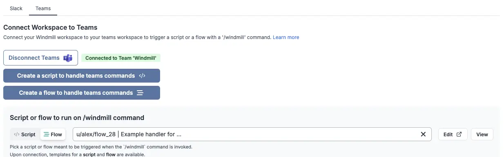
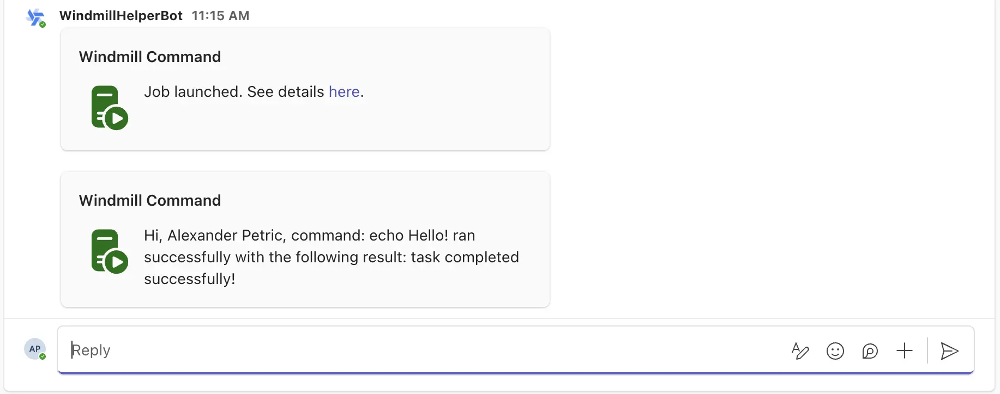
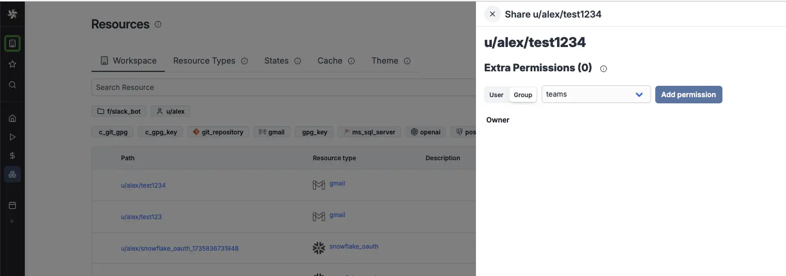
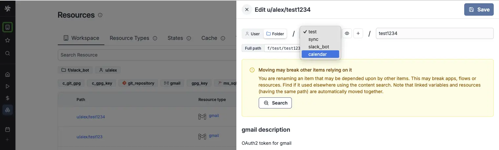
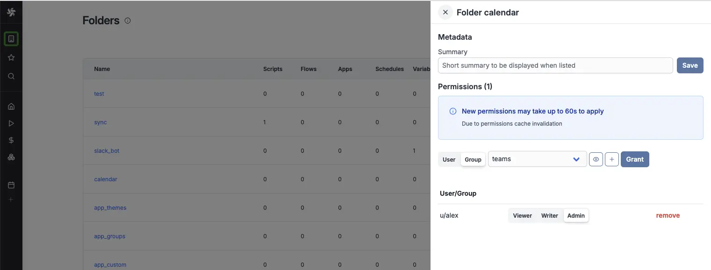
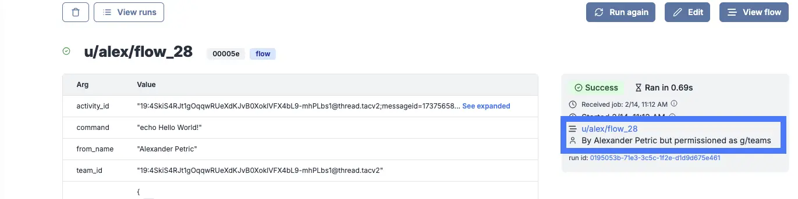
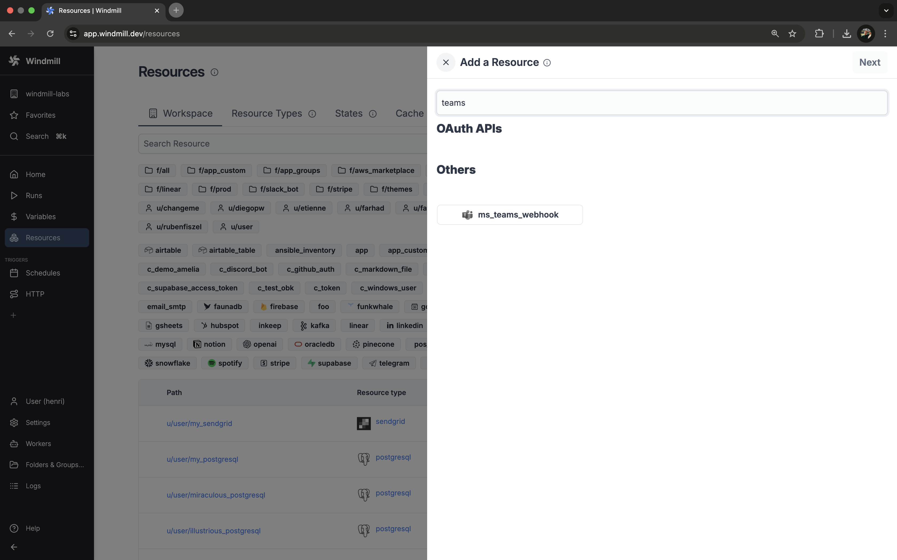

import DocCard from '@site/src/components/DocCard';
import Tabs from '@theme/Tabs';
import TabItem from '@theme/TabItem';

# Microsoft Teams integration

[Microsoft Teams](https://teams.microsoft.com/) is a collaboration platform that integrates with Office 365.

There are two ways to build interactions between Microsoft Teams and Windmill: run code on Windmill by a Microsoft Teams command or use the
Microsoft Teams API directly from Windmill. In this guide, we'll cover both approaches.

## Action on Windmill from MicrosoftTeams

The goal here is to be able to invoke a Windmill Script from Microsoft Teams, by using
`/windmill` command.

<video
	className="border-2 rounded-lg object-cover w-full h-full dark:border-gray-800"
	controls
	src="/videos/teams_handler.mp4"
/>

<br />

First, you need to be a **workspace admin**. Then you should go to <a href="https://app.windmill.dev/workspace_settings" rel="nofollow">Workspace Settings Page </a> and select the "Slack / Teams" tab. On there, click "Connect to Microsoft Teams".

:::info Self-hosted

The Microsoft Teams integration is done through OAuth. On [self-hosted instances](../advanced/1_self_host/index.mdx), integrating an OAuth API will require [Setup OAuth and SSO](../misc/2_setup_oauth/index.mdx).

:::

Note that you can connect multiple Windmill workspaces to the same Teams bot. Only one Windmill workspace can accept the `/windmill` [commands](#using-commands-on-teams) from a given Teams "Team".

### Using commands on Teams

Once you connected your workspace to a Teams Team, you can either select an existing script or flow to handle the `/windmill` command, or create a new one by clicking the "Create a script to handle teams command" button.

You will be navigated to the Script editor. Give your script a name
(e.g. `teams_command_handler`), a short summary (e.g. "Teams command handler"). You'll get to [this](https://hub.windmill.dev/scripts/teams/11409/example-of-responding-to-a-microsoft-teams-command-teams) template:

```typescript
import * as wmill from "windmill-client"

export async function main(
  activity_id: string,
  command: string,
  from_name: string,
  team_id: string,
  teams_message: any
) {
  // Your business logic
  const res = "task completed successfully!"

  // (optional) Send update to Teams channel about completion of job
  await wmill.TeamsService.sendMessageToConversation(
    {
      requestBody: {
        conversation_id: activity_id,
        success: true,
        text: `Hi, ${from_name}, command: ${command} ran successfully with the following result: ${res}`
      }
    }
  )
}
```

After the Script is deployed, navigate back to the

<a href="https://app.windmill.dev/workspace_settings?tab=slack" rel="nofollow">
	Teams settings
</a>
Choose the "Script" option for adding a command handler and select your newly created Script.



Congratulations! You've just created a Teams command handler. Now you can use
the `/windmill` command in your Teams workspace to trigger the Script. 

In addition to activity_id, the script/flow can use the following parameters, simply by having them as inputs with the proper name:

```
# the ID of the activity in the Teams conversation
activity_id 

# the command that was triggered
command 

# the name of the user who triggered the command
from_name 

# Microsoft Teams Team ID
team_id 

# the original payload from the Teams backend
teams_message 
```



You won't be able to have Teams interact with your [resources](../core_concepts/3_resources_and_types/index.mdx) and [variables](../core_concepts/2_variables_and_secrets/index.mdx) before adding them to the `teams` [group](../core_concepts/8_groups_and_folders/index.mdx#groups) that was automatically created by Windmill after you set up your Teams workspace on Windmill.

<details>
  <summary>How to let Teams use your resources and variables:</summary>

To give the permission, go to "Resources" (and "Variables") menu, click on `Share`, `Group` and pick `teams`.

<br />



<br />

One simplier way to handle permissions is to host resources and variables on a [folder](../core_concepts/8_groups_and_folders/index.mdx#folders) that is part of the [group](../core_concepts/8_groups_and_folders/index.mdx#groups) `teams`.

<br />



<br />



</details>

### Handle multiple commands

You can extend your workspace script to handle complex commands coming from Teams messages. [This article](/blog/handler-slack-commands) shows how to manage multiple commands & human-in-the-loop steps for a slackbot using [branches](../flows/13_flow_branches.md), a text parser and [approval steps](../flows/11_flow_approval.mdx) and can be easily adapted to Teams.

<div className="grid grid-cols-2 gap-6 mb-4">
	<DocCard
		title="Tutotial - Handler of multiple Slack commands"
		description="Create a flow with a parser & branches that will handle multiple Slack commands."
		href="/blog/handler-slack-commands#control-the-slackbot-by-getting-username"
	/>
</div>

### Monitor who ran the command

You can see who ran the `/windmill` command by going to the

<a href="https://app.windmill.dev/runs" rel="nofollow">
	Runs page
</a>
on Windmill. The runs will be permissioned through the `g/teams` global group.



One of the parameters passed to the script is the "from_name" parameter, which is the name of the user who triggered the command. To process further teams specific details from the command, you can use the "teams_message" parameter.

```javascript
## Example of teams_message payload
{
  "id": "1739549535827",
  "from": {
    "id": "29:152-adq1512TRGdQmxTqdgnfTA",
    "name": "Alexander Petric"
  },
  "text": "<at>WindmillHelperBot</at>. /windmill echo Hello World!",
  "type": "message",
  "locale": "en-US",
  "entities": [
    {
      "text": "<at>WindmillHelperBot</at>",
      "type": "mention",
      "mentioned": {
        "id": "28:0eba9472-83d1-429e-ba2c-1c2993dda84d",
        "name": "WindmillHelperBot"
      }
    },
    {
      "type": "clientInfo",
      "locale": "en-US",
      "country": "US",
      "platform": "Mac",
      "timezone": "America/New_York"
    }
  ],
  "recipient": {
    "id": "28:0eba9472-83d1-429e-ba2c-1c2993dda84d",
    "name": "WindmillHelperBot"
  },
  "timestamp": "2025-02-14T16:12:15.857639Z",
  "serviceUrl": "https://smba.trafficmanager.net/amer/508f04d5-b0de-4661-b035-b90bb6911ce7/",
  "attachments": [
    {
      "content": "<p><span itemtype=\"http://schema.skype.com/Mention\" itemscope=\"\" itemid=\"0\">WindmillHelperBot</span>. /windmill echo Hello World!</p>"
    }
  ],
  "channelData": {
    "team": {
      "id": "19:4SkiS4RJt1gOqqwRUeYdKJvB0XoklVFX4bL9-mhPLbs1@thread.tacv2"
    },
    "tenant": {
      "id": "508f04d5-b0de-4661-b035-b90bb6911ce7"
    },
    "channel": {
      "id": "19:4SkiS4RJt1gOqqwRUeXdKJvB0XoklVFX4bL9-mhPLbs1@thread.tacv2"
    },
    "teamsTeamId": "19:4SkiS4RJt1gOqqwRUeXdKJvB0XoklVFX4bL9-mhPLbs1@thread.tacv2"
  },
  "conversation": {
    "id": "19:4SkiS4RJt1gOqqwRUeXdKJvB0XoklVFX4bL9-mhPLbs1@thread.tacv2;messageid=1737565847488"
  }
}

```

### Teams approval steps

[Approval steps](../flows/11_flow_approval.mdx) are a way to suspend a [flow](../flows/1_flow_editor.mdx) until specific event(s) are received, such as approvals or cancellations. You can use them to handle approvals from Microsoft Teams.

The Windmill [TypeScript](../advanced/2_clients/ts_client.mdx) client exposes helper functions to request approvals on Microsoft Teams. There are two types of approvals:

1. **Interactive approval**: A Teams message that can be approved or rejected directly from Teams without having to go back to the Windmill UI
2. **Basic approval**: A simple link that will open the approval page in the Windmill UI in your browser

<iframe
	style={{ aspectRatio: '16/9' }}
	src="https://www.youtube.com/embed/gc6P7nnMORk"
	title="Microsoft Teams approval step"
	allow="accelerometer; autoplay; clipboard-write; encrypted-media; gyroscope; picture-in-picture; web-share"
	allowFullScreen
	className="border-2 rounded-lg object-cover w-full dark:border-gray-800"
></iframe>

<br />

The following hub scripts can be used:
- [Request Interactive Teams Approval](https://hub.windmill.dev/scripts/teams/13935/interactive-microsoft-teams-approval-teams)
- [Request Basic Teams Approval](https://hub.windmill.dev/scripts/teams/13936/microsoft-teams-approval-teams)

If you define a [form](../flows/11_flow_approval.mdx#form) on the approval step, the form will be displayed in the Teams message as a modal.


Both of these scripts are using the Windmill client helper function:

<Tabs className="unique-tabs">
<TabItem value="ts_interactive" label="TypeScript Interactive" attributes={{className: "text-xs p-4 !mt-0 !ml-0"}}>
```typescript
await wmill.requestInteractiveTeamsApproval({
    teamName: "Windmill",
    channelName: "General",
    message: "Please approve this request",
    approver: "approver123",
    defaultArgsJson: { key1: "value1", key2: 42 },
    dynamicEnumsJson: { foo: ["choice1", "choice2"], bar: ["optionA", "optionB"] },
});
```
</TabItem>

<TabItem value="ts_basic" label="TypeScript Basic" attributes={{className: "text-xs p-4 !mt-0 !ml-0"}}>
```typescript
const card_block = {
    "type": "message",
    "attachments": [
        {
            "contentType": "application/vnd.microsoft.card.adaptive",
            "content": {
                "type": "AdaptiveCard",
                "$schema": "https://adaptivecards.io/schemas/adaptive-card.json",
                "version": "1.6",
                "body": [
                    ... // card body
                ],
            },
        }
    ],
    "conversation": {"id": `${conversation_id}`},
}

await wmill.TeamsService.sendMessageToConversation({
    requestBody: { conversation_id, text: "A workflow has been suspended and is waiting for approval!", card_block }
})
```
</TabItem>
</Tabs>

Where [dynamic_enums](../flows/11_flow_approval.mdx#dynamics-enums) can be used to dynamically set the options of enum form arguments and [default_args](../flows/11_flow_approval.mdx#default-args) can be used to dynamically set the default values of form arguments.

If multiple approvals are required, you can use the client helper directly and send approval requests to different channels:

```typescript
import * as wmill from "windmill-client"

export async function main() {
  // Send approval request to team A
  await wmill.requestInteractiveTeamsApproval({
    teamName: "Team A",
    channelName: "General",
    message: "Please approve this request"
  })
  
  // Send approval request to team B
  await wmill.requestInteractiveTeamsApproval({
    teamName: "Team B", 
    channelName: "General",
    message: "Please approve this request"
  })
}
```

For more details on approval steps and their features, check out the [Approval steps documentation](../flows/11_flow_approval.mdx).

<div className="grid grid-cols-2 gap-6 mb-4">
	<DocCard
		title="Suspend & Approval / Prompts"
		description="Suspend a flow until specific event(s) are received, such as approvals or cancellations."
		href="/docs/flows/flow_approval"
	/>
</div>

## Action on Teams from Windmill

### Write to Teams from Windmill

The second way to make Teams and Windmill interact is through scripts triggered from Windmill to the Teams API. In other words, our goal here is to allow Windmill Scripts acting on Teams on your behalf.

Let's navigate to the <a href="https://app.windmill.dev/resources" rel="nofollow">Resources page</a> and click "Add a resource/API".

:::info

You can read more about Resources in the documentation [here][docs-resource].

:::



Select the `ms_teams_webhook` Resource Type from the resources list and add a webhook_url (see Teams [docs](https://learn.microsoft.com/en-us/microsoftteams/platform/webhooks-and-connectors/how-to/add-incoming-webhook?tabs=dotnet) for details on how to create a webhook).

You can then use the resource in a script, like this script found on [WindmillHub](https://hub.windmill.dev/scripts/msteams/1582/send-a-message-to-ms-teams-channel-via-webhook-msteams) that "Sends a message to MS Teams channel via webhook":

```typescript
import { IncomingWebhook } from "npm:ms-teams-webhook@2.0.2";

// See below for an example card you can pass in

type MsTeamsWebhook = {
  webhook_url: string;
};
export async function main(
  ms_teams_webhook: MsTeamsWebhook,
  messageCard: object,
) {
  const webhook = new IncomingWebhook(ms_teams_webhook.webhook_url);
  const ret = await webhook.send(messageCard);
  return ret;
}

const example_card = {
  "@type": "MessageCard",
  "@context": "https://schema.org/extensions",
  summary: "This is a test summary",
  themeColor: "0078D7",
  title: "This is a test title",
  sections: [
    {
      activityTitle: "Windmill Webhook",
      activitySubtitle: "2023-05-25 17:57:55",
      activityImage:
        "https://connectorsdemo.azurewebsites.net/images/MSC12_Oscar_002.jpg",
      text: "This is a test text",
    },
  ],
};
```
### Error handlers

Microsoft Teams is an efficient way to be notified of errors on a Windmill run, whole workspace or instance. Windmill provides an integration for error / success / recovery handling on Microsoft Teams.

More details on [Error handling](../core_concepts/10_error_handling/index.mdx) page.

### Critical alerts

Microsoft Teams can be used to receive [critical alerts](../core_concepts/37_critical_alerts/index.mdx) from Windmill. This feature is available in the [Enterprise Edition](/pricing).

Critical alerts are generated under the following conditions:
- [Job](../core_concepts/20_jobs/index.mdx) is re-run after a crash
- [License key](../misc/7_plans_details/index.mdx#using-the-license-key-self-host) does not renew
- [Workspace error handler](../core_concepts/10_error_handling/index.mdx#workspace-error-handler) fails
- Number of running workers in a group falls below a specified threshold
- Number of [jobs waiting in queue](../core_concepts/9_worker_groups/index.mdx#queue-metric-alerts) is above a threshold for more than a specified amount of time

To set up critical alerts to Microsoft Teams:

1. Configure [SMTP](../advanced/18_instance_settings/index.mdx#smtp) in the instance settings
2. Connect your instance to Microsoft Teams in the [instance settings](../advanced/18_instance_settings/index.mdx#critical-alert-channels)
3. Specify the Teams channel where alerts should be sent

You can also set up worker group-specific alerts to receive notifications when the number of running workers in a group falls below a specified threshold. This can be configured in the [worker group config](../core_concepts/9_worker_groups/index.mdx#alerts).

:::note
Instance-wide critical alerts are only visible to users with the [superadmin](../core_concepts/16_roles_and_permissions/index.mdx#superadmin) or [devops](../core_concepts/16_roles_and_permissions/index.mdx#devops) roles. For workspace-specific alerts, users need to have admin privilege over that workspace.
:::

<div className="grid grid-cols-2 gap-6 mb-4">
	<DocCard
		title="Critical alerts"
		description="Get a notification for critical events such as everytime a job is re-run after a crash."
		href="/docs/core_concepts/critical_alerts"
	/>
</div>

## Troubleshooting

### "The bot is not part of the conversation roster" error

This error occurs when Windmill tries to send a message to a Teams channel but the Bot Framework rejects the request. Common causes:

1. **Channel moderation rules**: If the Teams channel has posting restrictions (channel moderation enabled), the bot may not be allowed to post. Check your Teams channel settings and either:
   - Disable channel moderation
   - Add the Windmill bot to the list of users allowed to post

2. **Bot not installed in the team**: The Windmill Teams app must be installed in the team where you want to send messages. Verify the app appears in the team's "Apps" section.

3. **Bot ID mismatch** (self-hosted): For self-hosted instances, ensure your Azure AD App Registration client ID matches:
   - The Microsoft App ID in your Azure Bot Service
   - The `botId` in your Teams app manifest

### Messages not being delivered

If the bot appears to be connected but messages aren't being delivered, check the service URL region. The default service URL is for the Americas region. If your Teams tenant is in a different region, set the `TEAMS_SERVICE_URL` environment variable:
   - Americas: `https://smba.trafficmanager.net/amer/` (default)
   - EMEA: `https://smba.trafficmanager.net/emea/`
   - APAC: `https://smba.trafficmanager.net/apac/`
   - US Government (GCC): `https://smba.infra.gcc.teams.microsoft.com/`

<!-- Links -->

[hub-teams]: https://hub.windmill.dev/integrations/teams
[hub-script]: https://hub.windmill.dev/scripts/teams/11409/example-of-responding-to-a-microsoft-teams-command-teams
[docs-resource]: /docs/core_concepts/resources_and_types
