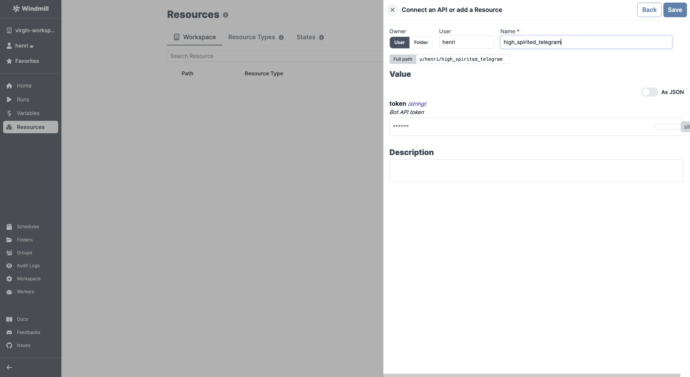

# Telegram Integration

[Telegram](https://telegram.org/) is a cloud-based instant messaging and voice over IP service.

To integrate Telegram to Windmill, you need to save the following elements as a [resource](../core_concepts/3_resources_and_types/index.mdx).

| Property | Type   | Description   | Required | Where to find                                                                                                                                                                                                                                                                                                                                                                                                              |
| -------- | ------ | ------------- | -------- | -------------------------------------------------------------------------------------------------------------------------------------------------------------------------------------------------------------------------------------------------------------------------------------------------------------------------------------------------------------------------------------------------------------------------- |
| token    | string | Bot API token | true     | 1. Open the Telegram app on your device or use the web version (https://web.telegram.org/). 2. Search for the "BotFather" bot in the search bar. 3. Start a chat with the BotFather. 4. Send the command "/newbot" to create a new bot. 5. Follow the BotFather's instructions to give your bot a name and username. 6. Once you have successfully created the bot, the BotFather will provide you with the Bot API token. |

  

Your resource can be used [passed as parameters](../core_concepts/3_resources_and_types/index.mdx#passing-resources-as-parameters-to-scripts-preferred) or [directly fetched](../core_concepts/3_resources_and_types/index.mdx#fetching-them-from-within-a-script-by-using-the-wmill-client-in-the-respective-language) within [scripts](../script_editor/index.mdx), [flows](../flows/1_flow_editor.mdx) and [apps](../apps/0_app_editor/index.mdx).

<video
	className="border-2 rounded-xl object-cover w-full h-full dark:border-gray-800"
	controls
	src="/videos/add_resources_variables.mp4"
/>

 

:::tip

Find some pre-set interactions with Telegram on the [Hub](https://hub.windmill.dev/integrations/telegram).

Feel free to create your own Telegram scripts on [Windmill](../getting_started/00_how_to_use_windmill/index.mdx).

:::
