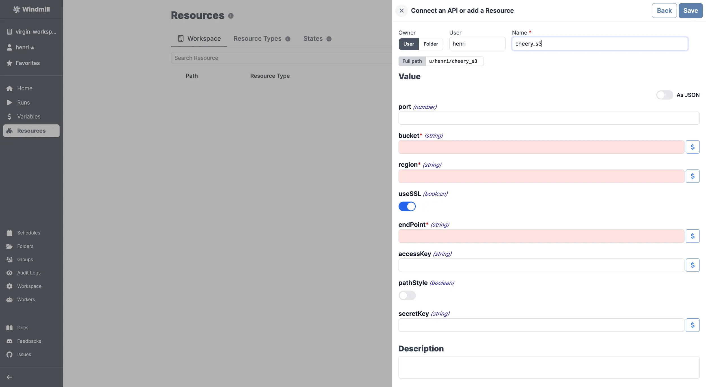
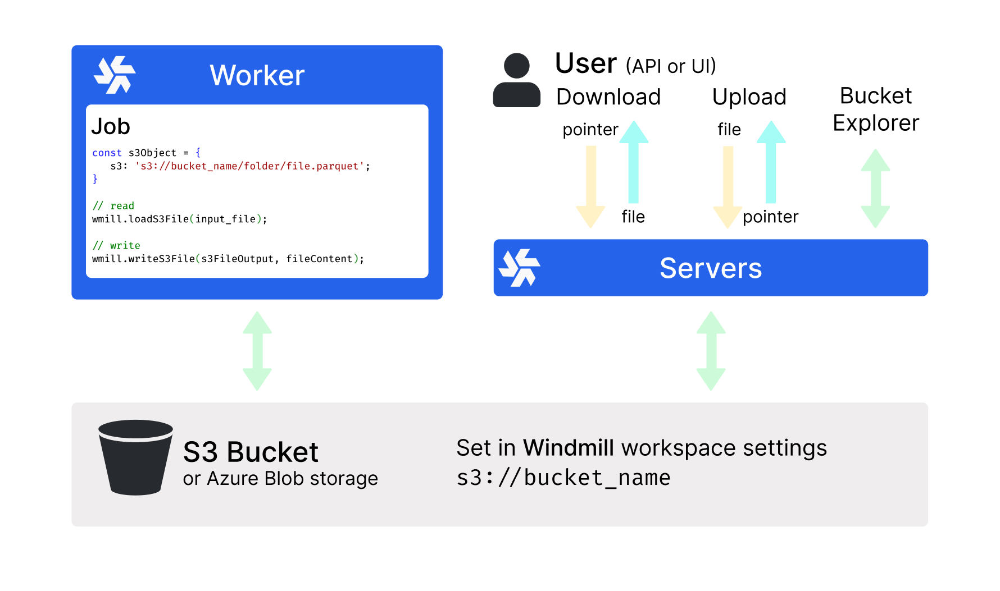
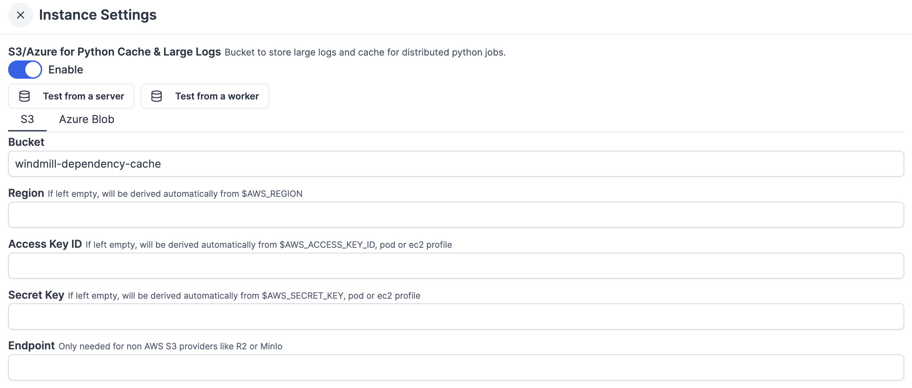

import DocCard from '@site/src/components/DocCard';

# Tigris integration

[Tigris](https://www.tigrisdata.com/) is an S3-compatible object storage service that automatically caches data at the edge closest to where it's accessed. Zero egress fees and a free tier (5 GB).

Instance and workspace object storage are different from using S3 resources within scripts, flows, and apps, which is free and unlimited. This is what is [described in this page](#add-a-s3-resource).

At the [workspace level](../core_concepts/38_object_storage_in_windmill/index.mdx#workspace-object-storage), what is exclusive to the [Enterprise](/pricing) version is using the integration of Windmill with S3 that is a major convenience layer to enable users to read and write from S3 without having to have access to the credentials.

Additionally, for [instance integration](../core_concepts/38_object_storage_in_windmill/index.mdx#instance-object-storage), the Enterprise version offers advanced features such as large-scale log management and distributed dependency caching.

Tigris's API follows the same schema as any S3 compatible API.

## Add a S3 resource

To integrate Tigris to Windmill, you need to save the following elements as a [resource](../core_concepts/3_resources_and_types/index.mdx).

Create an access key at [console.tigris.dev](https://console.tigris.dev). Keys are prefixed with `tid_` (access key) and `tsec_` (secret key).

| Property  | Type    | Description                  | Default | Required | Where to Find                                              | Additional Details                                                                     |
| --------- | ------- | ---------------------------- | ------- | -------- | ---------------------------------------------------------- | -------------------------------------------------------------------------------------- |
| bucket    | string  | S3 bucket name               |         | true     | [Tigris Console](https://console.tigris.dev)               | Name of the bucket to access                                                           |
| region    | string  | AWS region for the S3 bucket | `auto`  | true     | N/A                                                        | Must be `auto`. Tigris routes requests to the nearest edge automatically               |
| useSSL    | boolean | Use SSL for connections      | true    | false    | N/A                                                        | SSL/TLS is required for Tigris                                                         |
| endPoint  | string  | S3 endpoint                  |         | true     | [Tigris documentation](https://www.tigrisdata.com/docs/)   | Use `t3.storage.dev`, or `fly.storage.tigris.dev` on Fly.io                            |
| accessKey | string  | AWS access key               |         | true     | [Tigris Console](https://console.tigris.dev)               | Access key ID, prefixed with `tid_`                                                    |
| pathStyle | boolean | Use path-style addressing    | false   | false    | N/A                                                        | Must be `false`. Tigris uses virtual-hosted-style URLs                                 |
| secretKey | string  | AWS secret key               |         | true     | [Tigris Console](https://console.tigris.dev)               | Secret access key, prefixed with `tsec_`                                               |

  

Your resource can be used [passed as parameters](../core_concepts/3_resources_and_types/index.mdx#passing-resources-as-parameters-to-scripts-preferred) or [directly fetched](../core_concepts/3_resources_and_types/index.mdx#fetching-them-from-within-a-script-by-using-the-wmill-client-in-the-respective-language) within [scripts](../script_editor/index.mdx), [flows](../flows/1_flow_editor.mdx), [low-code apps](../apps/0_app_editor/index.mdx) and [full-code apps](../full_code_apps/index.mdx).

<iframe
	style={{ aspectRatio: '16/9' }}
	src="https://www.youtube.com/embed/ggJQtzvqaqA"
	title="YouTube video player"
	frameBorder="0"
	allow="accelerometer; autoplay; clipboard-write; encrypted-media; gyroscope; picture-in-picture; web-share"
	allowFullScreen
	className="border-2 rounded-lg object-cover w-full dark:border-gray-800"
></iframe>

 

> Example of a Supabase resource being used in two different manners from a script in Windmill.
 

:::tip

Find some pre-set interactions with S3 on the [Hub](https://hub.windmill.dev/integrations/s3).

Feel free to create your own S3 scripts on [Windmill](../getting_started/00_how_to_use_windmill/index.mdx).

:::

## Workspace object storage

Once you've created an S3, Azure Blob, or Google Cloud Storage resource in Windmill, you can use Windmill's native integration with S3, Azure Blob, or GCS, making it the recommended storage for large objects like files and binary data.

The workspace object storage is exclusive to the [Enterprise](/pricing) edition. It is meant to be a major convenience layer to enable users to read and write from S3 without having to have access to the credentials.

	<DocCard
		title="Workspace object storage"
		description="Connect your Windmill workspace to your S3 bucket, your Azure Blob storage, or your GCS bucket to enable users to read and write from S3 without having to have access to the credentials."
		href="/docs/core_concepts/object_storage_in_windmill#workspace-object-storage"
	/>

## Instance object storage

Under [Enterprise Edition](/pricing), instance object storage offers advanced features to enhance performance and scalability at the [instance](../advanced/18_instance_settings/index.mdx) level. This integration is separate from the [Workspace object storage](#workspace-object-storage) and provides solutions for large-scale log management and distributed dependency caching.

	<DocCard
		title="Instance object storage"
		description="Connect your Windmill instance to your S3 bucket, your Azure Blob storage, or your GCS bucket to enable users to read and write from S3 without having to have access to the credentials."
		href="/docs/core_concepts/object_storage_in_windmill#instance-object-storage"
	/>

