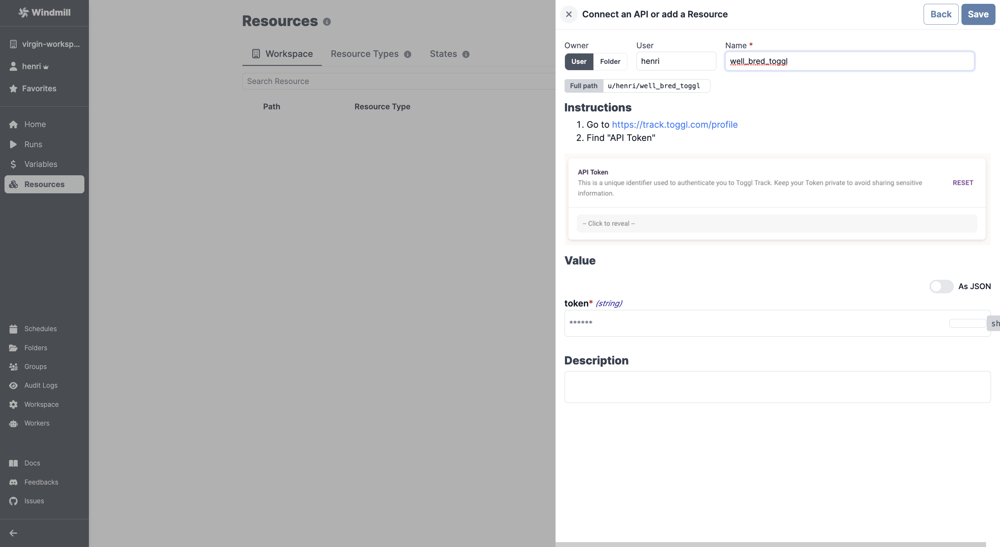

# Toggl Integration

To integrate [Toggl](https://toggl.com/) to Windmill, you need to save the following elements as a [resource](../core_concepts/3_resources_and_types/index.md).

| Property | Type   | Description     | Required | Where to find                                       |
| -------- | ------ | --------------- | -------- | --------------------------------------------------- |
| token    | string | API token       | true     | 1. Go to https://track.toggl.com/profile 2. Find "API Token" |

  

:::tip

Feel free to create your own Toggl scripts on [Windmill](../getting_started/00_how_to_use_windmill/index.md).

:::