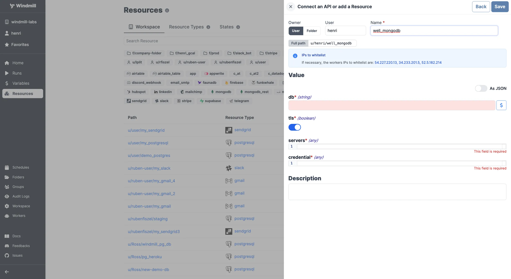

# Upstash Integration

Upstash follows the same connection method as [MongoDB](./mongodb.md), providing the database name, TLS settings, server information, and credentials for authentication.

Here's a table detailing the properties for Upstash integration using the [MongoDB resource type](https://hub.windmill.dev/resource_types/22/mongodb):

| Property          | Type    | Description                | Default | Required | Where to Find              | Additional Details                                  |
| ----------------- | ------- | -------------------------- | ------- | -------- | -------------------------- | --------------------------------------------------- |
| db                | integer | Database index             |         | true     | Redis Server Configuration | Index of the Redis database you want to connect to  |
| tls               | boolean | Use TLS for connections    | true    | false    | Your own preference        | Set to true for secure connections                  |
| servers           | array   | Array of server objects    |         | true     | Redis Server Configuration | Each server object should contain `host` and `port` |
| host (nested)     | string  | Server address             |         | true     | Redis Server Configuration | Hostname of the Redis instance                      |
| port (nested)     | integer | Port number                | 6379    | false    | Redis Server Configuration | Default Redis port is `6379`                        |
| credential        | object  | Authentication information |         | true     | Redis Server Configuration | Contains `password`                                 |
| password (nested) | string  | Database password          |         | true     | Redis Server Configuration | Your Redis server's password                        |
