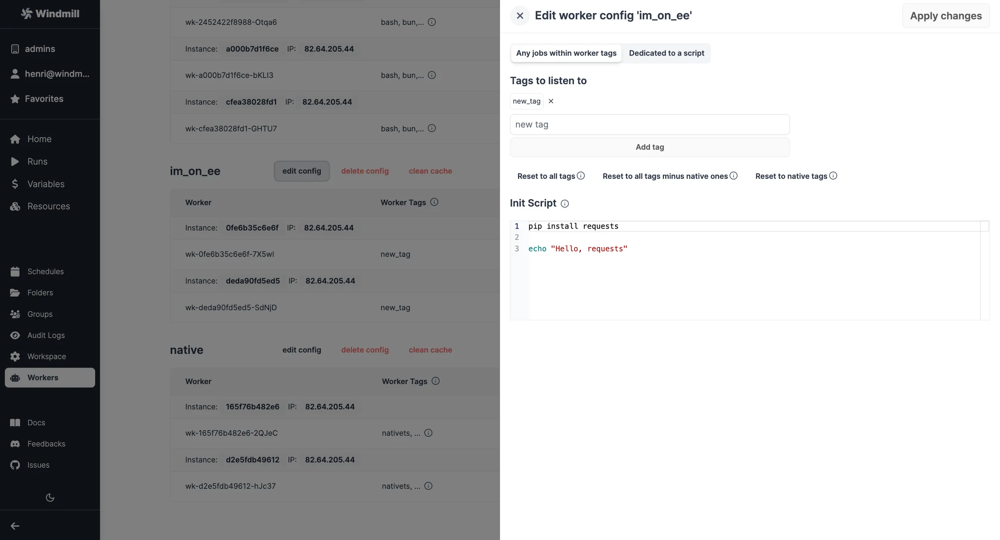

import DocCard from '@site/src/components/DocCard';

# Worker Groups Management UI

Workers are autonomous processes that run one script at a time using the full
machines resources available to them. They are at the basis of [Windmill's architecture](../10_architecture/index.md).

In the [Community Edition](/pricing), worker management is done using tags that can be respectively assigned to workers (through the [env variable](#how-to-assign-worker-tags-to-a-worker-group) `WORKER_TAGS`) and scripts or flows, so that the workers listen to specific jobs queues.

Under [Cloud plans & Self-Hosted Enterprise license](/pricing), worker groups can be managed through Windmill UI.

Specifically, you can group the workers into worker groups, groups for which you can [manage the tags](../../core_concepts/9_worker_groups/index.mdx) they listen to, [assignment to a single script](../../core_concepts/25_dedicated_workers/index.mdx), or the [worker init scripts](../../advanced/8_preinstall_binaries/index.mdx#init-scripts), from the UI.

More at:

	<DocCard
		title="Workers and Worker Groups"
		description="Worker Groups allow users to run scripts and flows on different machines with varying specifications."
		href="/docs/core_concepts/worker_groups"
	/>
	<DocCard
		title="Dedicated Workers / High Throughput"
		description="Dedicated Workers are workers that are dedicated to a particular script."
		href="/docs/core_concepts/dedicated_workers"
	/>
	<DocCard
		title="Init Scripts"
		description="Init Scripts are executed at the beginning when the worker starts."
		href="/docs/advanced/preinstall_binaries#init-scripts"
	/>

