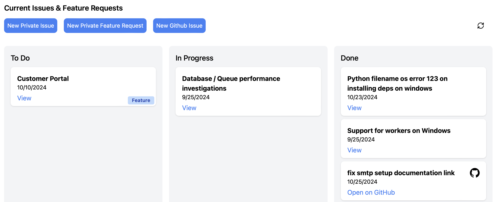
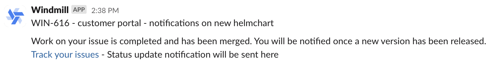

import DocCard from '@site/src/components/DocCard';

# Support & SLA

Windmill provides dedicated support and service level agreements (SLAs) to ensure timely assistance and address any issues that may arise during your usage of the platform.

## Technical support

Our knowledgeable support team is available 24/7 to assist you with any technical inquiries, troubleshooting, or questions you may have. We are committed to providing timely responses and resolutions to ensure a seamless experience with Windmill.

## Issue prioritization

To effectively handle and prioritize issues, we categorize them into different priority levels based on their impact and urgency. This enables us to allocate resources efficiently and ensure that critical issues receive immediate attention. Issues are tracked through private issues boards and bug trackers, such as GitHub ones.

- P0 (Priority 0): Reserved for blocking and urgent issues that require immediate resolution.
- P1 (Priority 1): High-priority issues that significantly impact functionality or performance.
- P2 (Priority 2): Medium-priority issues that have a moderate impact on functionality.
- P3 (Priority 3): Low-priority issues that have minimal impact on functionality or usability.

## Service Level Agreement (SLA)

Our SLA defines the expected response times for each priority level:

- P0: Response within 3 hours.
- P1: Response within 24 hours.
- P2: Response within 48 hours.
- P3: Response within 72 hours.

## Support level for each plan

- **Community**: Basic support is available for users on the Community plan. Response times may vary, and priority is given to higher-tier plans.
- **Team & Pro**: Users on the Team & Pro plans receive Priority Support 24/7. Our goal is to respond within 48 hours and provide assistance from our automation engineers.
- **Enterprise**: Customers on the Enterprise plan enjoy the highest level of support. They receive Priority Support 24/7 with a 3-hour response time and benefit from dedicated assistance from our automation engineers.

	<DocCard title="Pricing" description="Details on each Windmill Plan" href="/pricing" />

## Security

Windmill adheres to SOC 2 Type II compliance. As part of our commitment to maintaining a secure platform, we conduct regular penetration testing. Any identified vulnerabilities are treated with utmost priority (P0) and addressed promptly, with same-day fixes being our standard practice. We prioritize the security of our users and strive to provide a safe environment for their automation needs.

Our SOC 2 Type II report is available upon request for [Enterprise](/pricing) customers.

## Contacting support

If you require support or have any questions, you can reach out to our support team through the following channels:

- Email: contact@windmill.dev.
- Discord: [Windmill Discord Community](https://discord.com/invite/V7PM2YHsPB).
- Dedicated Slack or Discord channel on enterprise plan.
- Schedule a Meeting: [Book a Meeting](https://www.windmill.dev/book-demo).
- Feature request and issue tracking [Dashboard](https://portal.windmill.dev/issues) (enterprise only feature).

Our support team is committed to ensuring your success with Windmill, and we are here to provide the assistance you need at every step of your journey.

	<DocCard
		title="Contact / Getting help"
		description="Getting stuck using Windmill? Your problem can be quickly solved and reporting it is the best way to contribute."
		href="/docs/misc/getting_help"
	/>

## Feature request and issue dashboard

[Enterprise](/pricing) users have access to a dedicated feature request and issue dashboard, allowing them to submit and track their requests and issues. Additionally, updates to issues are automatically sent via email and to a designated Slack or Discord channel for easy tracking.

### Configuration

[Superadmins](../../core_concepts/16_roles_and_permissions/index.mdx) and anyone with access to [Windmill Customer Portal](../7_plans_details/index.mdx#windmill-customer-portal) can configure the following dashboard settings from the portal:
- **Linked GitHub users**: When an issue is created by a linked GitHub user, it is automatically added to the dashboard.
- **Authorized domains**: Users with email addresses associated with authorized domains are granted access to the dashboard.
- **Email notification addresses**: Email addresses to receive notifications about new issues and updates.

### Usage

To use the feature request and issue dashboard, follow these steps:

1. Access the dashboard at [https://portal.windmill.dev/issues](https://portal.windmill.dev/issues).
2. Log in using your authorized email address.
3. Create a new issue by clicking the "New private issue" or "New private feature request" buttons and filling out the form. If you believe your issue is of general public interest you can also create a public [GitHub issue](https://github.com/windmill-labs/windmill/issues).
4. View and update existing issues by clicking on them in the dashboard.
5. Receive email notifications and Slack/Discord updates about new issues and updates.

6. An issue is marked as done when a corresponding pull request is merged. The issue will be tagged as "release: pending"
7. Once a new release has been cut, you will be notified and the issue will be tagged with the release version.

	<DocCard
		title="Windmill Customer Portal"
		description="Follow usage, subscription, issues and feature requests."
		href="/docs/misc/plans_details#windmill-customer-portal"
	/>

