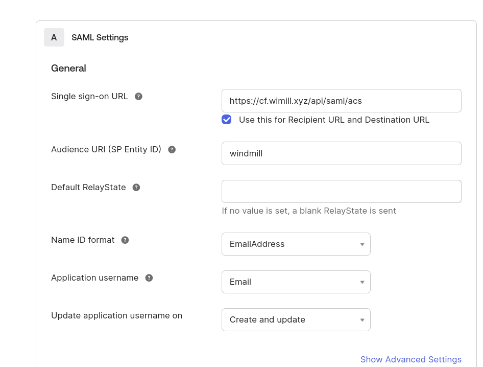
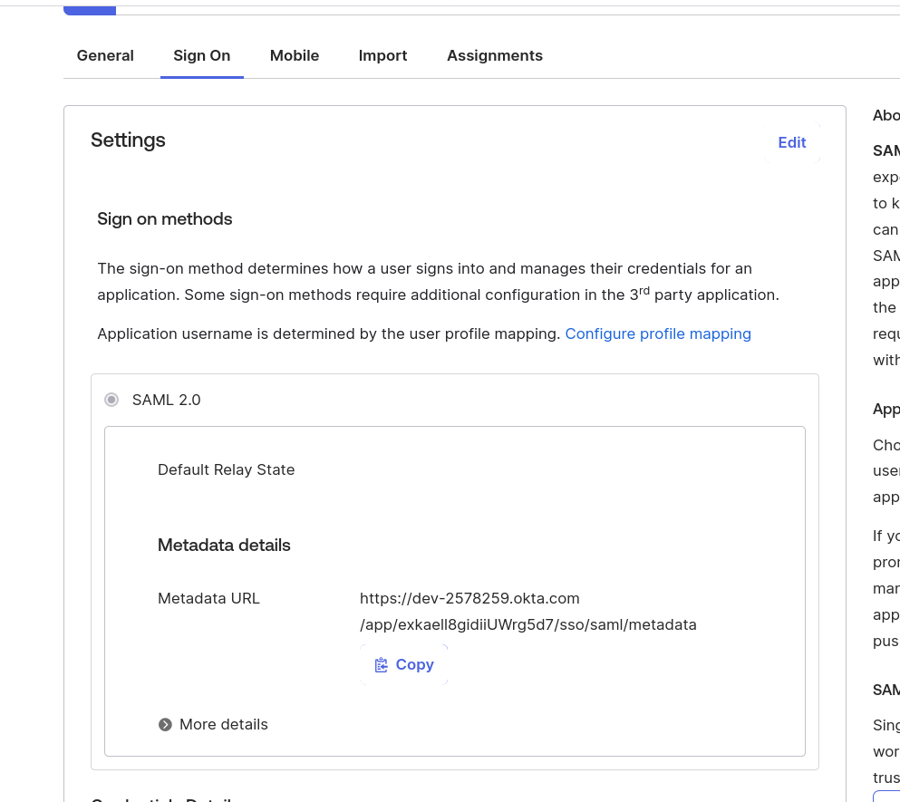
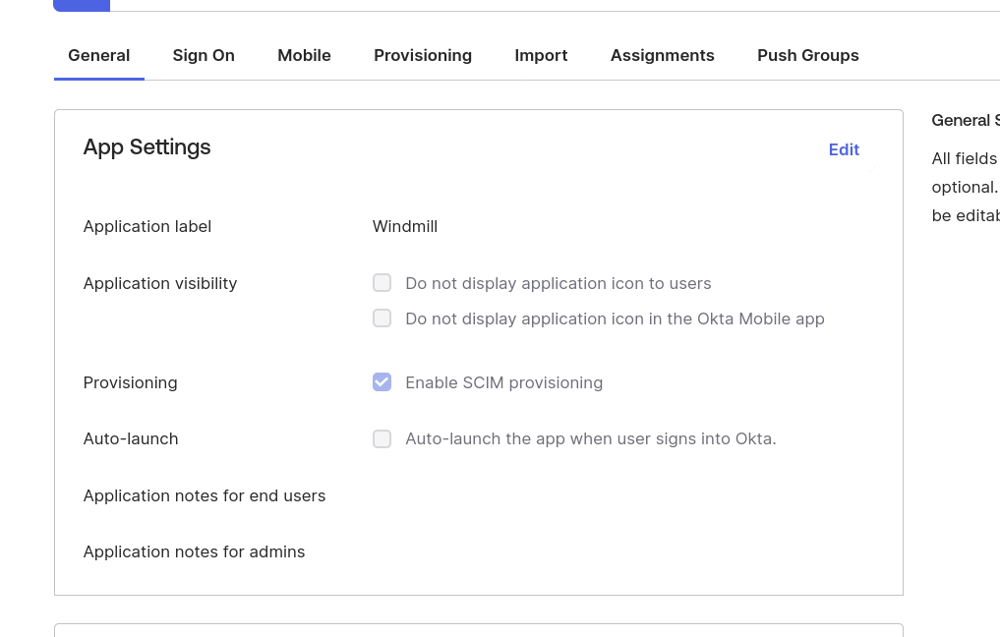
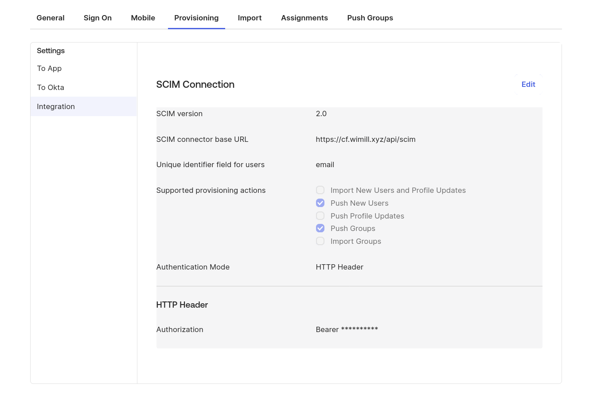

# SAML & SCIM

## SAML

### Okta

Configure Okta with the following settings (and replace cf.wimill.xyz with your domain):

Pass SAML_METADATA to the container to enable SAML authentication. In the helm charts, the value is `enterprise.samlMetadata`:

## SCIM

### Okta

Configure Okta with the following settings (and replace cf.wimill.xyz with your domain):

For the Bearer Token, use the value of `enterprise.scimToken` in the helm charts which corresponds to the SCIM_TOKEN env variable for the server container.

