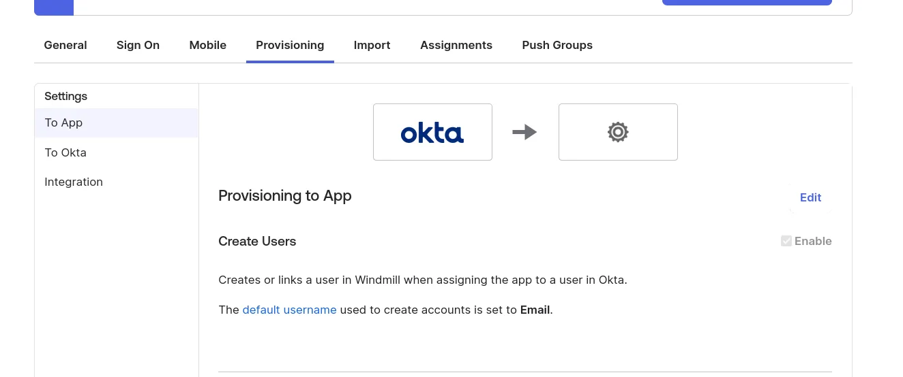
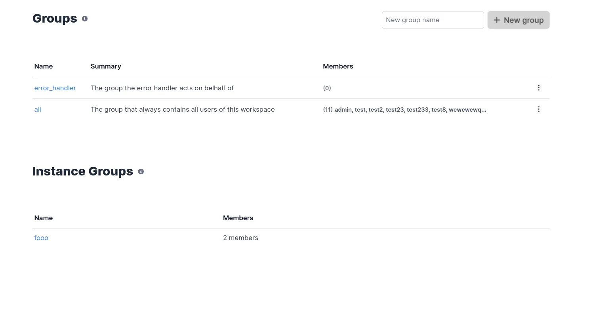

# SAML & SCIM

This guide provides guidance on configuring SAML (Security Assertion Markup Language) and SCIM (System for Cross-domain Identity Management) on Windmill for both Okta and Microsoft Azure.

This feature is available under [Enterprise Edition](/pricing). Configuration is set from [Instance Settings](../../advanced/18_instance_settings/index.mdx#scimsaml)

## SAML

The entity ID is `windmill`

ACS Url is `<instance_url>/api/saml/acs`
SCIM connector is `<instance_url>/api/scim`
Application username format is `Email`

In the Instance Settings UI, pass the SAML Metadata URL (or content) containing the metadata URL (or XML content).

### Okta

Configure Okta with the following settings (and replace cf.wimill.xyz with your domain):

In the Instance Settings UI, pass the SAML Metadata URL (or content) containing the metadata URL (or XML content).

### Microsoft Azure

In the Azure portal, go to "Enterprise Applications" and create a new one of type "Non-gallery".

Once the application is created, in the application's page go to "Single sign-on" on the left menu, and click on the "SAML" button.

Edit the configuration to set the Entity ID to `windmill` and the ACS url to `<instance_url>/api/saml/acs`.

Copy the App Federation Metadata URL and paste it in the Instance Settings UI.

If for some reasons, the metadata URL cannot be used, you can copy the XML content and paste it in the field instead.

Once it's saved, you can test the login by clicking on the `Test` button at the bottom, then on the drawer `Test sign in`.

## SCIM

### Okta

Configure Okta with the following settings (and replace cf.wimill.xyz with your domain):

In the Instance Settings UI, set the SCIM token containing the secret value that you will share to Okta.

### Microsoft Azure

Create an application from the "Enterprise Applications" menu (see [Configuring SAML with Microsoft Azure](#microsoft-azure)). Once the application is created, in the application's page go to "Provisioning" on the left menu, and click on the "Get started" button.

Choose the "Automatic" provisioning mode, and then for the Tenant URL, input the public URL of your Windmill server with the prefix `/api/scim`.

Copy the App Federation Metadata URL and paste it in the Instance Settings UI.

In the Instance Settings UI, set the SCIM token containing the secret value that you will share to Azure. You can click "Test" in Windmill's Instance Settings UI to validate the SAML metadata URL/Content.

You can then click on the Test Connection button to validate Azure can connect to Windmill's SCIM endpoint. You can then choose to sync only the Users and Groups assigned to this application, or all users and groups. Note that if you choose the former, after you save, go to the application's page and click on the "Users and groups" button in the left menu bar. Only the users and groups present here will be synced to Windmill.

Once this is done, you can click on the Save button at the top left. Azure will now synchronize users and groups approximately every 40 minutes.

### In Windmill

Once setup, the groups page should contain a new section:

