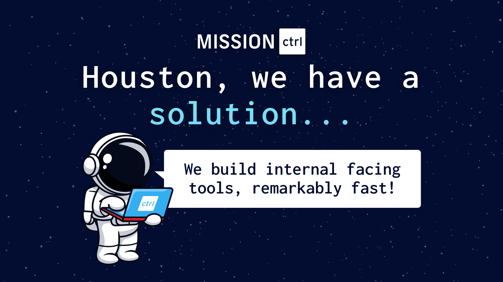

import DocCard from '@site/src/components/DocCard';

# Windmill Partners

Partners are consultancies and agencies that are Windmill's experts and are known to give great results.

If you are an agency, see [How to become an official partner](#how-to-become-an-official-partner).

## List of Validated Partners

### Mission Ctrl

[Mission Ctrl](https://missionctrl.dev/) is a full service data and systems transformation consultancy. They help you design and monitor your data solutions.

Mission Ctrl provides the necessary support to implement Windmill at scale within your organization and leverage it to create your data pipelines and internal tools.

    <DocCard
    	title="Get in Touch with Mission Ctrl"
    	description="Book a meeting with the Mission Ctrl Team"
    	href="https://missionctrl.dev/book"
    />

## How to become an official partner

Any organization wishing to add value to Windmill is welcome to apply to Windmill's partnership program.

If you would like to provide consulting, technical implementation assistance, or add-on services, you can contact us at contact@windmill.dev to discuss.

Hosting Windmill for your own clients is also an option and is covered under our [Whitelabeling license](../8_white_labelling/index.md).

    <DocCard
    	title="Get in Touch"
    	description="Send email to contact@windmill.dev to talk about partnership."
    	href="mailto:contact@windmill.dev"
    />
	<DocCard
    	title="White Labeling Windmill"
    	description="Windmill offers white labeling capabilities, allowing you to customize the Windmill platform to align with your brand."
    	href="/docs/misc/white_labelling"
    />

