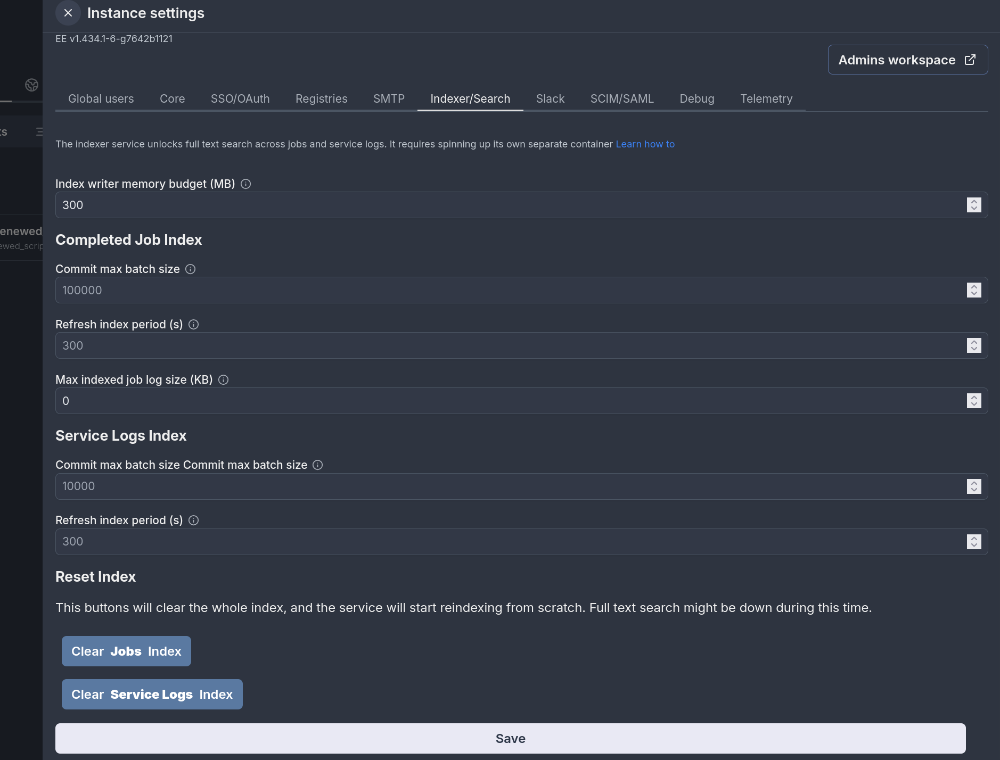

# Full text search on jobs and logs


Windmill offers the functionality to do full-text search on jobs (across args, logs, results, ...) and service logs.

In order to access this functionality, the instance must be running the windmill indexer service.


## How to run the indexer service

### Setup using docker compose

On the Windmill's docker-compose.yml there is an example of how to setup the indexer container to enable full text search, just make sure to change replicas from 0 to 1.

:::warn
The replicas should be set to exactly one and not more, only one index writer can exist at a time and having multiple will not result in the expected behavior.
:::

```yml
  # The indexer powers full-text job and log search, an EE feature.
  windmill_indexer:
    image: ${WM_IMAGE}
    pull_policy: always
    deploy:
      replicas: 1 # set to 1 to enable full-text job and log search
    restart: unless-stopped
    expose:
      - 8001
    environment:
      - PORT=8001
      - DATABASE_URL=${DATABASE_URL}
      - MODE=indexer
    depends_on:
      db:
        condition: service_healthy
    volumes:
      - windmill_index:/tmp/windmill/search
```

The indexer is in charge of both indexing new jobs and answering search queries. Because of this,
we also need to redirect search requests to this container instead of the normal windmill server.
This is what it looks like if you're using Caddy:

```Caddyfile
{$BASE_URL} {
        bind {$ADDRESS}
        reverse_proxy /ws/* http://lsp:3001
        # reverse_proxy /ws_mp/* http://multiplayer:3002
        reverse_proxy /api/srch/* http://windmill_indexer:8001
        reverse_proxy /* http://windmill_server:8000
        # tls /certs/cert.pem /certs/key.pem
}
```

Redirecting requests prefixed by /api/srch to port 8001 (same port as in the docker-compose.yml)

### Setup using helm charts

This section is a work in progress.

## Configure the indexer service

### Indexer settings

The index can be configured in the Instance Settings. Note that the default values should work for most use cases




| Setting name                           | default  | description |
| -------------------------------------- | -------- | ----------- |
| Index writer memory budget (MB)        | 300 MB  | How much memory the writer can use before writing to disk. Increasing it can improve indexing throughput. |
| Commit max batch size                  | 100000  | How many documents to include at most per commit. This is mostly relevant for the first time indexing. A large value will result in less commits, i.e. faster and more efficient indexing, but results will be available only once their commits are completed.  |
| Refresh index period (s)               | 300s    | The indexer will periodically fetch the latest jobs and write them to the index. A shorter period means new jobs/logs are available for search faster, but also results in more and more frequent writes to s3. |
| Max indexed job log size (MB)          | 1 MB    | Job logs bigger than this will be truncated before indexing. |


### Index persistence

There are two ways to make the index persistent (and avoid reindexing all jobs at every restart). The recommended way is to setup an object storage such as Amazon S3, and the index will automatically be backed up and pulled from there. This can be done by setting up [S3/Azure for python cache and large logs](../../core_concepts/38_object_storage_in_windmill/index.mdx#large-job-logs-management).

It is also possible to store the index in a volume attached to the indexer container. The docker-compose.yml serves as an example of how to set it up (on `/tmp/windmill/search`).

## Using full text search

Learn how full text search can be used to find [completed jobs](../../core_concepts/35_search_bar/index.mdx#searching-runs) and [service logs](../../core_concepts/36_service_logs/index.mdx#log-search)


