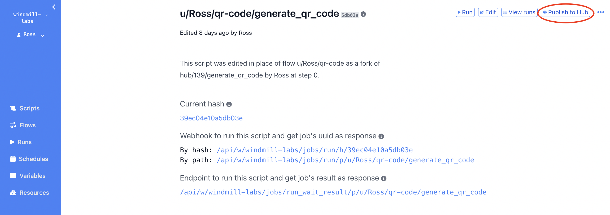
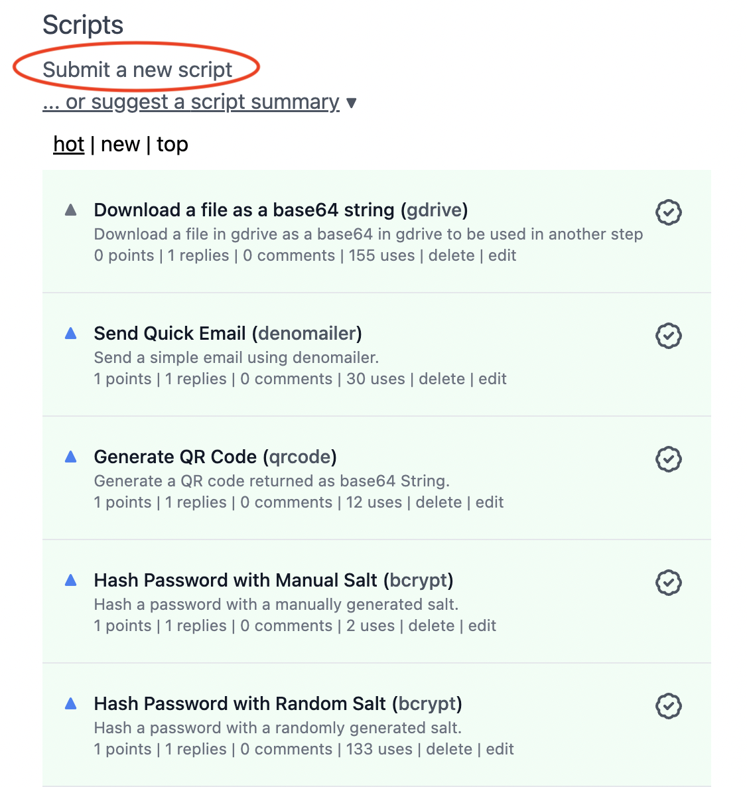
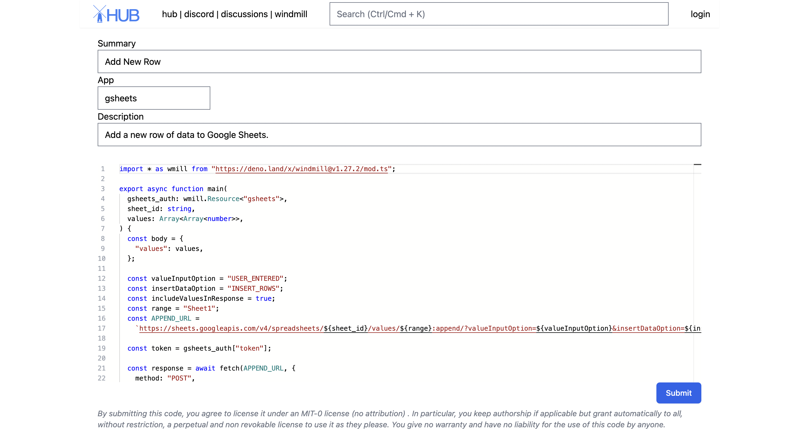
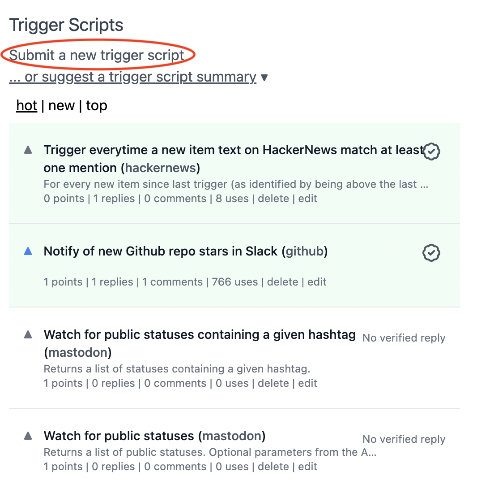
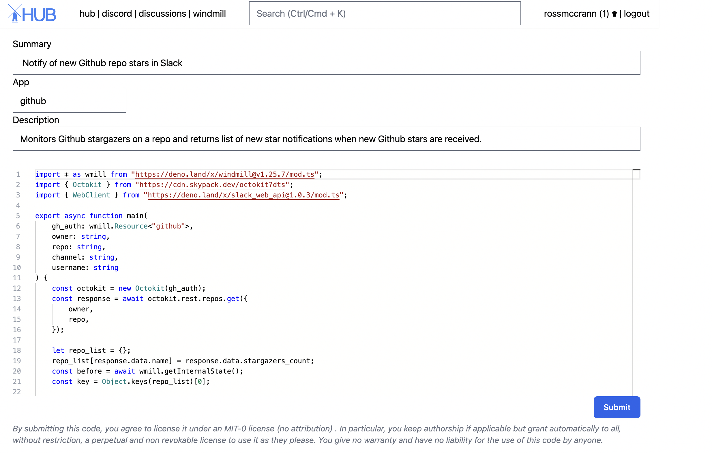

# Share on Windmill Hub

New modules/scripts can be added to Windmill Hub by logging in and navigating to
the homepage at [Windmill Hub](https://hub.windmill.dev/).

## Scripts

Scripts are standalone apps that can be reused and chained as building blocks to
create more complex Flows. In order to add a new script, goto the Scripts
section on the Windmill Hub homepage and select "Submit a new script".

Once a script is created in Windmill, it can easily be added to Windmill Hub by
navigating to the script information page and clicking the "Publish to Hub"
button. You will be redirected to a submit new script page on Windmill Hub.
Enter a short "Summary" describing what the script does. Next enter the name of
the app that the script uses and add a description with further information.
Finally, add the code for the script into the editor and click save to publish
the new script on Windmill Hub.

Alternatively, scripts can be added directly from the
[Windmill Hub](https://hub.windmill.dev/). To add a new script navigate to the
script section on the Windmill Hub homepage and select "Submit a new trigger
script".

Enter a short "Summary" describing what the script does. Next enter the name of
the app that the script uses and add a description with further information.
Finally, add the code for the script into the editor and click save to publish
the new script on Windmill Hub.

## Trigger Script

Trigger scripts are scripts whose purpose is to pull data from an external
source and return all new items since last run. They are generally used in Flows
that are scheduled very regularly to reduce latency to react to new events. When
new items are returned by a trigger script, it will trigger the rest of the flow
once per item. If no new items, the flow will be skipped.

Once a trigger script is created in Windmill, it can easily be added to Windmill
Hub by navigating to the trigger script information page and clicking the
"Publish to Hub" button. You will be redirected to a submit new trigger script
page on Windmill Hub.

Alternatively, trigger scripts can be added directly from the
[Windmill Hub](https://hub.windmill.dev/). To add a new trigger script navigate
to the trigger script section on the Windmill Hub homepage and select "Submit a
new trigger script".

Next, enter a short "Summary" describing what the trigger script does. Next
enter the name of the app that the trigger script uses and add a description
with further information. Finally, add the code for the trigger script into the
editor and click save to publish the new trigger script on Windmill Hub.

