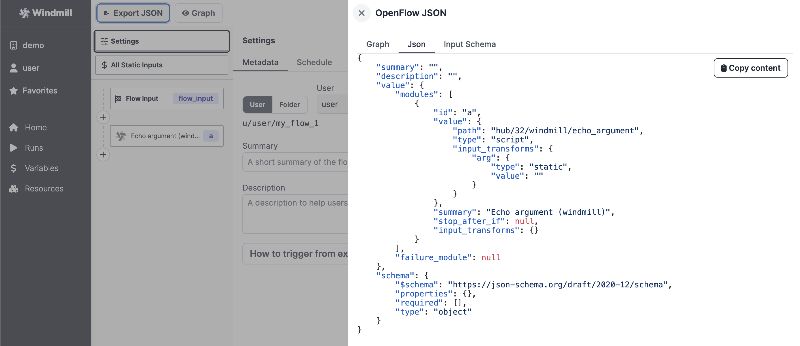

# Share on Windmill Hub

**[Windmill Hub][wm-hub] is the community website of Windmill** where you can find
and share your Scripts, Flows, Apps and Resource Types with every Windmill user.
The best submissions get approved by the Windmill Team and get integrated
directly in the app for everyone to reuse easily.

Scripts can be written in TypeScript (Deno), Go, Python and Bash, however,
similarly to the Windmill app, **TypeScript is the recommended language**.

With the hub, **we aim to create a trusted support for users** to save time and find inspirations to solve problems they didn't even know Windmill could crack! It is therefore **also made for less technical users** to get familiar with Windmill and find ways to improve their daily work.

The Hub is complementary to our **[Discord][wm-discord]** where community members give mutual support & kudos, you should have a look!

Below you will find guides on how to contribute to the Hub, thank you for being part of the community!

## Scripts

Currently [Windmill Hub][wm-hub] supports TypeScript(Deno), Python, Go and Bash
scripts. You can add Common, Error Handler, Approval and Trigger Scripts by
going to the <a rel="nofollow" href="https://hub.windmill.dev/scripts/add">New Script</a> page. The
**Summary** will be the title of the Script, **Integration** should have the name of
the app it integrates with (if there is one), and **Description** should be a
short description of the script - it supports Markdown.

Then you can do your magic and write your script for the community.

Once approved by the Windmill Team, the Script will be available for
**everyone** to use directly on Windmill Cloud.

## Flows

Using the [OpenFlow](../../openflow/index.md) portable format, one can simply
copy the JSON from the Flow editor and paste it on the
[New Flow](https://hub.windmill.dev/flows/add) page to upload it to the Hub.

Then you can do your magic and share your flow for the community.

Once a Flow is approved by the Windmill Team, it will be directly integrated
into **every workspace of every instance of Windmill**.

## Resource Types

[Resource Types](../../core_concepts/3_resources_and_types/index.md) are simply
[JSON Schemas](../../core_concepts/13_json_schema_and_parsing/index.md) which create a **Type** to
Resources by constraining the properties or fields that the Resource can have.
In addition, they serve two main purposes on Windmill:

- Filter Resources by Resource Types for the generated UI.
- Allow to have a way to manually create Resources of the specified Resource
  Type using the autogenerated UI from their JSON Schema.

To add a Resource Type to the Windmill Hub, go to the
[New Resource Type](https://hub.windmill.dev/resource_types/add) page. You can
then add your arguments one by one or use the monaco editor to edit it as a JSON
directly.

Adding a Resource Type to the [Hub][wm-hub] will be available for **every
Windmill user**, once it is approved by the Windmill Team.

If it gets approved, the
windmill-gh-action-deploy will deploy it in the starter workspace of Windmill Cloud. Being deployed on the
starter workspace means that it will be available to **all workspaces**.

________
Thank you for your interest in sharing your work on the Hub. Community is essential to our work to build a tool that is useful, powerful and fun to use.

<!-- Resources -->

[wm-hub]: https://hub.windmill.dev
[wm-discord]: https://discord.com/invite/V7PM2YHsPB

<!-- ## Scripts

Scripts are standalone apps that can be reused and chained as building blocks to
create more complex Flows. In order to add a new script, goto the Scripts
section on the Windmill Hub homepage and select "Submit a new script".

Once a script is created in Windmill, it can easily be added to Windmill Hub by
navigating to the script information page and clicking the "Publish to Hub"
button. You will be redirected to a submit new script page on Windmill Hub.
Enter a short "Summary" describing what the script does. Next enter the name of
the app that the script uses and add a description with further information.
Finally, add the code for the script into the editor and click save to publish
the new script on Windmill Hub.

Alternatively, scripts can be added directly from the
[Windmill Hub](https://hub.windmill.dev/). To add a new script navigate to the
script section on the Windmill Hub homepage and select "Submit a new trigger
script".

Enter a short "Summary" describing what the script does. Next enter the name of
the app that the script uses and add a description with further information.
Finally, add the code for the script into the editor and click save to publish
the new script on Windmill Hub.

## Trigger Script

Trigger scripts are scripts whose purpose is to pull data from an external
source and return all new items since last run. They are generally used in Flows
that are scheduled very regularly to reduce latency to react to new events. When
new items are returned by a trigger script, it will trigger the rest of the flow
once per item. If no new items, the flow will be skipped.

Once a trigger script is created in Windmill, it can easily be added to Windmill
Hub by navigating to the trigger script information page and clicking the
"Publish to Hub" button. You will be redirected to a submit new trigger script
page on Windmill Hub.

Alternatively, trigger scripts can be added directly from the
[Windmill Hub](https://hub.windmill.dev/). To add a new trigger script navigate
to the trigger script section on the Windmill Hub homepage and select "Submit a
new trigger script".

Next, enter a short "Summary" describing what the trigger script does. Next
enter the name of the app that the trigger script uses and add a description
with further information. Finally, add the code for the trigger script into the
editor and click save to publish the new trigger script on Windmill Hub.

 -->
