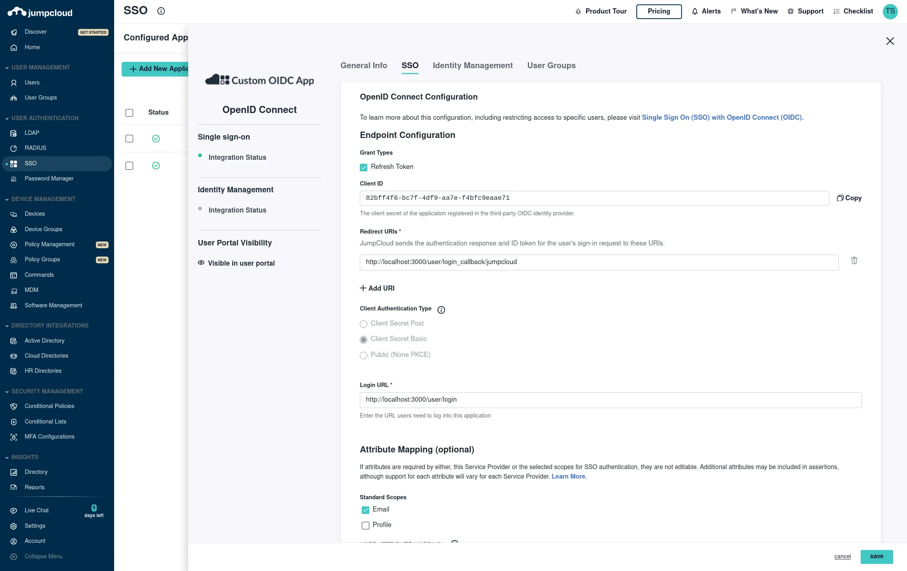

# Setup OAuth and SSO

Windmill supports Single Sign-On for [Microsoft](#microsoft), [Google](#google-login), [GitHub](#github), [GitLab](#gitlab), [Okta](#okta), and domain restriction.

On your [self-hosted instance](../../advanced/1_self_host/index.mdx), the oauth.json need to be mounted from your Windmill server and worker instances. On the [`docker-compose.yml`](https://github.com/windmill-labs/windmill/blob/main/docker-compose.yml), this would correspond to uncommenting these [2 lines](https://github.com/windmill-labs/windmill/blob/main/docker-compose.yml#L42-L43), and those [2 other lines](https://github.com/windmill-labs/windmill/blob/main/docker-compose.yml#L65-L66) and have an oauth.json file in the same folder as the docker-compose.yml.

The oauth.json has the following structure:

```json
{
  "<integration>": {
    "id": "...",
    "secret": "..."
  },
  ....
}
```

> `<integration>` code must match with the code that is setup in [oauth_connect.json](https://github.com/windmill-labs/windmill/blob/main/backend/oauth_connect.json).

<br/>

For environments that do not support mounting files or if not practical, you may also pass it base64 as env variable to the server: `OAUTH_JSON_AS_BASE64=$(base64 oauth.json | tr -d '\n')`.

## OAuth SSO

### Google login

**Create Google OAuth keys**

First, you need to create a Google OAuth Client:

- Go to https://console.developers.google.com/apis/credentials and create a project if you did not have one.
- Click "Create Credentials", then click "OAuth Client ID" in the drop-down menu.
- Enter the following:
  - Application Type: Web Application
  - Name: Windmill
  - Authorized Redirect URLs: https://<YOUR_INSTANCE>/user/login_callback/google
- Click Create.
- Copy the **Client ID** and **Client Secret** from the "OAuth Client" modal.
- Edit your `oauth.json` to look like:

```json
{
	"google": {
		"id": "<CLIENT_ID>",
		"secret": "<CLIENT_SECRET>",
		"allowed_domains": ["youremaildomain.dev"]
	}
}
```

### Keycloak

Setup your realm in Keycload then add the following to your `oauth.json`:

```
{
  "keycloak_<realm>": {
    "id": "...",
    "secret": "...",
    "connect_config": {
      "auth_url": "https://.../realms/<realm>/protocol/openid-connect/auth",
      "token_url": "https://.../realms/<realm>/protocol/openid-connect/token",
      "scopes": ["openid", "offline_access"]
    },
    "login_config": {
      "auth_url": "https://.../realms/<realm>/protocol/openid-connect/auth",
      "token_url": "https://.../realms/<realm>/protocol/openid-connect/token",
      "userinfo_url":  "https://.../realms/<realm>/protocol/openid-connect/userinfo",
      "scopes": ["openid", "offline_access"]
    }
  }
}
```

### Jumpcloud

SSO -> Custom OIDC

Name: Windmill

Go to SSO tab:

Redirect URI: https://<YOUR_INSTANCE>/user/login_callback/jumpcloud
Login: https://<YOUR_INSTANCE>/user/login

Client Authentication Type: Client Secret Basic
Attribute Mapping, Standard Scopes: Check Email

Add the proper groups then click save. You should see your Client ID and Client Secret on the next screen then add the following entry "jumpcloud" to your oauth.json:

```json
{
	"jumpcloud": {
		"id": "<CLIENT_ID>",
		"secret": "<CLIENT_SECRET>",
		"allowed_domains": ["youremaildomain.dev"]
	}
}
```



### Okta

Setup your `oauth.json` (e.g. via the `oauthConfig` in the values.yaml when using helm), using `okta` as the realm name, though
you can provide whatever realm name you want here, if you know what you're doing. This is configured as though helm is being
used for the deployment.

```
{
  "okta": {
    "id": "<client credential from the client ID section of the okta service configuration>",
    "secret": "<from the CLIENT SECRETS section of the okta service configuration>",
    "login_config": {
      "auth_url": "https://<your org>.okta.com/oauth2/v1/authorize",
      "token_url": "https://<your org>.okta.com/oauth2/v1/token",
      "userinfo_url": "https://<your org>.okta.com/oauth2/v1/userinfo",
      "scopes": ["openid", "profile", "email"]
    },
    "connect_config": {
      "auth_url": "https://<your org>.okta.com/oauth2/v1/authorize",
      "token_url": "https://<your org>.okta.com/oauth2/v1/token",
      "scopes": ["openid", "profile", "email"]
    }
  }
}
```

From your Admin page, setup windmill using the service flow

1. `Create a new app integration`
   a. For "sign-in method" select "OIDC - Open ID Connect"
   b. For "application type" select "Web Appliction"
2. Select all of the following options for Grant type of "Client acting on behalf of a user"

- Authorization Code
- Refresh Token
- Implicit (hybrid)
- Allow ID Token with implicit grant type
- Allow Access Token with implicit grant type

3. For Refresh Token, select "Rotate token after every use"
4. Under "LOGIN", set the following:

- "Sign-in redirect URIs" `https://<your windmill's public hostname as configured in values.yaml>/user/login_callback/okta/`
- "Sign-out redirect URIs" `https://<your windmill's public hostname as configured in values.yaml>`
- "Login initiated by" `App Only`
- "Initiate login URI" `https://<your windmill's public hostname as configured in values.yaml>/user/login`

### Microsoft

Redirect URI: https://<YOUR_INSTANCE>/user/login_callback/microsoft
Login: https://<YOUR_INSTANCE>/user/login

Microsoft's Single Sign-On integration is supported by Windmill. Detailed steps for setting up Microsoft as an OAuth SSO provider will be provided in the upcoming documentation but the entry for the oauth.json is as following:

```json
{
	"microsoft": {
		"id": "<CLIENT_ID>",
		"secret": "<CLIENT_SECRET>",
		"allowed_domains": ["youremaildomain.dev"]
	}
}
```

### GitHub

Redirect URI: https://<YOUR_INSTANCE>/user/login_callback/github
Login: https://<YOUR_INSTANCE>/user/login

GitHub's Single Sign-On integration is supported by Windmill. Detailed steps for setting up GitHub as an OAuth SSO provider will be provided in the upcoming documentation but the entry for the oauth.json is as following:

```json
{
	"github": {
		"id": "<CLIENT_ID>",
		"secret": "<CLIENT_SECRET>",
		"allowed_domains": ["youremaildomain.dev"]
	}
}
```

### GitLab

Redirect URI: https://<YOUR_INSTANCE>/user/login_callback/gitlab
Login: https://<YOUR_INSTANCE>/user/login

GitLab's Single Sign-On integration is supported by Windmill. Detailed steps for setting up GitLab as an OAuth SSO provider will be provided in the upcoming documentation but the entry for the oauth.json is as following:

```json
{
	"gitlab": {
		"id": "<CLIENT_ID>",
		"secret": "<CLIENT_SECRET>",
		"allowed_domains": ["youremaildomain.dev"]
	}
}
```

### Custom OAuth

You can add a completely custom oauth without requiring a dev setup. The item accepts an extra optional field: `connect_config` or `login_config` of type OAuthConfig:

```
interface OAuthConfig {
    auth_url: string,
    token_url: string,
    userinfo_url?: string,
    scopes?: string[],
    extra_params?: Record<string, string>,
    extra_params_callback?: Record<string, string>,
    req_body_auth?: bool
}
```

`connect_config` is used for resources, and `login_config` for SSO.

Once you have validated your custom item, we would be greateful if you could open a PR. See [Contributor's guide](../4_contributing/index.md) for more details.

## OAuth Resources

### Slack

1. Create a new slack app at <https://api.slack.com/apps?new_app=1>

Your app manifest shoud look like this, replacing `<YOUR INSTANCE URL>` in 2 places.

```yaml
display_information:
  name: Windmill
  description: windmill.dev slackbot and oauth integration
  background_color: '#3b82f6'
  long_description: The Windmill app allows to use command to run jobs inside Windmill as well as receiving message as the Windmill app. The windmill app pairs a slack workspace with a windmill workspace. It must be installed from within the settings of a windmill workspace.
features:
  app_home:
    home_tab_enabled: true
    messages_tab_enabled: true
    messages_tab_read_only_enabled: true
  bot_user:
    display_name: Windmill
    always_online: true
  slash_commands:
    - command: /windmill
      url: <YOUR INSTANCE URL>/api/oauth/slack_command
      description: Trigger the script set in your workspace settings for slack
      usage_hint: the text that will be passed to the script
      should_escape: false
oauth_config:
  redirect_urls:
    - <YOUR INSTANCE URL>
  scopes:
    user:
      - chat:write
      - admin
      - channels:write
    bot:
      - chat:write
      - chat:write.public
      - channels:join
      - commands
settings:
  org_deploy_enabled: false
  socket_mode_enabled: false
  token_rotation_enabled: false
```

1.

```json
{
  ...
  "slack": {
    "id": "<CLIENT_ID>",
    "secret": "<CLIENT_SECRET>"
  }
}
```

### Google Sheet

**Create GSheet OAuth keys**

- Create a Google OAuth account by going to https://console.developers.google.com/apis/credentials and create a project if you did not have one.
- Click "Enable APIs and Services"
  - Search "Google Sheets API"
  - Enable this API
- Click "Create Credentials", then click "OAuth 2.0 Client IDs" in the drop-down menu.
- Enter the following:
  - Application Type: Web Application
  - Name: Windmill
  - Authorized Redirect URLs: https://<YOUR_INSTANCE>/oauth/callback/gsheets
- Click Create.
- Copy the **Client ID** and **Client Secret** from the "OAuth Client" modal.
- Edit your `oauth.json` to look like:

```json
{
	"gsheets": {
		"id": "<CLIENT_ID>",
		"secret": "<CLIENT_SECRET>"
	}
}
```

The same steps apply to enable more APIs ([Gmail](../../integrations/gmail.md), [Gdrive](../../integrations/gdrive.md), etc.) on your Google Account to set up the resources in Windmill.