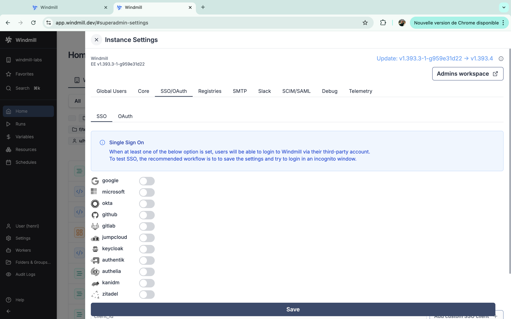
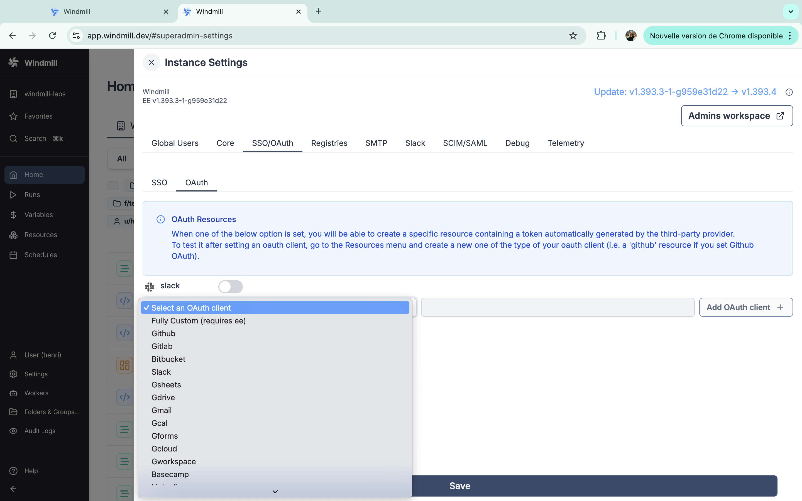

import DocCard from '@site/src/components/DocCard';

# Setup OAuth and SSO

Windmill supports Single Sign-On for [Google](#google-login), [Microsoft](#microsoft), [Okta](#okta), [GitHub](#github), [GitLab](#gitlab), [Jumpcloud](#jumpcloud), [Keycloak](#keycloak), [Authentik](#authentik), [Authelia](#authelia), [Kanidm](#kanidm), [Zitadel](#zitadel) and domain restriction.

Windmill supports [Slack](#slack), [GitHub](#github-1), [GitLab](#gitlab-1), [Bitbucket](#bitbucket), [Google Sheets](#google-sheets), [Google Drive](#google-drive-gdrive), [Gmail](#gmail), [Google Calendar](#google-calendar-gcal), [Google Forms](#google-forms-gforms), [Google Cloud](#google-cloud-gcloud), [Google Workspace](#google-workspace-gworkspace), [Basecamp](#basecamp), [LinkedIn](#linkedin), [QuickBooks](#quickbooks), [Visma](#visma), [Snowflake](#snowflake), and [Custom OAuth](#custom-oauth).

On [self-hosted instances](../../advanced/1_self_host/index.mdx), OAuth configuration are set in the [instance settings](../../advanced/18_instance_settings/index.mdx).

<div className="grid grid-cols-2 gap-6 mb-4">
	<DocCard
		title="Self-host Windmill"
		description="Self host Windmill in 2 minutes."
		href="/docs/advanced/self_host/"
	/>
</div>

## SSO



We recommend using a private navigation tab to test the new settings as soon as they are saved by refreshing the login page as a non authed user.

### Google login

<iframe
	style={{ aspectRatio: '16/9' }}
	src="https://www.youtube.com/embed/jSpuBsRv0yM"
	title="YouTube video player"
	frameBorder="0"
	allow="accelerometer; autoplay; clipboard-write; encrypted-media; gyroscope; picture-in-picture; web-share"
	allowFullScreen
	className="border-2 rounded-lg object-cover w-full dark:border-gray-800"
></iframe>

<br />

**Create Google OAuth keys**

First, you need to create a Google OAuth Client:

- Go to https://console.developers.google.com/apis/credentials and create a project if you did not have one.
- Click "Create Credentials", then click "OAuth Client ID" in the drop-down menu.
- Enter the following:
  - Application Type: Web Application
  - Name: Windmill
  - Authorized Redirect URLs: `https://<YOUR_INSTANCE>/user/login_callback/google`
- Click Create.
- Copy the **Client ID** and **Client Secret** from the "OAuth Client" modal.

[Instance settings](../../advanced/18_instance_settings/index.mdx#authoauth) 'SSO OAuth' - 'SSO' - Toggle "Google" and set client id, org and client secret.

### Microsoft

Redirect URI: `https://<YOUR_INSTANCE>/user/login_callback/microsoft`
Login: `https://<YOUR_INSTANCE>/user/login`

Create a new OAuth 2.0 Client in [Microsoft portal](https://portal.azure.com/#blade/Microsoft_AAD_RegisteredApps/ApplicationsListBlade).

In the "Authentication" tab, set the redirect URI to `BASE_URL/user/login_callback/microsoft`, the logout channel to
`BASE_URL/auth/logout` where BASE_URL is what you configured as core BASE_URL.
Also set "Accounts in any organizational directory (Any Microsoft Entra ID tenant -
Multitenant) and personal Microsoft accounts (e.g. Skype, Xbox)", you can restrict the
emails directly in Windmill using the "allowed_domains" setting.

[Instance settings](../../advanced/18_instance_settings/index.mdx#authoauth) 'SSO OAuth' - - 'SSO' - Toggle "microsoft" and set client id, org and client secret.

### Okta

From your Admin page, setup Windmill using the service flow:

1. `Create a new app integration`:

   a. For "sign-in method" select "OIDC - Open ID Connect".

   b. For "application type" select "Web Application".

2. Select all of the following options for Grant type of "Client acting on behalf of a user":

   - Authorization Code
   - Refresh Token
   - Implicit (hybrid)
   - Allow ID Token with implicit grant type
   - Allow Access Token with implicit grant type

3. For Refresh Token, select "Rotate token after every use".
4. Under "LOGIN", set the following:

   - "Sign-in redirect URIs" `https://<your windmill's public hostname as configured in values.yaml>/user/login_callback/okta/`
   - "Sign-out redirect URIs" `https://<your windmill's public hostname as configured in values.yaml>`
   - "Login initiated by" `App Only`
   - "Initiate login URI" `https://<your windmill's public hostname as configured in values.yaml>/user/login`

[Instance settings](../../advanced/18_instance_settings/index.mdx#authoauth) 'SSO OAuth' - - 'SSO' - Toggle "okta" and set client id, org and client secret.

### GitHub

Redirect URI: `https://<YOUR_INSTANCE>/user/login_callback/github`
Login: `https://<YOUR_INSTANCE>/user/login`

[Instance settings](../../advanced/18_instance_settings/index.mdx#authoauth) 'SSO OAuth' - - 'SSO' - Toggle "github" and set client id, org and client secret.

### GitLab

Redirect URI: `https://<YOUR_INSTANCE>/user/login_callback/gitlab`
Login: `https://<YOUR_INSTANCE>/user/login`

GitLab's Single Sign-On integration is supported by Windmill. Detailed steps for setting up GitLab as an OAuth SSO provider will be provided in the upcoming documentation but the entry for the oauth.json is as following:

[Instance settings](../../advanced/18_instance_settings/index.mdx#authoauth) 'SSO OAuth' - - 'SSO' - Toggle "gitlab" and set client id, org and client secret.

### Jumpcloud

SSO -> Custom OIDC

Name: Windmill

Go to SSO tab:

Redirect URI: `https://<YOUR_INSTANCE>/user/login_callback/jumpcloud`
Login: `https://<YOUR_INSTANCE>/user/login`

Client Authentication Type: Client Secret Basic
Attribute Mapping, Standard Scopes: Check Email

Add the proper groups then click save. You should see your Client ID and Client Secret on the next screen then add the following entry "jumpcloud":

[Instance settings](../../advanced/18_instance_settings/index.mdx#authoauth) 'SSO OAuth' - - 'SSO' - Toggle "jumpcloud" and set client id and client secret, and "Client Authentication Type" to "Client Secret Basic"


### Keycloak

Setup your realm in Keycloak and set Keycloak in [Instance settings](../../advanced/18_instance_settings/index.mdx#authoauth) 'SSO OAuth' - - 'SSO' and Keycloak

### Authentik

To integrate Windmill with Authentik as an OAuth provider, follow these steps:

1. **Create OAuth Client in Authentik**:
   - Go to your Authentik instance dashboard.
   - Navigate to **Applications** and click **Create New Application**.
   - In the application settings, set the following:
     - **Redirect URI**: `https://<YOUR_INSTANCE>/user/login_callback/authentik`
     - **Post-Logout Redirect URI**: `https://<YOUR_INSTANCE>/user/login`
     - **Grant Types**: Authorization Code, Refresh Token
   - After saving the application, you will be provided with a **Client ID** and **Client Secret**.

2. **Instance settings in Windmill**:
   - Go to Windmill's admin settings under 'SSO OAuth' - 'SSO'.
   - Toggle "authentik" and enter:
     - **Authentik URL**: `https://<AUTHENTIK_HOST>/application/o/authorize/`
     - **Client ID**: [from Authentik]
     - **Client Secret**: [from Authentik]
   - Save your settings.

### Authelia

To integrate Windmill with Authelia as an OAuth provider, follow these steps:

1. **Create OAuth Client in Authelia**:
   - Go to your Authelia instance dashboard.
   - Navigate to **OIDC Clients** and create a new client.
   - Set the following values:
     - **Redirect URI**: `https://<YOUR_INSTANCE>/user/login_callback/authelia`
     - **Post-Logout Redirect URI**: `https://<YOUR_INSTANCE>/user/login`
     - **Scopes**: OpenID, Email
   - After saving, you will be given a **Client ID** and **Client Secret**.

2. **Instance settings in Windmill**:
   - Go to Windmill's admin settings under 'SSO OAuth' - 'SSO'.
   - Toggle "authelia" and enter:
     - **Authelia URL**: `https://<AUTHELIA_URL>/api/oidc/authorization`
     - **Client ID**: [from Authelia]
     - **Client Secret**: [from Authelia]
   - Save your settings.

### Kanidm

To integrate Windmill with Kanidm as an OAuth provider, follow these steps:

1. **Create OAuth Client in Kanidm**:
   - In your Kanidm instance, create a new OAuth 2.0 client in the dashboard.
   - Set the following values:
     - **Redirect URI**: `https://<YOUR_INSTANCE>/user/login_callback/kanidm`
     - **Post-Logout Redirect URI**: `https://<YOUR_INSTANCE>/user/login`
   - After saving the client, you will receive a **Client ID** and **Client Secret**.

2. **Instance settings in Windmill**:
   - Go to Windmill's admin settings under 'SSO OAuth' - 'SSO'.
   - Toggle "kanidm" and enter:
     - **Kanidm URL**: `https://<KANIDM_URL>/ui/oauth2`
     - **Client ID**: [from Kanidm]
     - **Client Secret**: [from Kanidm]
   - Save your settings.

### Zitadel

To integrate Windmill with Zitadel as an OAuth provider, follow these steps:

1. **Create OAuth Client in Zitadel**:
   - Log in to your Zitadel instance.
   - Navigate to the **Applications** section and create a new OAuth client.
   - Set the following values:
     - **Redirect URI**: `https://<YOUR_INSTANCE>/user/login_callback/zitadel`
     - **Post-Logout Redirect URI**: `https://<YOUR_INSTANCE>/user/login`
   - Once created, Zitadel will provide a **Client ID** and **Client Secret**.

2. **Instance settings in Windmill**:
   - Go to Windmill's admin settings under 'SSO OAuth' - 'SSO'.
   - Toggle "zitadel" and enter:
     - **Zitadel URL**: `https://<ZITADEL_URL>/oauth/v2/authorize`
     - **Client ID**: [from Zitadel]
     - **Client Secret**: [from Zitadel]
   - Save your settings.

### Custom OAuth

You can use other custom SSO clients from the [Instance settings](../../advanced/18_instance_settings/index.mdx#authoauth) 'SSO OAuth' - - 'SSO' and provide a client id to 'Add custom SSO client'.

## OAuth

When one of the OAuth options is set, you will be able to create a specific [resource](../../core_concepts/3_resources_and_types/index.mdx) containing a 'token' automatically generated by the third-party provider.
To test it after setting an oauth client, go to the Resources menu and create a new one of the type of your oauth client (i.e. a '[github](https://hub.windmill.dev/integrations/github)' resource if you set GitHub OAuth).



### Slack

Create a new Slack app at `https://api.slack.com/apps?new_app=1`

Pick "From an app manifest", then YAML.


Your app manifest should look like this, replacing `<YOUR INSTANCE URL>` in 3 places:

```yaml
display_information:
  name: Windmill
  description: windmill.dev slackbot and oauth integration
  background_color: '#3b82f6'
  long_description: The Windmill app allows to use command to run jobs inside Windmill as well as receiving message as the Windmill app. The Windmill app pairs a Slack workspace with a Windmill workspace. It must be installed from within the settings of a Windmill workspace.
features:
  app_home:
    home_tab_enabled: true
    messages_tab_enabled: true
    messages_tab_read_only_enabled: true
  bot_user:
    display_name: Windmill
    always_online: true
  slash_commands:
    - command: /windmill
      url: <YOUR INSTANCE URL>/api/oauth/slack_command
      description: Trigger the script set in your workspace settings for Slack
      usage_hint: the text that will be passed to the script
      should_escape: false
oauth_config:
  redirect_urls:
    - <YOUR INSTANCE URL>
  scopes:
    user:
      - chat:write
      - admin
      - channels:write
    bot:
      - chat:write
      - chat:write.public
      - channels:join
      - files:write
      - commands
settings:
  interactivity:
    is_enabled: true
    request_url: <YOUR INSTANCE URL>/api/slack
  org_deploy_enabled: false
  socket_mode_enabled: false
  token_rotation_enabled: false
```


Then from your [Instance settings](../../advanced/18_instance_settings/index.mdx), fill with Client ID and Client Secret.


As for any OAuth Settings, make sure that there is a corresponding resource type with the same name with a "token" field in the [superadmin](../../core_concepts/16_roles_and_permissions/index.mdx#superadmin) workspace. That should be the case by default with Slack.


Now users should be able to connect to Slack through OAuth:


### Microsoft Teams
- Go to the [Azure Portal](https://portal.azure.com/) and create a new "Bot Service" of type "[Azure Bot](https://portal.azure.com/#create/Microsoft.AzureBot)".

- Give your bot a unique "handle".
- Select the bot to be "Single tenant" rather than "Multi-tenant".
- You can leave the rest of the settings as default.
- Once created, go to [Microsoft Entra App Registration](https://portal.azure.com/#view/Microsoft_AAD_IAM/ActiveDirectoryMenuBlade/~/RegisteredApps) and select the bot you just created.
- On the left menu, click "Manage" -> "API permissions" -> "+ Add a permission" -> "Microsoft Graph" -> "Application permissions" -> "Channel.ReadBasic.All" and "Team.ReadBasic.All".

- On the left menu, click "Manage" -> "Certificates & secrets" -> "+ New client secret" -> "Add".
- Copy the **Client Secret** as you'll need it to set up the OAuth resource in Windmill.
- Also, copy the **Application (client) ID** and **Directory (tenant) ID** as you'll need them to set up the OAuth resource in Windmill.

- Sign in to the [Teams Bot Framework Portal](https://dev.teams.microsoft.com/apps) and create a new App.
- Fill in the "Basic Information" section and use the "Application ID" from the previous step.
- In the "Branding" section, upload the icons and accent colors.
- In "App Features", select "Bot" and under "Bot ID", use the "Application ID" from the previous step.

- Leave the rest of the settings as default, then go to "Domains" and add the domain of your Windmill instance.
- Finally, either "Preview" or "Publish" the app to your organization. Note that a preview is only possible if your organization allows [custom app installations](https://learn.microsoft.com/en-us/microsoftteams/manage-apps). If you publish, your Microsoft Teams admin will have to approve the app before it can be used in the "[Manage apps](https://admin.teams.microsoft.com/policies/manage-apps)" section of your organization.

:::warning
Deploying and approving an app to your organization can take a while. In the worst case, it can take up to 24 hours.
:::

- [Instance settings](../../advanced/18_instance_settings/index.mdx) -> Resources -> Add OAuth "teams" and set the client id (Application ID / Bot ID from the previous steps), client secret, and tenant id (Directory ID).


### GitHub

- Go to [GitHub Developer Settings](https://github.com/settings/developers).
- Click "New OAuth App".
- Enter the following:
  - Application Name: Windmill
  - Homepage URL: `https://<YOUR_INSTANCE>`
  - Authorization Callback URL: `https://<YOUR_INSTANCE>/oauth/callback/github`
- Click "Register Application".
- Copy the **Client ID** and **Client Secret** from the application details.
- [Instance settings](../../advanced/18_instance_settings/index.mdx) -> Resources -> Add OAuth "github" and set the client id and client secret.

### GitLab

- Go to your [GitLab profile settings](https://gitlab.com/profile/applications).
- Click "New Application".
- Enter the following:
  - Name: Windmill
  - Redirect URI: `https://<YOUR_INSTANCE>/oauth/callback/gitlab`
  - Scopes: Choose appropriate scopes like `api`, `read_user`, etc.
- Click "Save Application".
- Copy the **Application ID** and **Secret** from the application details.
- [Instance settings](../../advanced/18_instance_settings/index.mdx) -> Resources -> Add OAuth "gitlab" and set the client id and client secret.

### Bitbucket

- Go to [Bitbucket's App Creation page](https://bitbucket.org/account/settings/app-passwords/).
- Click "Create App Password".
- Enter the following:
  - Label: Windmill
  - Redirect URI: `https://<YOUR_INSTANCE>/oauth/callback/bitbucket`
  - Select appropriate scopes.
- Copy the **Client ID** and **Client Secret** from the application details.
- [Instance settings](../../advanced/18_instance_settings/index.mdx) -> Resources -> Add OAuth "bitbucket" and set the client id and client secret.

### Google Sheets

- Create a Google OAuth account by going to https://console.developers.google.com/apis/credentials and create a project if you did not have one.
- Click "Enable APIs and Services"
  - Search "Google Sheets API"
  - Enable this API
- Click "Create Credentials", then click "OAuth 2.0 Client IDs" in the drop-down menu.
- Enter the following:
  - Application Type: Web Application
  - Name: Windmill
  - Authorized Redirect URLs: `https://<YOUR_INSTANCE>/oauth/callback/gsheets`
- Click Create.
- Copy the **Client ID** and **Client Secret** from the "OAuth Client" modal.
- [Instance settings](../../advanced/18_instance_settings/index.mdx) -> Resources -> Add OAuth "gsheet" and set client id and client secret

The same steps apply to enable more APIs (**Gmail**, **Gdrive**, etc.) on your Google Account to set up the resources in Windmill.

### Google Drive (GDrive)

- Follow the instructions for Google Sheets OAuth, but search for and enable **Google Drive API** in the API services.
- Add the same Authorized Redirect URLs: `https://<YOUR_INSTANCE>/oauth/callback/gdrive`.
- Use the created credentials in Windmill.
- [Instance settings](../../advanced/18_instance_settings/index.mdx) -> Resources -> Add OAuth "gdrive" and set the client id and client secret.

### Gmail

- Follow the instructions for Google Sheets OAuth, but search for and enable **Gmail API** in the API services.
- Add the same Authorized Redirect URLs: `https://<YOUR_INSTANCE>/oauth/callback/gmail`.
- Use the created credentials in Windmill.
- [Instance settings](../../advanced/18_instance_settings/index.mdx) -> Resources -> Add OAuth "gmail" and set the client id and client secret.

### Google Calendar (GCal)

- Follow the instructions for Google Sheets OAuth, but search for and enable **Google Calendar API** in the API services.
- Add the same Authorized Redirect URLs: `https://<YOUR_INSTANCE>/oauth/callback/gcal`.
- Use the created credentials in Windmill.
- [Instance settings](../../advanced/18_instance_settings/index.mdx) -> Resources -> Add OAuth "gcal" and set the client id and client secret.

### Google Forms (GForms)

- Google Forms API may use Google Drive, so follow the Google Drive API OAuth instructions.
- Add the same Authorized Redirect URLs: `https://<YOUR_INSTANCE>/oauth/callback/gforms`.
- Use the created credentials in Windmill.
- [Instance settings](../../advanced/18_instance_settings/index.mdx) -> Resources -> Add OAuth "gforms" and set the client id and client secret.

### Google Cloud (GCloud)

- Follow the instructions for Google Sheets OAuth, but search for and enable **Google Cloud APIs** in the API services.
- Add the same Authorized Redirect URLs: `https://<YOUR_INSTANCE>/oauth/callback/gcloud`.
- Use the created credentials in Windmill.
- [Instance settings](../../advanced/18_instance_settings/index.mdx) -> Resources -> Add OAuth "gcloud" and set the client id and client secret.

### Google Workspace (GWorkspace)

- Follow the instructions for Google Sheets OAuth, but ensure you enable **Admin SDK API** in the API services.
- Add the same Authorized Redirect URLs: `https://<YOUR_INSTANCE>/oauth/callback/gworkspace`.
- Use the created credentials in Windmill.
- [Instance settings](../../advanced/18_instance_settings/index.mdx) -> Resources -> Add OAuth "gworkspace" and set the client id and client secret.

### Basecamp

- Go to [Basecamp's Developer Portal](https://integrate.37signals.com/authentication).
- Click "Register Your Application".
- Enter the following:
  - Name: Windmill
  - Redirect URI: `https://<YOUR_INSTANCE>/oauth/callback/basecamp`
- Copy the **Client ID** and **Client Secret** from the application details.
- [Instance settings](../../advanced/18_instance_settings/index.mdx) -> Resources -> Add OAuth "basecamp" and set the client id and client secret.

### LinkedIn

- Go to [LinkedIn Developers](https://www.linkedin.com/developers/apps).
- Click "Create App".
- Enter the following:
  - App Name: Windmill
  - Authorized Redirect URLs: `https://<YOUR_INSTANCE>/oauth/callback/linkedin`
- Copy the **Client ID** and **Client Secret**.
- [Instance settings](../../advanced/18_instance_settings/index.mdx) -> Resources -> Add OAuth "linkedin" and set the client id and client secret.

### QuickBooks

- Go to [QuickBooks Developer](https://developer.intuit.com/app/developer/qbo/docs/get-started).
- Click "Create an App".
- Enter the following:
  - App Name: Windmill
  - Redirect URL: `https://<YOUR_INSTANCE>/oauth/callback/quickbooks`
- Copy the **Client ID** and **Client Secret**.
- [Instance settings](../../advanced/18_instance_settings/index.mdx) -> Resources -> Add OAuth "quickbooks" and set the client id and client secret.

### Visma

- Go to [Visma Developer Portal](https://developer.visma.com/).
- Click "Create New Application".
- Enter the following:
  - Name: Windmill
  - Redirect URI: `https://<YOUR_INSTANCE>/oauth/callback/visma`
- Copy the **Client ID** and **Client Secret**.
- [Instance settings](../../advanced/18_instance_settings/index.mdx) -> Resources -> Add OAuth "visma" and set the client id and client secret.

### Snowflake

Go to [Snowflake](https://app.snowflake.com/) and open a new worksheet.

Edit and run the following query to create an OAuth integration:

```sql
CREATE OR REPLACE SECURITY INTEGRATION <enter a name for the OAuth integration>
TYPE = OAUTH
OAUTH_CLIENT = CUSTOM
OAUTH_CLIENT_TYPE = 'CONFIDENTIAL'
OAUTH_REDIRECT_URI = 'https://<public url of your Windmill instance>/oauth/callback/snowflake_oauth'
OAUTH_USE_SECONDARY_ROLES = IMPLICIT
ENABLED = TRUE
COMMENT = '<enter a description of your security integration>'
```
Retrieve the **client_id** and **client_secret** from the following query:
```sql
-- NOTE: replace <OAuth integration name> with the name of the OAuth integration you created above.
WITH oauth_data AS (
  SELECT PARSE_JSON(SYSTEM$SHOW_OAUTH_CLIENT_SECRETS('<OAuth integration name>')) AS oauth_json
)
SELECT
    oauth_json:OAUTH_CLIENT_ID::string AS client_id,
    oauth_json:OAUTH_CLIENT_SECRET::string AS client_secret
FROM
    oauth_data;
```

Retrieve your [snowflake account identifier](https://docs.snowflake.com/en/user-guide/admin-account-identifier#finding-the-organization-and-account-name-for-an-account) from the URL of your snowflake account or from your account settings. You can also retrieve the account identifier by running this query:
```sql
SELECT CURRENT_ORGANIZATION_NAME() || '-' || CURRENT_ACCOUNT_NAME() AS org_account_formatted;
```

[Instance settings](../../advanced/18_instance_settings/index.mdx) -> Resources -> Add OAuth "snowflake_oauth" and set the **client id**, **client secret** and **account identifier**.

Take a look at [this guide](../../misc/9_guides/snowflake_app_with_user_roles/index.mdx#sample-app-setup) to learn more about how to build an App with the Snowflake OAuth integration.

### Custom OAuth

Under [Enterprise Edition](/pricing), you can add a completely custom OAuth without requiring a dev setup. The item accepts an extra optional field: `connect_config` or `login_config` of type OAuthConfig:

```
interface OAuthConfig {
    auth_url: string,
    token_url: string,
    userinfo_url?: string,
    scopes?: string[],
    extra_params?: Record<string, string>,
    extra_params_callback?: Record<string, string>,
    req_body_auth?: bool
}
```

`connect_config` is used for resources, and `login_config` for SSO.

Once you have validated your custom item, we would be grateful if you could open a PR. See [Contributor's guide](../4_contributing/index.md) for more details.
