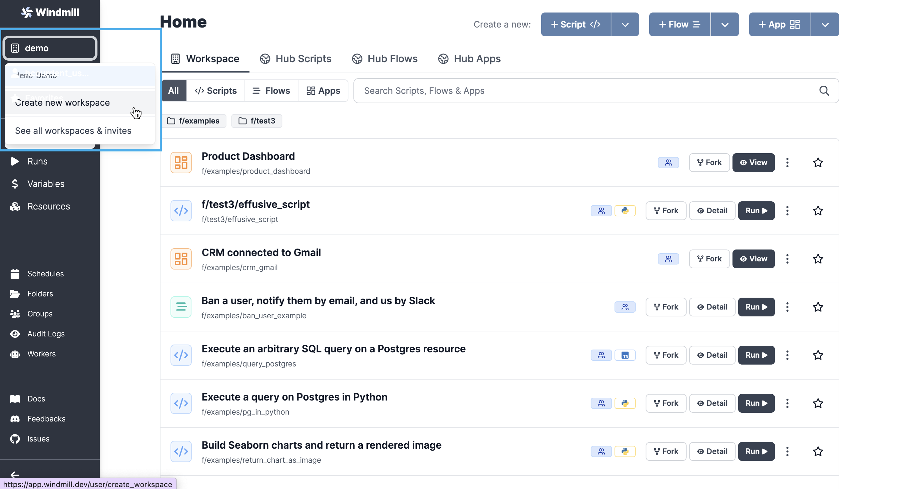
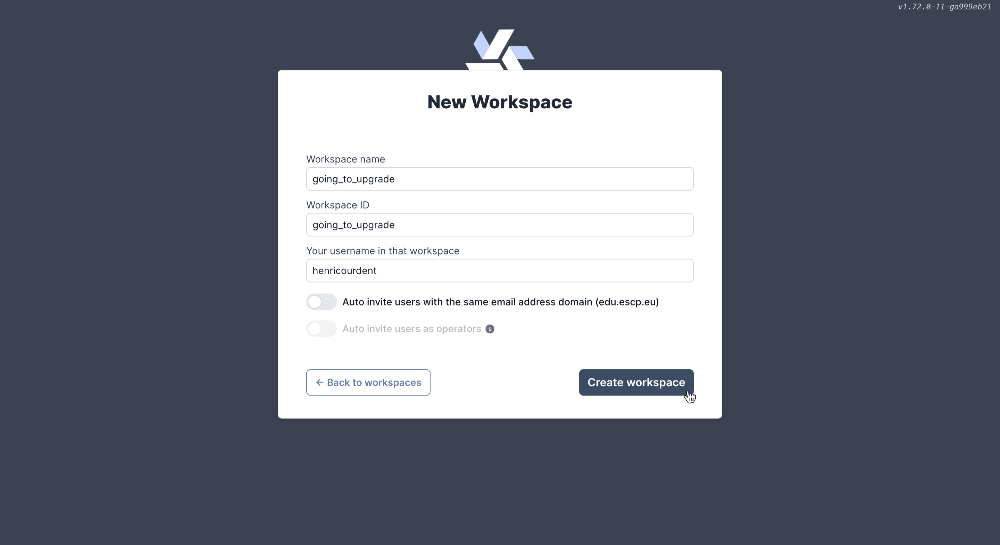
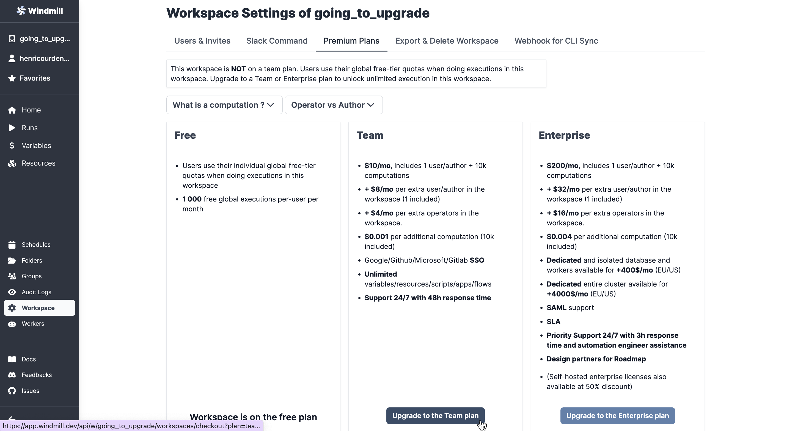

# How to Upgrade Windmill

Using Windmill is free, as we are committed to [open-source](https://github.com/windmill-labs/windmill). You can either:
- **[self-host](https://docs.windmill.dev/docs/advanced/self_host/)** it to use Windmill without restrictions (AGPLv3 License)
- use the **[cloud app](https://app.windmill.dev/user/login)**, building scripts, flows and apps for free.

However, you might need to upgrade your plan (from free) to Team or Enterprise editions. Reasons for this could be:
- Self hosted: Commercial licence, Audit Logs exports, Distributed dependency cache...
- Cloud: More computations, authors & operators, Dedicated isolated workers and database, Dedicated entire kubernetes cluster...
- Both: SAML, SLA and Priority support & design partners...

All details about plans are available on [Pricing][pricing] page.

**Plans on Windmill work at the workspace level**. The free-tier is global across any non-upgraded workspace, so upgrading Windmill means _upgrading the workspace_ to premium, not the account.

The exact billing of the subscription will then take into account number of users, among other things (computations, dedicated isolated workers and database, dedicated cluster etc).

Plans based on a workspace basis allow you to easily manage authorisations among users and track executions in aggregate.

## Enterprise Edition

Shortest first, to upgrade your workspace to Enterprise reach out to contact@windmill.dev or [book a demo][demo] with us.

You can find a simulation of cost on the [Pricing page][pricing].

## Team Edition

Upgrading to team edition is made **directly from your cloud workspace**.

From [Windmill Cloud](https://app.windmill.dev/user/login), go to the workspace you want to update.

:::tip Create a new workspace

 

From Windmill Cloud, click on the workspace button (by default, named "Demo") and then `Create new workspace`.

 

Configure settings and then `Create workspace`.

 

Your workspace is created!

 

It's empty for now, but populate it by creating new [scripts](../../getting_started/0_scripts_quickstart/index.md), [flows](../../getting_started/0_scripts_quickstart/index.md) & [apps](../../getting_started/7_apps_quickstart/index.md), or even import them from [Hub](https://hub.windmill.dev/).

:::

From your workspace - and if you are admin - click on your username, and then `Upgrade`.

This will lead you to the Workspace tab, where you can click on `Upgrade to the Team plan`.

From where you will access the Stripe page.

Your **billing will be automatically set** depending on the number of users/operators, and computations you executed.

We try to be as transparent as possible, if any question, feel free to reach out to contact@windmill.dev.

<!-- Resources -->

[demo]: https://cal.com/ruben-windmill/windmill-demo
[pricing]: https://www.windmill.dev/pricing/
[cloud]: https://app.windmill.dev/user/login
