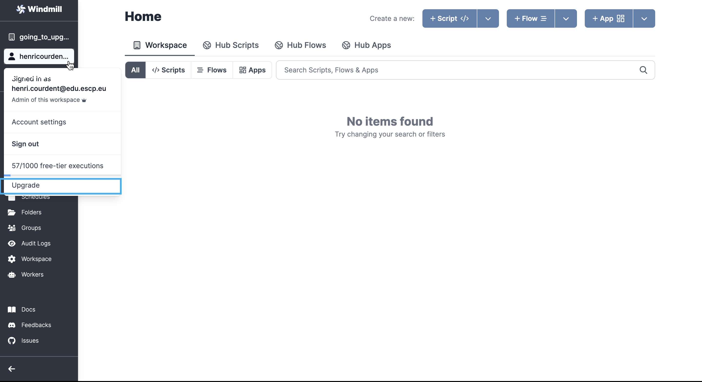

# How to Upgrade Windmill

Using Windmill is free, as we are committed to [open-source](https://github.com/windmill-labs/windmill). You can either:

- **[Self-host](https://docs.windmill.dev/docs/advanced/self_host/)** it to use Windmill without restrictions (AGPLv3 License).
- Use the **<a href="https://app.windmill.dev/" rel="nofollow">Cloud App</a>**, building scripts, flows and apps for free.

However, you might need to upgrade your plan (from free) to Team or Enterprise editions. Reasons for this could be:

- Self hosted: Commercial licence, Distributed dependency cache...
- Cloud: More computations, authors & operators, Dedicated isolated workers and database, Dedicated entire kubernetes cluster...
- Both: Audit logs, SAML, SLA and Priority support & design partners...

All details about plans are available on [Pricing][pricing] page.

**Plans on Windmill work at the workspace level**. The free-tier is global across any non-upgraded workspace, so upgrading Windmill means _upgrading the workspace_ to premium, not the account.

The exact billing of the subscription will then take into account number of users, among other things (computations, dedicated isolated workers and database, dedicated cluster etc).

Plans based on a workspace basis allow you to easily manage authorisations among users and track executions in aggregate.

## Team Edition

Upgrading to team edition is made **directly from your cloud workspace**.

From <a href="https://app.windmill.dev/" rel="nofollow">Windmill Cloud</a>, go to the workspace you want to update.

  
Learn how to create a new workspace. Expand:

From Windmill Cloud, click on the workspace button (by default, named "Demo") and then `+ Workspace`.

 

Configure settings and then `Create workspace`.

 

Your workspace is created!

 

It's empty for now, but populate it by creating new [scripts](../../getting_started/0_scripts_quickstart/index.mdx), [flows](../../getting_started/6_flows_quickstart/index.md) & [apps](../../getting_started/7_apps_quickstart/index.md), or even import them from [Hub](https://hub.windmill.dev/).

From your workspace - if you are admin - click on your username, and then `Upgrade`.

This will lead you to the Workspace tab, where you can click on `Upgrade to the Team plan`.

From where you will access the Stripe page.

Your **billing will be automatically set** depending on the number of users/operators, and computations you executed.

We try to be as transparent as possible, if any question, feel free to reach out to contact@windmill.dev.

## Enterprise Edition

You can find plan details and a simulation on the [Pricing page][pricing].

### Cloud

To upgrade your workspace to the Enterprise Edition, please reach out to us via contact@windmill.dev, [Discord](https://discord.com/invite/V7PM2YHsPB), or schedule a [meeting][demo]. Once you contact us, we will provide you with a secure Stripe link for payment. After completing the payment, your workspace and, if applicable, the cluster will be upgraded.

As an Enterprise user, you will gain access to a dedicated platform where you can view detailed usage information and access invoices at <a href="https://windmill.dev/billing" rel="nofollow">https://windmill.dev/billing</a>.

### Self-hosted

To upgrade your workspace to the Enterprise Edition for self-hosted deployments, please reach out to us via contact@windmill.dev, [Discord](https://discord.com/invite/V7PM2YHsPB), or schedule a [meeting][demo]. Once you contact us, we will provide you with a secure Stripe link for subscription. Upon subscribing, you will receive a license key that is valid for one year. To adjust the number of seats, you can update your usage on the subscription page at [https://windmill.dev/billing](https://windmill.dev/billing).

At the end of the subscription period, you will receive another license key valid for one year. We kindly request that you export your usage stats by sending us an email containing the data exported by Windmill through the provided export button at the end of the subscription period.

:::tip Using the License Key
To utilize the license key, switch from the windmill image to the windmill-ee image in both the server and workers. Pass the license key as the `LICENSE_KEY` environment variable.
:::

For any further inquiries or assistance regarding the Enterprise Edition upgrade process, please don't hesitate to contact us.

## White Labeling Windmill

Windmill offers white labeling capabilities, allowing you to customize the Windmill platform to align with your brand. We do prodive a library to embed the entire Windmill app or specific components, such as the flow builder, into your own application or website. This enables you to provide Windmill's services to your clients while maintaining your brand's identity.

For more information about white labeling and customization options, please reach out to us at contact@windmill.dev, [Discord](https://discord.com/invite/V7PM2YHsPB), or schedule a [meeting][demo].

<!-- Resources -->

[demo]: https://www.windmill.dev/book-demo
[pricing]: https://www.windmill.dev/pricing/
[cloud]: https://app.windmill.dev/user/login
